<p align="center">
  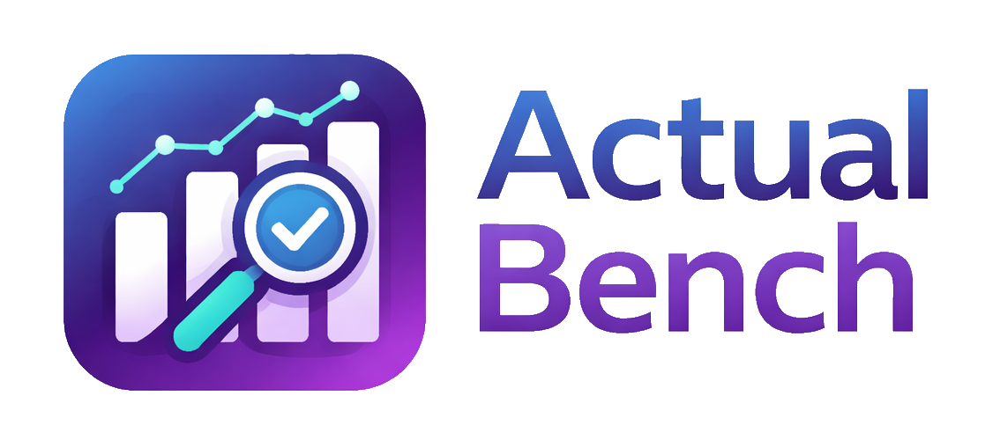
</p>

<h1 align="center">Actual Bench</h1>

<p align="center">
  <strong>The advanced admin, budgeting, diagnostics, and ActualQL workbench for Actual Budget.</strong>
</p>

<p align="center">
  Bulk-edit your budget data, clean up rules, inspect snapshots, run ActualQL, and manage multi-month budgets, safely, with every change staged locally until you click <strong>Save</strong>.
</p>

<p align="center">
  <a href="https://github.com/x-rous/actual-bench/actions/workflows/ci.yml"></a>
  <a href="https://github.com/x-rous/actual-bench/releases"></a>
  <a href="https://hub.docker.com/r/xrous/actual-bench"></a>
  <a href="https://github.com/x-rous/actual-bench/blob/main/LICENSE"></a>
</p>

---

**Actual Bench** is a companion app for [Actual Budget](https://github.com/actualbudget/actual). It connects to a self-hosted [actual-http-api](https://github.com/jhonderson/actual-http-api) server and gives power users a focused interface for the work that is hard to do in the native Actual Budget UI: bulk setup, master-data cleanup, advanced rule maintenance, full year view budget editing, diagnostics, and ad-hoc ActualQL analysis.

It is not trying to replace Actual Budget's day-to-day transaction entry experience. It is the workbench you open when you need to inspect, repair, seed, audit, or reshape your budget data with confidence.

## Why Actual Bench?

- **Staged by default** - creates, edits, deletes, merges, imports, and budget-cell changes stay local until you explicitly save.
- **Spreadsheet-grade budget editing** - edit a 12-month budget window with keyboard navigation, range selection, copy/paste, fill actions, right-click bulk actions, undo/redo, and a draft review panel.
- **Powerful rules management** - create, edit, duplicate, merge, filter, lint, and clean up Actual Budget rules with resolved entity names instead of raw IDs.
- **Bulk data management** - manage accounts, payees, categories, schedules, tags, and rules with inline editing, filters, CSV import/export, bulk actions, and impact-aware confirmations.
- **Diagnostics without mutation** - inspect exported budget snapshots locally in the browser, run deterministic health checks, browse SQLite tables/views, and export findings or data.
- **ActualQL workspace** - run, format, explain, save, replay, and export ActualQL queries with table, raw JSON, scalar, and tree result views.
- **Multi-budget friendly** - save multiple connections, switch between budgets, and keep staged data and query cache scoped per connection.


## Screenshots

| Connection  |
|:---:|
| 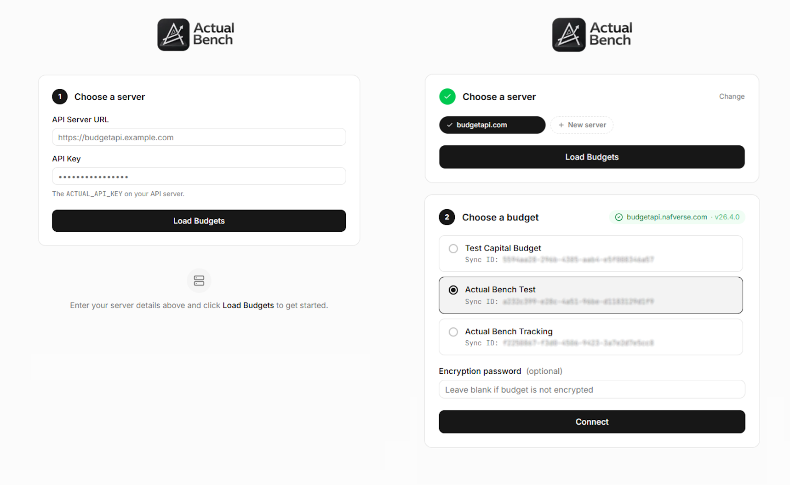 |

| Payees | Categories |
|:---:|:---:|
| 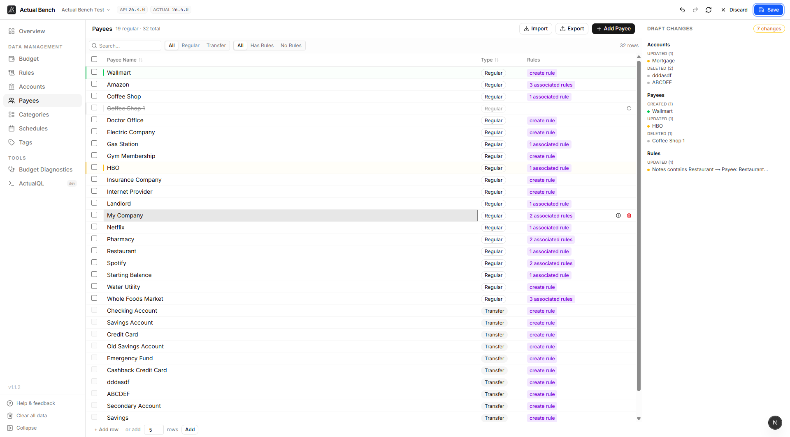 | 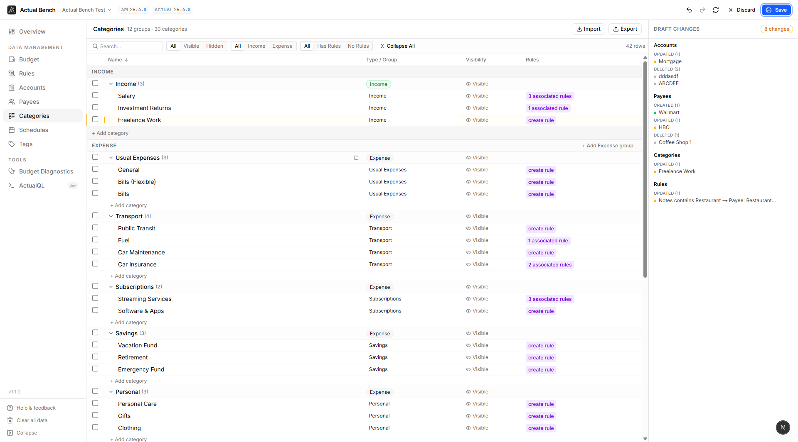 |

| Accounts Detail | Rules |
|:---:|:---:|
| 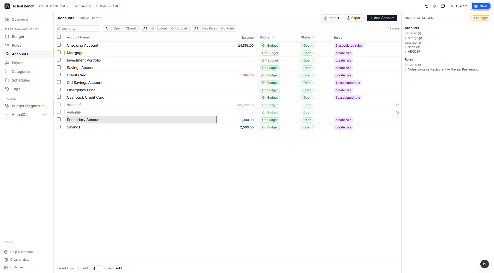 | 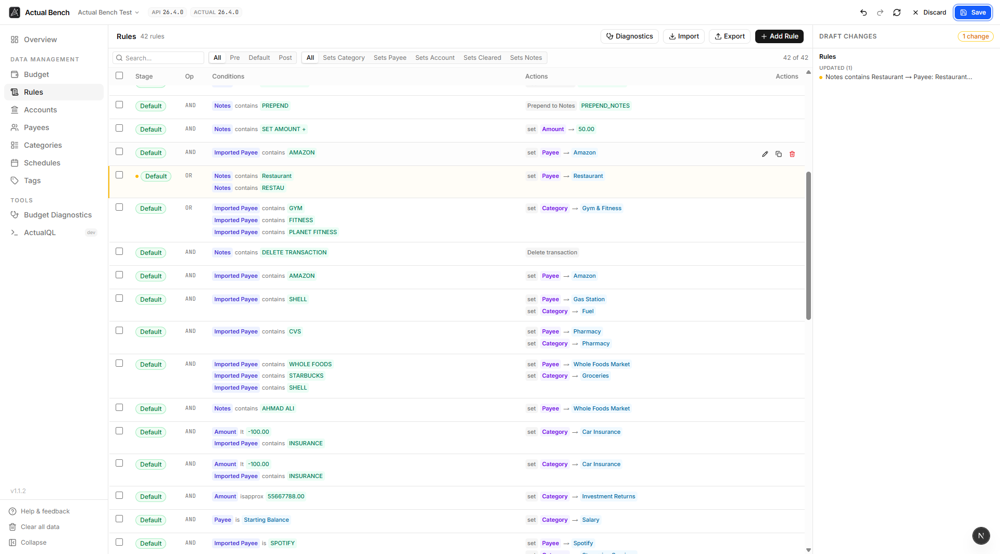  |

| Rule diagnostics | Rules Merge |
|:---:|:---:|
| 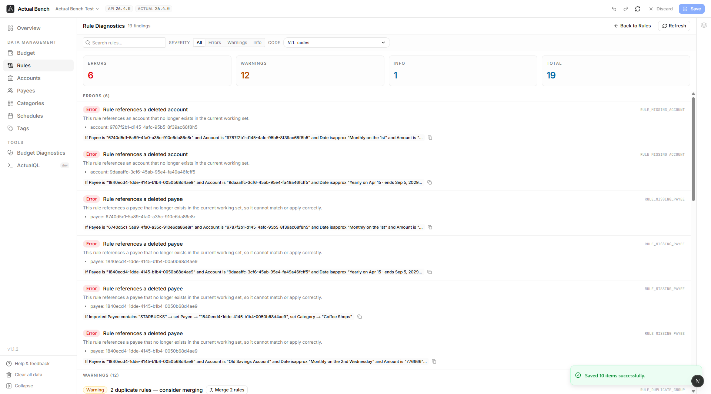 | 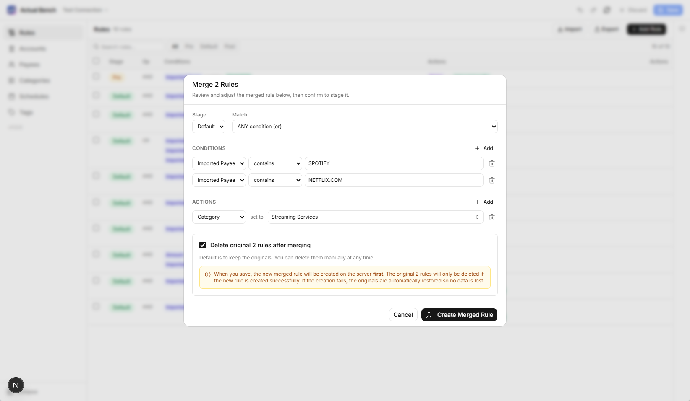 |

| Envelope Budget | Tracking Budget |
|:---:|:---:|
| 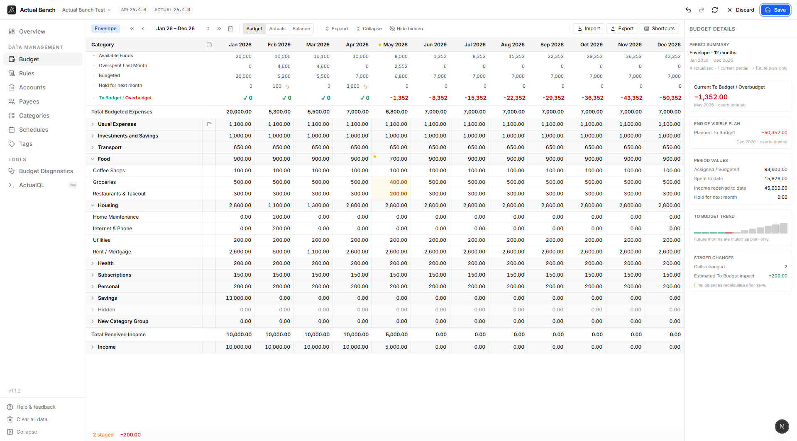 | 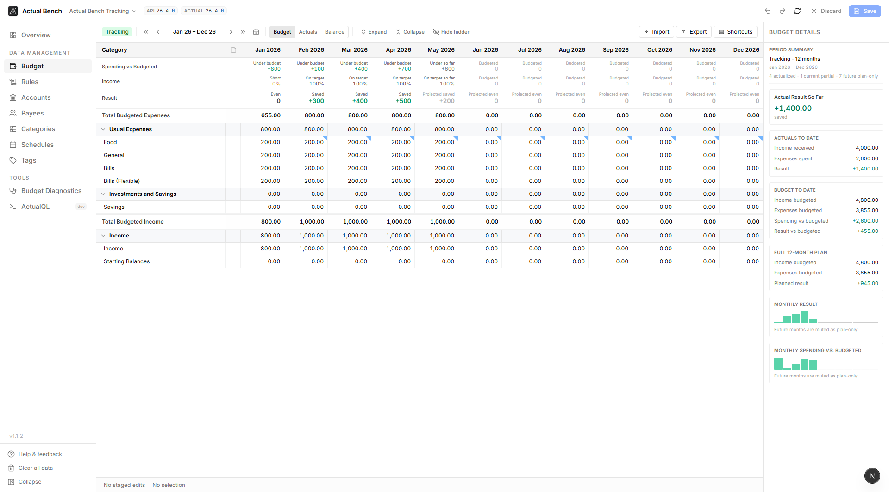 |

| ActualQL Queries | Budget File Overview |
|:---:|:---:|
| 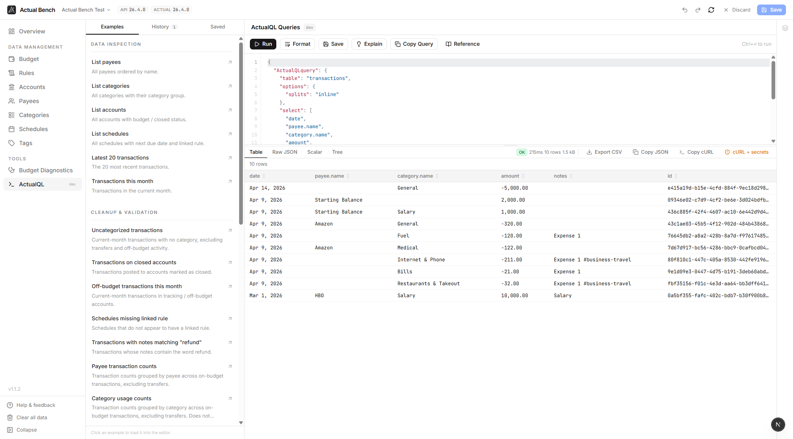 | 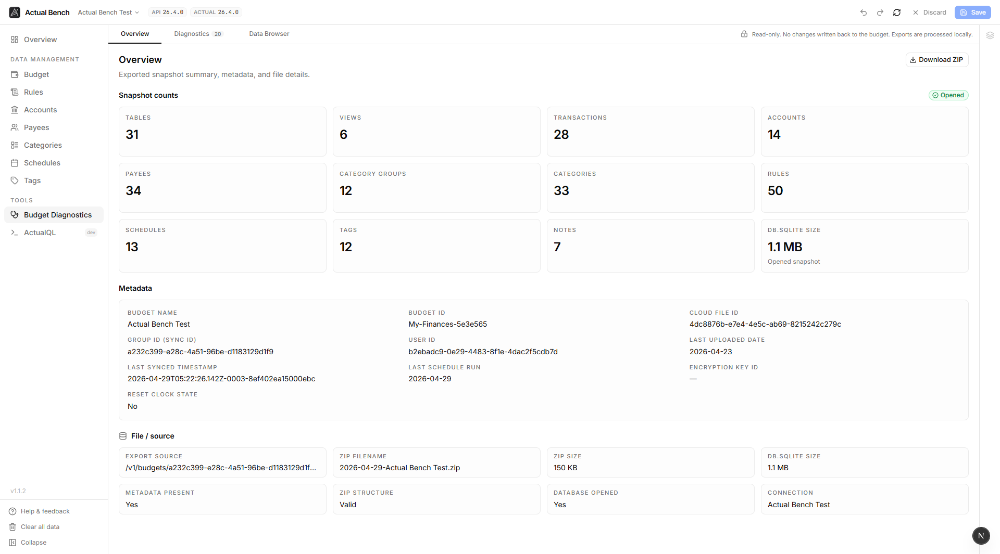 |

| Budget Diagnostics | Data Browser |
|:---:|:---:|
| 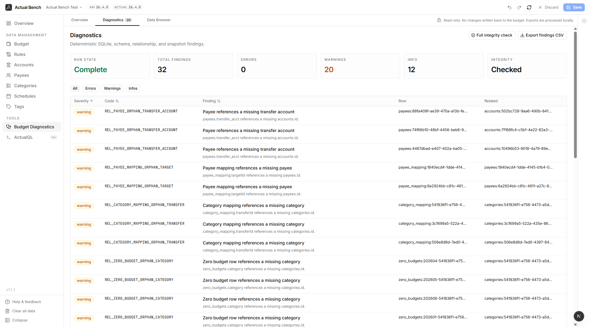 | 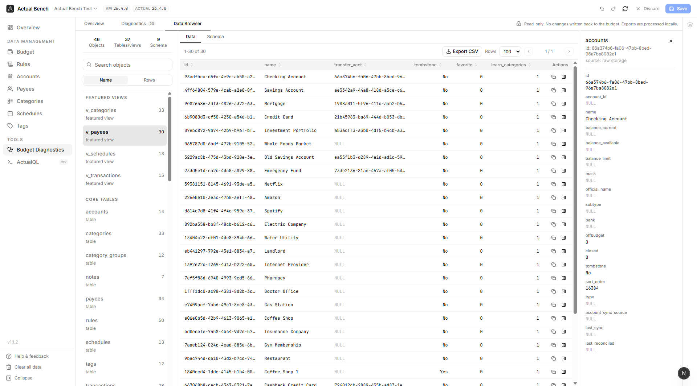 |


## Feature overview

### Budget Management Workspace

A full-width 12-month budget editor for envelope and tracking budgets.

- Budget / Actuals / Balance view toggle
- Sticky month headers and sticky category column
- Expand/collapse category groups and show/hide hidden categories
- Inline cell editing with arithmetic expression support
- Multi-cell selection, copy/paste from Excel or Google Sheets, fill down/right, previous-month fill, and average-based fill
- Right-click bulk actions such as copy previous month, set to zero, set fixed amount, apply percentage change, and average calculations
- Draft panel with selected-cell details, group totals, year summary, staged deltas, and save errors
- Envelope-mode actions for next-month hold and category transfer
- Keyboard shortcut cheatsheet generated from the same keymap used by the workspace

### Data Management

Manage the core Actual Budget entities from dedicated admin pages.

| Area | What you can do |
|---|---|
| **Accounts** | Create, rename, close, reopen, delete, inspect balances, view rule references, import/export CSV |
| **Payees** | Create, rename, merge, delete, separate regular and transfer payees, view rule references, import/export CSV |
| **Categories** | Manage income/expense groups, categories, visibility, hierarchy, notes, and import/export CSV |
| **Schedules** | Create one-time or recurring schedules with amount modes, recurrence controls, weekend adjustment, auto-add, and linked rules |
| **Tags** | Create, rename, color-code, describe, filter, bulk-delete, and import/export tags |
| **Rules** | Build rules with conditions/actions, stages, AND/OR logic, templates, entity chips, filtering, search, duplication, merge, and CSV import/export |

### Rule Diagnostics

A read-only linting workspace for the rules you are about to save.

- Runs against the current working set, including unsaved staged edits
- Detects missing entity references, empty/no-op actions, impossible conditions, shadowed rules, broad match criteria, duplicates, near-duplicates, and unsupported field/operator combinations
- Groups findings by severity with filters for error, warning, info, and code
- Lets you jump directly to the affected rule
- Opens the merge dialog from duplicate and near-duplicate findings
- Runs in the browser against already-loaded data; no new backend endpoint is required

### Budget Diagnostics

A read-only local diagnostics workspace for exported budget snapshots.

- Opens the active budget export locally in the browser
- Shows snapshot metadata, object counts, ZIP size, SQLite size, sync details, and source details
- Runs deterministic schema, relationship, metadata, and SQLite health checks
- Supports a full SQLite integrity check
- Exports findings to CSV
- Includes a Data Browser for tables, views, indexes, triggers, schema inspection, row details, relationship drill-in, and full table/view CSV export

### ActualQL Queries

A dedicated query console for advanced analysis.

- Syntax-highlighted JSON editor with line numbers
- Run with button or `Ctrl/Cmd+Enter`
- Format JSON, save queries, pin favorites, and reload recent history
- Explain query intent in plain English
- Built-in ActualQL reference and example packs
- Result views: table, raw JSON, scalar, and collapsible tree
- Copy result JSON, query JSON, sanitized cURL, or full cURL when explicitly needed
- Warns when staged local changes exist because query results reflect saved server state

### Staged editing and safety

Actual Bench is built around a review-before-save workflow.

- Nothing is written to the server until you click **Save**
- New, updated, deleted, and invalid rows are visually marked
- Top bar shows staged changes across the current workspace
- Undo/redo works across staged edits within the session
- Refresh, navigation, browser close, and cross-workspace entry flows warn before discarding pending changes
- Delete/close dialogs show impact details such as transaction counts, rule references, account balance, and child category counts where available
- Usage Inspector drawers show references and impact without triggering a delete flow

## Architecture

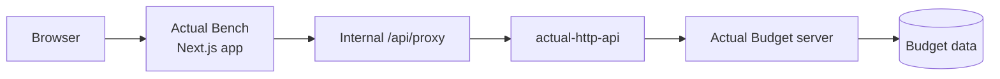

All requests to `actual-http-api` go through Actual Bench's internal Next.js proxy. The browser does not call `actual-http-api` directly.

## Privacy and data handling

- Saved connections are stored in **session storage** and are cleared when the browser tab is closed.
- Staged data and query cache are scoped per connection so switching budgets does not leak local state between sessions.
- Budget Diagnostics processes exported snapshots locally in the browser and does not write diagnostic changes back to the budget.
- Exported budget ZIP files and diagnostic data may still contain personal financial information, so handle downloaded files carefully.
- ActualQL queries are read-only from the Actual Bench perspective, but they reflect saved server state, not unsaved staged edits.

## Requirements

- A running [Actual Budget](https://github.com/actualbudget/actual) server
- A running [actual-http-api](https://github.com/jhonderson/actual-http-api) instance connected to that server
- An `ACTUAL_API_KEY` configured for `actual-http-api`
- Docker, Docker Compose, or Node.js 20+ for local development


## Quick start

### Docker

```bash
# Latest stable release
docker run -d \
  --name actual-bench \
  --restart unless-stopped \
  -p 3000:3000 \
  xrous/actual-bench:latest

# Latest unreleased build from main. Useful for testing, but may be unstable.
docker run -d \
  --name actual-bench-edge \
  --restart unless-stopped \
  -p 3000:3000 \
  xrous/actual-bench:edge
```

Open `http://localhost:3000` and connect to your `actual-http-api` server.

### Docker Compose

```yaml
services:
  actual-bench:
    image: xrous/actual-bench:latest
    container_name: actual-bench
    ports:
      - "3000:3000"
    restart: unless-stopped
```

Start it with:

```bash
docker compose up -d
```

### Docker networking note

If Actual Bench and `actual-http-api` are running in separate containers, Actual Bench must be able to reach `actual-http-api` **from inside the Actual Bench container**.

If the UI shows `fetch failed` or `502 Bad Gateway`, check whether both containers share a Docker network:

```bash
docker inspect -f '{{.Name}} -> {{range $k, $v := .NetworkSettings.Networks}}{{printf "%s " $k}}{{end}}' actual-bench
docker inspect -f '{{.Name}} -> {{range $k, $v := .NetworkSettings.Networks}}{{printf "%s " $k}}{{end}}' actual-http-api
```

For a permanent Compose-based fix, attach Actual Bench to the same external network as `actual-http-api`:

```yaml
services:
  actual-bench:
    image: xrous/actual-bench:latest
    ports:
      - "3000:3000"
    networks:
      - actual-stack
    restart: unless-stopped

networks:
  actual-stack:
    external: true
```

Replace `actual-stack` with your real Docker network name.

## Connecting to a budget

Actual Bench uses a two-step connection flow.

### 1. Choose a server

Enter your `actual-http-api` base URL and API key, then click **Load Budgets**.

| Field | Description |
|---|---|
| **API Server URL** | Base URL of your `actual-http-api` server, for example `https://actual-api.example.com` |
| **API Key** | The `ACTUAL_API_KEY` configured on the API server |

### 2. Choose a budget

Pick a budget returned by the API server, optionally enter the encryption password for encrypted budgets, and click **Connect**.

Previously used connections appear on the connection screen for one-click reconnect during the current browser session.


## Common workflows

### Seed or migrate a budget

1. Connect to the target budget.
2. Import accounts, payees, categories, schedules, tags, or rules from CSV.
3. Review staged changes in the draft panel.
4. Use undo/redo or discard if something looks wrong.
5. Click **Save** only when the staged result is correct.

### Clean up rules

1. Open **Rules** to filter, inspect, duplicate, edit, or merge rules.
2. Open **Rule Diagnostics** to find broken references, duplicates, broad criteria, shadowing, and impossible conditions.
3. Jump from a finding to the affected rule or start a merge directly from duplicate findings.
4. Save once the staged rule set is clean.

### Review budget health

1. Open **Budget Diagnostics**.
2. Review snapshot metadata and object counts.
3. Run diagnostics and optional full integrity check.
4. Use **Data Browser** for deeper SQLite inspection.
5. Export findings or table/view CSVs when needed.

### Analyze with ActualQL

1. Open **ActualQL**.
2. Start from an example query or write raw ActualQL JSON.
3. Run the query and inspect results as table, JSON, scalar, or tree.
4. Save useful queries, pin favorites, or copy a sanitized cURL for debugging.

## CSV import/export

Every entity page supports CSV export and import. Imported rows are staged first and only saved after confirmation.

Sample files are included in [`public/samples csv/`](public/samples%20csv/) for testing with a fresh budget:

| File | Contents |
|---|---|
| `sample-accounts.csv` | Accounts covering on/off-budget and open/closed combinations |
| `sample-payees.csv` | Common regular payees |
| `sample-categories.csv` | Category groups and categories across income and expense areas |
| `sample-rules.csv` | Multi-condition, multi-action, OR logic, stages, and payee auto-creation examples |
| `sample-schedules.csv` | One-time, monthly, weekly, yearly, and range-amount schedules |
| `sample-tags.csv` | Tags with colors and descriptions |
| `sample-budget.csv` | Budget import template with groups, categories, and budgeted amounts per month |

CSV exports include a UTF-8 BOM for better compatibility with Excel and Google Sheets.


## Tech stack

- [Next.js](https://nextjs.org/) + React + TypeScript
- Tailwind CSS
- Zustand for local staged state
- TanStack Query for server-state caching
- TanStack Table for entity tables
- SQLite WASM worker for local diagnostics snapshot inspection
- Docker images published for stable releases and edge builds

## Development

### Prerequisites

- Node.js 20+
- npm
- A running `actual-http-api` instance for integration testing

### Setup

```bash
git clone https://github.com/x-rous/actual-bench.git
cd actual-bench
npm install
npm run dev
```

`npm install` copies the SQLite WASM asset used by Budget Diagnostics into `public/sqlite/`.

Open `http://localhost:3000`.

### Scripts

| Command | Description |
|---|---|
| `npm run dev` | Start the development server |
| `npm run build` | Build for production |
| `npm start` | Serve the production build |
| `npm run lint` | Run ESLint |
| `npm test` | Run tests |
| `npm run clean` | Remove build/cache artifacts |

## Known limitations

- Main entity admin pages load the full entity set; very large budgets may feel slower on Accounts, Payees, Categories, Rules, and similar pages.
- Actual Bench depends on `actual-http-api`; unsupported or changing API endpoints may affect some features.

## Contributing

Contributions are welcome. Please keep PRs focused, user-facing, and aligned with the staged-editing model.

Useful links:

- [Feature reference](FEATURES.md)
- [Contributing guide](CONTRIBUTING.md)
- [Changelog](CHANGELOG.md)
- [Issues](https://github.com/x-rous/actual-bench/issues)
- [Releases](https://github.com/x-rous/actual-bench/releases)

## License

This project is licensed under the terms of the repository license. See [LICENSE](LICENSE) for details.
