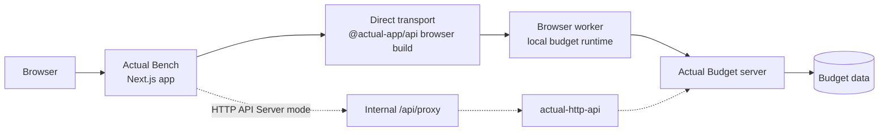

<p align="center">
  
</p>

<h1 align="center">Actual Bench</h1>

<p align="center">
  <strong>The advanced admin, budgeting, diagnostics, and ActualQL workbench for Actual Budget.</strong>
</p>

<p align="center">
  Bulk-edit your budget data, clean up rules, inspect budget file snapshots, run ActualQL, and manage yearly budgets, safely, with every change staged locally until you click <strong>Save</strong>.
</p>

<p align="center">
  <a href="https://actual-bench-demo.vercel.app"></a>
  <a href="https://github.com/x-rous/actual-bench/actions/workflows/ci.yml"></a>
  <a href="https://github.com/x-rous/actual-bench/releases"></a>
  <a href="https://hub.docker.com/r/xrous/actual-bench"></a>
  <a href="https://github.com/x-rous/actual-bench/blob/main/LICENSE"></a>
</p>

<p align="center">
  <a href="https://actual-bench-demo.vercel.app"><strong>🚀 Try the live demo →</strong></a><br />
  <sub>Explore a fully-loaded sample budget — no setup required. (Shared sandbox; resets periodically.)</sub>
</p>

---

**Actual Bench** is a companion app for [Actual Budget](https://github.com/actualbudget/actual). Its target architecture is Direct Actual Server access through Actual's browser API transport, while HTTP API Server mode through [actual-http-api](https://github.com/jhonderson/actual-http-api) remains fully supported for existing deployments and integrations. It gives power users a focused interface for the work that is cumbersome in the native Actual Budget UI: bulk setup, master-data cleanup, advanced rule maintenance, full-year view budget editing, diagnostics, and ad-hoc ActualQL analysis.

It is not trying to replace Actual Budget's day-to-day transaction entry experience. It is the workbench you open when you need to inspect, repair, seed, audit, or reshape your budget data with confidence.

## Why Actual Bench?

- **Staged by default** - creates, edits, deletes, merges, imports, and budget-cell changes stay local until you explicitly save.
- **Spreadsheet-grade budget editing** - edit a 12-month budget window with keyboard navigation, range selection, copy/paste, fill actions, right-click bulk actions, undo/redo, and a draft review panel.
- **Powerful rules management** - create, edit, duplicate, merge, filter, lint, and clean up Actual Budget rules with resolved entity names instead of raw IDs.
- **Bulk data management** - manage accounts, payees, categories, schedules, tags, and rules with inline editing, filters, CSV import/export, bulk actions, and impact-aware confirmations.
- **Diagnostics without mutation** - inspect exported budget snapshots locally in the browser, run deterministic health checks, browse SQLite tables/views, and export findings or data.
- **ActualQL workspace** - run, format, explain, save, replay, and export ActualQL queries with table, raw JSON, scalar, and tree result views.
- **Multi-budget friendly** - save multiple connections, switch between budgets, and keep staged data and query cache scoped per connection.


## Screenshots

| Connection  |
|:---:|
|  |

| Payees | Categories |
|:---:|:---:|
|  |  |

| Accounts Detail | Rules |
|:---:|:---:|
|  |   |

| Rule diagnostics | Rules Merge |
|:---:|:---:|
|  |  |

| Envelope Budget | Tracking Budget |
|:---:|:---:|
|  |  |

| ActualQL Queries | Budget File Overview |
|:---:|:---:|
|  |  |

| Budget File Health | Data Browser |
|:---:|:---:|
|  |  |


## Feature overview

### Budget Management Workspace

A full-width 12-month budget editor for envelope and tracking budgets.

- Budget / Actuals / Balance view toggle
- Expand/collapse category groups and show/hide hidden categories
- Inline cell editing with arithmetic expression support
- Multi-cell selection, copy/paste from Excel or Google Sheets, fill down/right, previous-month fill, and average-based fill
- Right-click bulk actions such as copy previous month, set to zero, set fixed amount, apply percentage change, and average calculations
- Draft panel with selected-cell details, group totals, year summary, staged deltas, and save errors
- Editable notes in the details panel for the selected cell, category, group, or whole month (selected from its column header) — read, add, edit, and clear inline with immediate save
- Envelope-mode staged hold for next month (with undo support) and staged category transfer
- Keyboard shortcut cheatsheet

### Advanced Data Management

Manage the core Actual Budget entities from dedicated admin pages with support for bulk actions.

| Area | What you can do |
|---|---|
| **Accounts** | Create, rename, close, reopen, delete, inspect balances, view rule references, notes, import/export CSV |
| **Payees** | Create, rename, merge, delete, separate regular and transfer payees, view rule references, import/export CSV |
| **Categories** | Manage income/expense groups, categories, visibility, hierarchy, notes, and import/export CSV |
| **Schedules** | Create one-time or recurring schedules with amount modes, recurrence controls, weekend adjustment, auto-add, linked rules, and CSV import/export |
| **Tags** | Create, rename, color-code, describe, filter, bulk-delete, and import/export tags |
| **Rules** | Build rules with conditions/actions, stages, AND/OR logic, templates, HyperFormula formulas, entity chips, filtering, search, duplication, merge, and CSV import/export |

### Rule Diagnostics

A read-only linting workspace for rules to help you identify potential issues and duplicates.

- Detects missing entity references, empty/no-op actions, shadowed rules, broad match criteria, duplicates, and near-duplicates rules.
- Groups findings by severity with filters for error, warning, info, and code
- Lets you jump directly to the affected rule
- Opens the merge dialog from duplicate and near-duplicate findings
- Runs in the browser against already-loaded data; no new backend endpoint is required
- Runs against the current working set, including unsaved staged edits

### Budget File Health & Data Browser

A read-only local diagnostics workspace for the exported budget snapshots.

- Opens the active budget SQLite database file locally in the browser
- Shows snapshot metadata, object counts, ZIP size, SQLite size, sync details, and source details
- Runs deterministic schema, relationship, metadata, and SQLite health checks and exports findings to CSV
- Supports a full SQLite integrity check
- Includes a Data Browser for tables, views, indexes, triggers, schema inspection, row details, relationship drill-in, and full table/view CSV export

### Budget File Sync

Sync data between budget files as saved one-way flows. One unified engine covers **transactions, payees, and categories** — preview, apply, run history, the review queue, and the safe-only automation layer work identically for each. It is **cross-budget, create-only, and preview-first**. Every data type syncs in **both Direct and HTTP API Server mode**, in any combination.

- **Master data:** pick a flow's data type (Transactions / Payees / Categories). Payee and category flows create missing entities on the target and match existing ones by name (no renames/deletes); categories place under the matching or a chosen default group, and block ambiguous placement for review.

- Compact flow editor: source/target Direct connection + account, filters, and transforms (reverse-sign by default, payee/category match-by-name, clean notes marker)
- Required dry-run preview classifies each item (new, already synced, duplicate, changed since sync, marker match, blocked, FX pending) with source and transformed target amounts side by side — no writes to Actual
- Apply creates only the selected safe new transactions with a durable `imported_id` marker and records app-owned mappings, so reruns skip already-synced items instead of creating duplicates
- Eligible split lines are exploded into separate target transactions; a reverse-flow helper mirrors a flow for two-way sync
- **Multi-currency consolidation:** a transaction flow can **convert amounts** between budgets in different currencies (its *Convert currency* option). Rates come from a database-backed registry filled automatically from the free [Frankfurter](https://frankfurter.dev) provider (no API key, weekend/holiday fallback); you can override any date or import a CSV. The preview shows original → rate → converted with currency labels; a missing or future rate goes to review as *FX pending*. Each converted transaction stores a locked-by-default rate snapshot and a compact audit note, and rates lock at first sync so past conversions never silently change. A dedicated **FX Rates** page (Tools → FX Rates) shows the trend and coverage and lets you fill, override, or import rates — overriding a rate that affects already-synced transactions shows an impact preview, and an opt-in flow setting can push corrected rates to those transactions through the normal previewed update path, replacing the existing snapshot in place
- Opt-in automation per flow: auto-apply safe items, or auto-sync on a schedule **while the app is open** (client-side, minimum 15 min). For **HTTP API mode** flows, an opt-in **unattended server schedule** runs the same safe-only sync with the app closed — credentials are stored in an encrypted, env-keyed server vault (`SYNC_VAULT_KEY`); see [`docs/UNATTENDED_SYNC.md`](docs/UNATTENDED_SYNC.md). Uncertain items collect in a review queue; exact duplicates can be auto-mapped (opt-in); failed items can be retried; and a flow auto-pauses after repeated failures
- Target-budget rules may post-process created transactions; this is surfaced as a warning. Not in scope: true transfer-linked sync, non-review updates/deletes, category auto-create, fuzzy duplicate auto-map, unattended sync for Direct-mode flows, FX gain/loss accounting, multi-currency within a single budget file, and silent recalculation of past conversions

### ActualQL Queries

A dedicated query console using ActualQL for advanced queries and analysis, available in HTTP API Server mode and Direct Actual Server mode.

- Syntax-highlighted JSON editor with line numbers
- Run with button or `Ctrl/Cmd+Enter`
- Format JSON, save queries, pin favorites, and reload recent history
- Explain query intent in plain English
- Built-in ActualQL reference and example packs
- Result views: table, raw JSON, scalar, and collapsible tree
- Copy result JSON and query JSON in all modes; copy sanitized or full actual-http-api cURL from HTTP API Server executions when explicitly needed
- Warns when staged local changes exist because query results reflect saved server state

### Excel Companion Workbook

An optional Excel companion workbook is available for users who prefer spreadsheet-based reporting alongside Actual Bench.

The workbook connects to `actual-http-api` and fetches read-only budget data for category groups, categories, accounts, payees, rules, transactions, months, account balances, and monthly budget status. It provides Excel tables for categories, category groups, accounts, payees, rules, all transactions, account balances, monthly budget status, available months, and separate balance, spent, and budgeted views.

Download: [Actual Bench Excel Companion](https://github.com/x-rous/actual-bench/releases/latest/download/actual-bench-excel-companion.xlsx)

### Staged editing and safety

Actual Bench is built around a review-before-save workflow.

- Nothing is written to the server until you click **Save**
- New, updated, deleted, and invalid rows are visually marked
- Top bar shows staged changes across the current workspace
- Undo/redo works across staged edits within the session
- Refresh, navigation, browser close, and cross-workspace entry flows warn before discarding pending changes
- Delete/close dialogs show impact details such as transaction counts, rule references, account balance, and child category counts where available
- Usage Inspector drawers show references and impact without triggering a delete flow

## Architecture



Direct mode is the target architecture for browser-based Actual Bench workflows: it bypasses `actual-http-api` and uses Actual's browser API worker from the user's browser. HTTP API Server mode remains a maintained compatibility architecture; it sends all `actual-http-api` requests through Actual Bench's internal Next.js proxy, and the browser never calls `actual-http-api` directly.

### Direct mode

Direct mode is shown by default alongside HTTP API Server mode and is the preferred target for new browser workflows. It uses worker/static asset headers required for cross-origin isolation (`Cross-Origin-Opener-Policy: same-origin` and `Cross-Origin-Embedder-Policy: require-corp`), and the Actual Server must be reachable from the browser through CORS or a same-origin reverse proxy. Set `DIRECT_BROWSER_API=0` only if your deployment cannot support Direct mode.

Direct mode currently supports core entity pages, Budget Management reads/staged saves, Budget File Health, Data Browser, and the ActualQL Query workspace. HTTP API Server mode remains first-class and maintained for deployments that prefer or require `actual-http-api`; query cURL generation remains HTTP API Server-only because it targets actual-http-api's `/run-query` endpoint.

## Privacy and data handling

- Saved server presets store only non-secret details in **session storage** and are cleared when the browser tab is closed.
- API keys, Actual Server passwords, and budget encryption passwords are kept in memory only by default. Refreshing or reopening the tab requires reconnecting. Actual's browser worker cache may require clearing this site's browser data if it becomes stale or corrupt.
- Optionally, you can **remember a connection**: its secret is then sealed (AES-256-GCM) in the server-side metadata database, encrypted with a key derived from a passphrase you set — the server can't decrypt without it, and you unlock once per session. Off by default; only offered when `/data` is durable.
- App workflow metadata is stored server-side in SQLite at `/data/actual-bench.sqlite` by default. It stores Actual Bench metadata only and does not store Actual credentials or copied budget data, except the explicit, encrypted opt-ins above (remembered connections) and unattended-sync credentials.
- Staged data and query cache are scoped per connection so switching budgets does not leak local state between sessions.
- Budget File Health and the Data Browser process exported snapshots locally in the browser and do not write changes back to the budget.
- Exported budget ZIP files and diagnostic data may still contain personal financial information, so handle downloaded files carefully.
- ActualQL queries are read-only from the Actual Bench perspective, but they reflect saved server state, not unsaved staged edits.
- The Excel companion workbook may contain your Actual API URL, API key, and downloaded financial data after use, so do not share a configured copy.

## Requirements

- A running [Actual Budget](https://github.com/actualbudget/actual) server
- For Direct mode: browser access from Actual Bench to Actual Server, plus cross-origin isolation/CORS support. Direct mode is enabled by default; set `DIRECT_BROWSER_API=0` to hide it when a deployment cannot support it
- For HTTP API Server mode: a running [actual-http-api](https://github.com/jhonderson/actual-http-api) instance and an `ACTUAL_API_KEY`
- Docker, Docker Compose, or Node.js 22.23.1 recommended for local development


## Quick start

### Docker

```bash
# Latest stable release
docker run -d \
  --name actual-bench \
  --restart unless-stopped \
  -p 3000:3000 \
  -v actual-bench-data:/data \
  xrous/actual-bench:latest

# Latest unreleased build from main. Useful for testing, but may be unstable.
docker run -d \
  --name actual-bench-edge \
  --restart unless-stopped \
  -p 3000:3000 \
  -v actual-bench-edge-data:/data \
  xrous/actual-bench:edge
```

All environment variables are optional. To set any, add `-e VAR=value` flags to the `docker run`
command, for example:

```bash
docker run -d \
  --name actual-bench \
  --restart unless-stopped \
  -p 3000:3000 \
  -v actual-bench-data:/data \
  -e DIRECT_BROWSER_API=0 \
  -e LOG_LEVEL=info \
  -e SYNC_VAULT_KEY=<strong-secret> \
  xrous/actual-bench:latest
```

See the [Configuration guide](https://x-rous.github.io/actual-bench/administration/configuration/) for
what each variable does and which are secrets.

Open `http://localhost:3000` and connect with Direct Actual Server mode, or use HTTP API Server mode if you run `actual-http-api`.

### Docker Compose

```yaml
services:
  actual-bench:
    image: xrous/actual-bench:latest
    container_name: actual-bench
    ports:
      - "3000:3000"
    environment:
      ACTUAL_BENCH_DB_PATH: /data/actual-bench.sqlite
      # --- Optional settings (uncomment to use) ---
      # DIRECT_BROWSER_API: "0"                    # offer only HTTP API Server mode
      # LOG_LEVEL: info                            # debug | info | warn | error
      # SYNC_VAULT_KEY: "<strong-secret>"          # enable unattended server-side sync
      # SYNC_SCHEDULER_SECRET: "<strong-secret>"   # enable the external scheduler trigger
    volumes:
      - actual-bench-data:/data
    restart: unless-stopped

volumes:
  actual-bench-data:
```

Start it with:

```bash
docker compose up -d
```

No environment variables are required for a basic setup. All variables are optional — see the
[Configuration guide](https://x-rous.github.io/actual-bench/administration/configuration/) for what
each one does and which are secrets.

### App metadata database

Actual Bench stores app-owned workflow metadata in a server-side SQLite database. The default path is `/data/actual-bench.sqlite`; set `ACTUAL_BENCH_DB_PATH` to use another file. Persist and back up the `/data` volume if you want to keep saved app metadata across container recreation.

The metadata database is not an Actual Budget data replica and does not store API keys, Actual Server passwords, budget encryption passwords, or session tokens.

### Docker networking note

Direct mode is browser-to-Actual-Server, so the browser must be able to reach your Actual Server URL and the response must satisfy CORS/cross-origin-isolation requirements. HTTP API Server mode is server-to-`actual-http-api`: if Actual Bench and `actual-http-api` are running in separate containers, Actual Bench must be able to reach `actual-http-api` **from inside the Actual Bench container**.

If the UI shows `fetch failed` or `502 Bad Gateway`, check whether both containers share a Docker network:

```bash
docker inspect -f '{{.Name}} -> {{range $k, $v := .NetworkSettings.Networks}}{{printf "%s " $k}}{{end}}' actual-bench
docker inspect -f '{{.Name}} -> {{range $k, $v := .NetworkSettings.Networks}}{{printf "%s " $k}}{{end}}' actual-http-api
```

For a permanent Compose-based fix, attach Actual Bench to the same external network as `actual-http-api`:

```yaml
services:
  actual-bench:
    image: xrous/actual-bench:latest
    ports:
      - "3000:3000"
    networks:
      - actual-stack
    restart: unless-stopped

networks:
  actual-stack:
    external: true
```

Replace `actual-stack` with your real Docker network name.


## Connecting to a budget

Actual Bench uses a two-step connection flow for both HTTP API Server and Direct Actual Server connections.

### 1. Choose a server

Choose **Direct Actual Server** for the target browser-to-Actual Server connection, or **HTTP API Server** for the maintained `actual-http-api` compatibility path. Enter the matching server URL and credential, then click **Load Budgets**.

| Field | Description |
|---|---|
| **HTTP API Server URL** | Base URL of your `actual-http-api` server, for example `https://actual-api.example.com` |
| **API Key** | The `ACTUAL_API_KEY` configured on the HTTP API server |
| **Actual Server URL** | Base URL of your Actual Server when using Direct mode, for example `https://actual.example.com` |
| **Actual Server password** | The password used by Actual Server browser clients |

### 2. Choose a budget

Pick a budget returned by the selected server, optionally enter the encryption password for encrypted budgets, and click **Connect**.

Previously used connections appear on the connection screen for one-click reconnect during the current browser session.

## CSV import/export

Every entity page supports CSV export and import. Imported rows are staged first and only saved after confirmation.

Sample files are included in [`public/samples csv/`](public/samples%20csv/) for testing with a fresh budget:

| File | Contents |
|---|---|
| `sample-accounts.csv` | Accounts covering on/off-budget and open/closed combinations |
| `sample-payees.csv` | Common regular payees |
| `sample-categories.csv` | Category groups and categories across income and expense areas |
| `sample-rules.csv` | Multi-condition, multi-action, OR logic, stages, and payee auto-creation examples |
| `sample-schedules.csv` | One-time, monthly, weekly, yearly, and range-amount schedules |
| `sample-tags.csv` | Tags with colors and descriptions |
| `sample-budget.csv` | Budget import template with groups, categories, and budgeted amounts per month |

CSV exports include a UTF-8 BOM for better compatibility with Excel and Google Sheets.


## Tech stack

- [Next.js](https://nextjs.org/) + React + TypeScript
- Tailwind CSS
- Zustand for local staged state
- TanStack Query for server-state caching
- TanStack Table for entity tables
- SQLite WASM worker for local diagnostics snapshot inspection
- Docker images published for stable releases and edge builds — multi-arch (`linux/amd64` + `linux/arm64`)

## Development

### Prerequisites

- Node.js 22.23.1 recommended
- npm
- A running `actual-http-api` instance for integration testing

### Setup

```bash
git clone https://github.com/x-rous/actual-bench.git
cd actual-bench
npm install
npm run dev
```

`npm install` copies the SQLite WASM asset used by Budget File Health and the Data Browser into `public/sqlite/`.

Open `http://localhost:3000`.

### Scripts

| Command | Description |
|---|---|
| `npm run dev` | Start the development server |
| `npm run build` | Build for production |
| `npm start` | Serve the production build |
| `npm run lint` | Run ESLint |
| `npm test` | Run tests |
| `npm run clean` | Remove build/cache artifacts |

## Known limitations

- Main entity admin pages load the full entity set; very large budgets may feel slower on Accounts, Payees, Categories, Rules, and similar pages.
- Direct mode depends on browser cross-origin isolation, CORS, and Actual's browser API package. HTTP API Server mode depends on `actual-http-api`; unsupported or changing API endpoints may affect that compatibility path.

## Contributing

Contributions are welcome. Please keep PRs focused, user-facing, and aligned with the staged-editing model.

Useful links:

- [Feature reference](FEATURES.md)
- [Contributing guide](CONTRIBUTING.md)
- [Changelog](CHANGELOG.md)
- [Issues](https://github.com/x-rous/actual-bench/issues)
- [Releases](https://github.com/x-rous/actual-bench/releases)

## License

This project is licensed under the terms of the repository license. See [LICENSE](LICENSE) for details.
