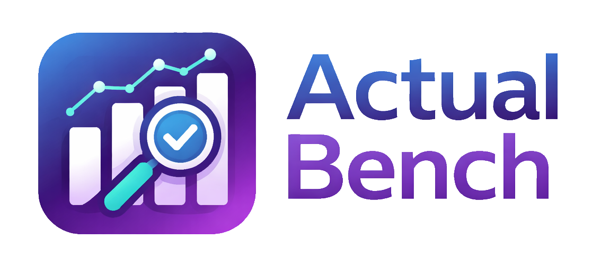
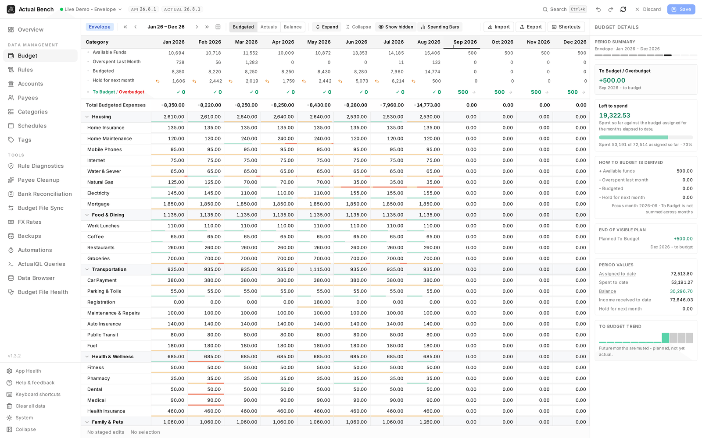
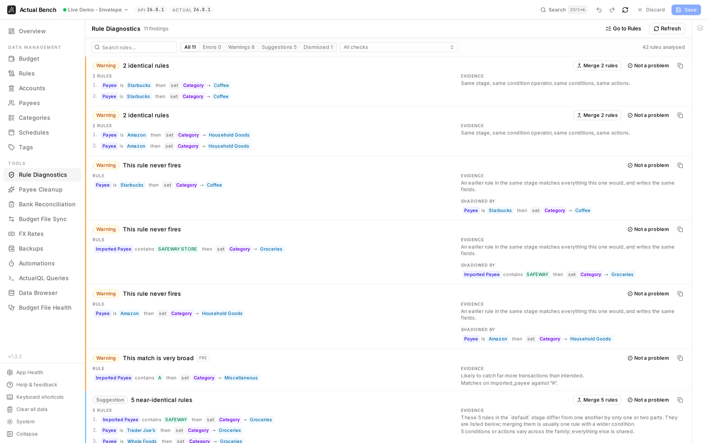
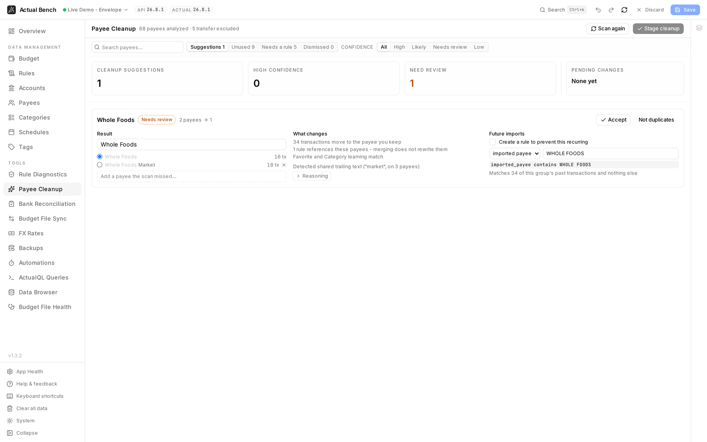
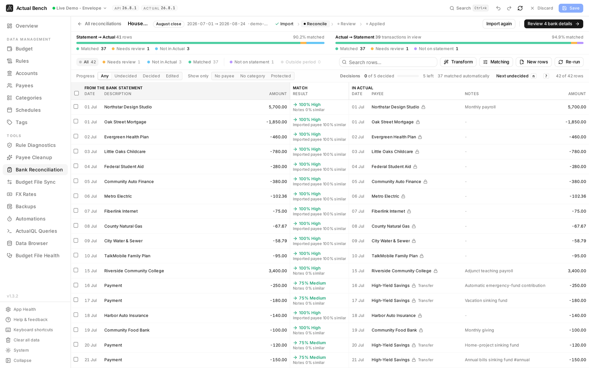
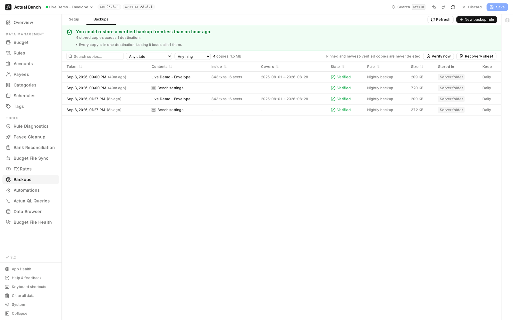
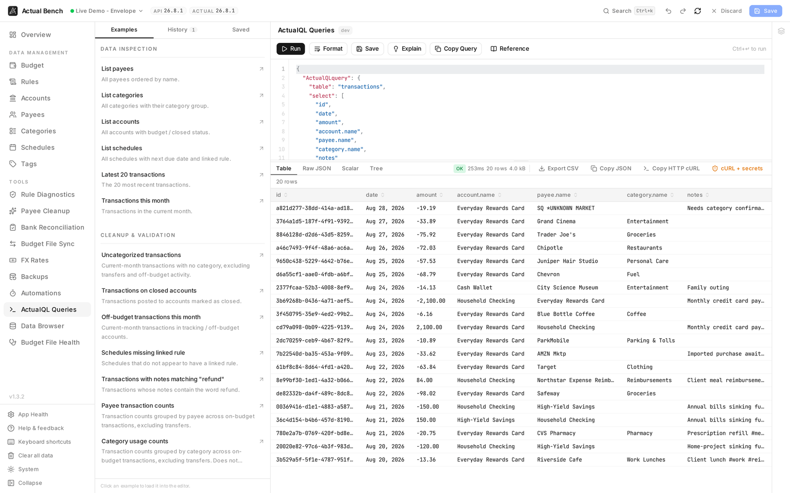
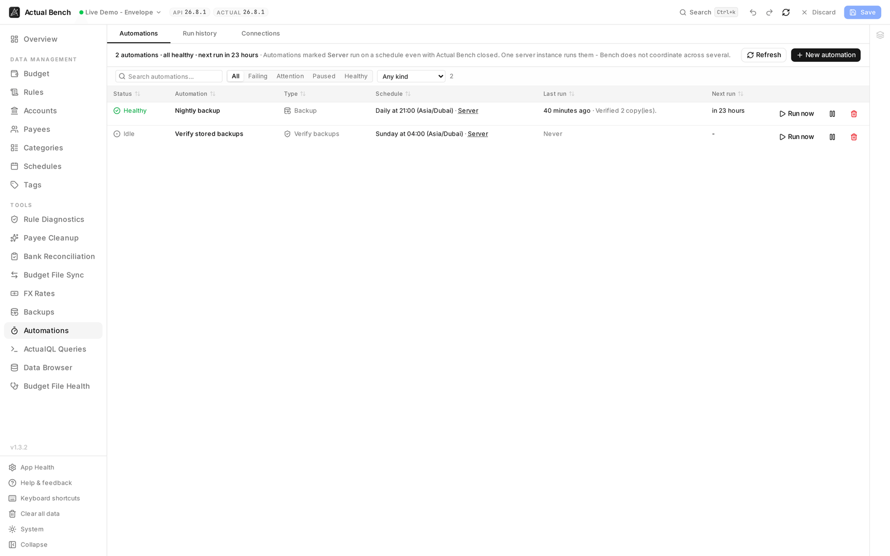

<div align="center">



# Actual Bench

**The workbench beside Actual Budget.**

A full year on one screen, bulk cleanup you review before it lands, rules you can audit,
statements you can reconcile - and backups that prove they still open.

[](https://github.com/x-rous/actual-bench/releases)
[](https://github.com/x-rous/actual-bench/actions/workflows/ci.yml)
[](https://hub.docker.com/r/xrous/actual-bench)
[](LICENSE)

[](https://x-rous.github.io/actual-bench/)
[](https://actual-bench-demo.vercel.app)
[](CHANGELOG.md)



</div>

---

## What is Actual Bench?

Keep doing your everyday budgeting in [Actual Budget](https://github.com/actualbudget/actual).
**Actual Bench** is for the other jobs: the ones that are slow one row at a time, the ones you want
to look at before they land, and the ones that should happen whether or not anything is open.

It is the app you open to plan a year, merge two hundred duplicate payees, work out why a rule never
fires, reconcile a bank statement, or check that last night's backup still opens. Every change is
staged locally and written only when you press **Save** - so you can be wrong about something and
find out before your budget is.

It does not replace Actual Budget, and it is not trying to. Day-to-day transaction entry belongs
there.

**[Try the live demo →](https://actual-bench-demo.vercel.app)**
No setup, no account. A year of household Envelope and Tracking budgets to poke at.
*(Shared sandbox; resets periodically.)*

## What it does

**Plan and edit**

- **[Budget Management](https://x-rous.github.io/actual-bench/user-guide/budget-management/)** - twelve months on one screen, with range selection, copy/paste from a spreadsheet, fill actions, undo/redo, and a draft panel that shows every pending change before you save.
- **[Rules](https://x-rous.github.io/actual-bench/user-guide/rules/)** - the whole rule set on one page, with every reference shown as the payee, category or account it names instead of an id. Split rules across categories, use templates and formulas, merge duplicates, and round-trip the lot through CSV.
- **[Entity admin](https://x-rous.github.io/actual-bench/user-guide/accounts/)** - accounts, payees, categories, schedules and tags, with inline editing, filters, bulk actions, CSV import/export, and delete dialogs that tell you what a deletion would take with it.
- **[Bundle export / import](https://x-rous.github.io/actual-bench/getting-started/bundle-export-import/)** - a budget's whole structure in one ZIP. Build a reusable template, seed a new budget from an old one, or take a snapshot before a cleanup you might regret.

**Clean up and audit**

- **[Payee Cleanup](https://x-rous.github.io/actual-bench/user-guide/payee-cleanup/)** - finds duplicate payees, shows the evidence for each grouping, and proposes the import rules that stop them coming back.
- **[Rule Diagnostics](https://x-rous.github.io/actual-bench/user-guide/rule-diagnostics/)** - reads your rules as a set: what shadows what, what can never fire, what duplicates what. Read-only; it never edits your budget.
- **[Budget File Health](https://x-rous.github.io/actual-bench/user-guide/budget-file-health/)** and **[Data Browser](https://x-rous.github.io/actual-bench/user-guide/data-browser/)** - open a budget snapshot in your browser, run health checks, and browse its tables directly.
- **[ActualQL](https://x-rous.github.io/actual-bench/user-guide/actualql/)** - a query console with saved queries, plain-English explain, and table, JSON, scalar and tree result views.

**Money in and out**

- **[Bank Reconciliation](https://x-rous.github.io/actual-bench/user-guide/bank-reconciliation/)** - import a statement (CSV/TSV, OFX/QFX, QIF), settle it row by row, and apply once. Re-reads every row before writing, so it will not overwrite an edit you made in Actual meanwhile.
- **[Bank sync](https://x-rous.github.io/actual-bench/user-guide/bank-sync/)** - trigger Actual's own SimpleFIN/GoCardless import and get a per-account answer, instead of one number for everything.
- **[Budget File Sync](https://x-rous.github.io/actual-bench/user-guide/budget-sync/)** - copy transactions, payees or categories between budget files. Preview first, apply only what you picked, never create a duplicate twice. Converts currency where budgets differ, using [locked FX rates](https://x-rous.github.io/actual-bench/user-guide/fx-rates/).
- **[Backups](https://x-rous.github.io/actual-bench/user-guide/backups/)** - scheduled or on demand, to a destination you choose, and every copy is opened and verified rather than assumed.
- **[Automations](https://x-rous.github.io/actual-bench/user-guide/automations/)** - one place for everything that runs on a schedule, which always says whether it runs on the server or only while a tab is open.

## Screenshots

| Rules audited as a set | Duplicate payees, with the evidence |
|:---:|:---:|
|  |  |

| A statement reconciled row by row | Backups that are opened and checked |
|:---:|:---:|
|  |  |

| Ask your data a question | Work that runs with the app closed |
|:---:|:---:|
|  |  |

## Quick start

You need a running [Actual Budget](https://github.com/actualbudget/actual) server. Nothing else is
required - every environment variable is optional.

```yaml
# docker-compose.yml
services:
  actual-bench:
    image: xrous/actual-bench:latest
    container_name: actual-bench
    ports:
      - "3000:3000"
    volumes:
      - actual-bench-data:/data
    restart: unless-stopped

volumes:
  actual-bench-data:
```

```bash
docker compose up -d
```

Or without a compose file:

```bash
docker run -d --name actual-bench --restart unless-stopped \
  -p 3000:3000 -v actual-bench-data:/data xrous/actual-bench:latest
```

Open `http://localhost:3000` and connect. Keep the `/data` volume: it holds Bench's own settings,
backup history and sync state - not a copy of your budget. Credentials stay in memory unless you opt
in: remembering a server seals them behind a passphrase you choose, and unattended sync needs
`SYNC_VAULT_KEY` set on the container, without which the vault stays off.

Running behind a reverse proxy, want the edge build, or need to change a setting? See
**[Installation](https://x-rous.github.io/actual-bench/getting-started/installation/)** and
**[Configuration](https://x-rous.github.io/actual-bench/administration/configuration/)**.

### Connecting

Bench talks to Actual two ways, and you pick one on the connection screen:

- **Direct Actual Server** - your browser talks to Actual directly, using Actual's own browser API. This is the target architecture.
- **HTTP API Server** - through [actual-http-api](https://github.com/jhonderson/actual-http-api). Fully maintained, and required for unattended server-side work.

**[How to connect →](https://x-rous.github.io/actual-bench/getting-started/connecting/)**

## Nothing is written until you say so

This is the one thing to know before you use it.

Creates, edits, deletes, merges, imports and budget-cell changes are staged in your browser. The top
bar counts what is pending, rows are marked as new, changed or invalid, undo and redo work across the
whole set, and leaving the page warns you first. Nothing reaches Actual until you press **Save**.

Reconciliation and Budget File Sync go further: both show you a full preview, and both re-read the
rows they are about to touch so a change you made in Actual meanwhile is never silently overwritten.
Diagnostics and ActualQL never write at all.

The exceptions are deliberate and small: notes save immediately, and the envelope carryover toggle
applies directly. Both say so where you use them.

## Documentation

Full documentation is at **[x-rous.github.io/actual-bench](https://x-rous.github.io/actual-bench/)**.

| | |
|---|---|
| [Getting started](https://x-rous.github.io/actual-bench/getting-started/introduction/) | Install, connect, and the ideas the app is built on |
| [User guide](https://x-rous.github.io/actual-bench/user-guide/budget-management/) | Every feature, page by page |
| [Administration](https://x-rous.github.io/actual-bench/administration/deployment/) | Deployment, configuration, upgrades and backups |
| [Troubleshooting](https://x-rous.github.io/actual-bench/help/troubleshooting/) | When something does not work |
| [Known limitations](https://x-rous.github.io/actual-bench/help/known-limitations/) | What it deliberately does not do |

## Contributing

Contributions are welcome. Keep pull requests focused, user-facing, and aligned with the staged
editing model. See **[CONTRIBUTING.md](CONTRIBUTING.md)** for the workflow, and
**[FEATURES.md](FEATURES.md)** for the complete feature reference.

- **Bugs and feature requests:** [Issues](https://github.com/x-rous/actual-bench/issues)
- **Releases:** [Changelog](CHANGELOG.md) · [Releases](https://github.com/x-rous/actual-bench/releases)

## License

[MIT](LICENSE) © Manaf
