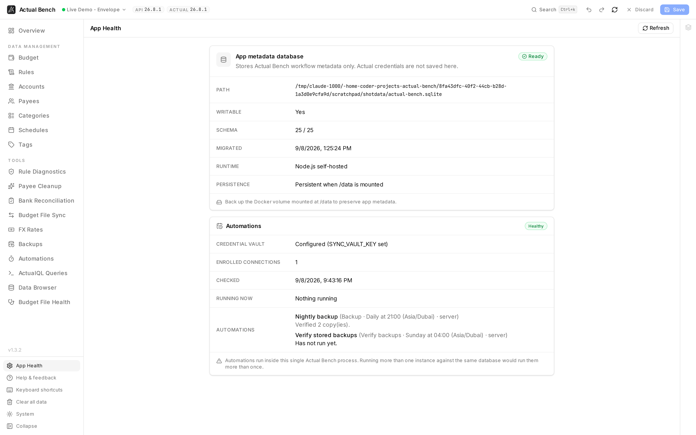

App Health reports the state of Actual Bench's metadata database, persistence, migrations, and
scheduler. It does not check your budget file; use [Budget File Health](../../user-guide/budget-file-health/)
for that. Use App Health after installation, upgrades, or when troubleshooting an operator issue.

:::note[This is about Actual Bench, not your budget]
This database is not a copy of your budget. It holds Bench's workflow data, and - if you turned them
on - the two encrypted credential stores: remembered servers and unattended sync. Neither is ever
written in plaintext. See [Work safely](../../getting-started/core-concepts/#where-data-and-credentials-are-stored).
:::

*This is Bench reporting on itself: whether its own database is reachable, whether the storage under
it is durable, and whether scheduled work can run.*

## What it reports

- **Database path** - the configured SQLite location (`ACTUAL_BENCH_DB_PATH`, default
  `/data/actual-bench.sqlite`).
- **Writable** - whether Bench can write to it. This says **Yes** or something is wrong.
- **Schema** - the current version, or `Not initialized` if the database was never created.
- **Migration status** - whether migrations are up to date.
- **Persistence** - a reminder that `/data` has to be mounted from outside. Writable is not the same as
  durable; a container's own filesystem is both writable and temporary.

## Verify a healthy install

After installing or upgrading, open App Health and confirm:

- **Writable** is `Yes`.
- **Schema** shows a version number (not `Not initialized`).
- **Persistence** reads *Persistent when /data is mounted*.

**Writable: No**, or persistence looking wrong, means the `/data` mount or its permissions need
attention. See [Installation](../../getting-started/installation/#verify-the-installation) and
[Upgrading and Backups](../upgrading-and-backups/).

## Common problems

- **Writable: No** - the container user cannot write to `/data`. Fix the mount permissions.
- **Schema: Not initialized** - the database was never created. Check `ACTUAL_BENCH_DB_PATH` actually
  points into the mounted volume.
- **Everything vanishes when you recreate the container** - `/data` is not persisted. Mount a named
  volume or a host path.

## Related pages

- [Installation](../../getting-started/installation/)
- [Upgrading and Backups](../upgrading-and-backups/)
- [Configuration](../configuration/)
