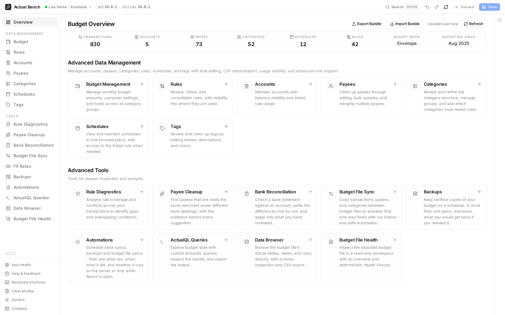

You land here after connecting. It shows a live snapshot of the budget you just opened and links to
everywhere else. Its real job is answering one question: is this the right budget? Nothing on this
page edits anything.

Open it from **Overview**, at the top of the sidebar (`/overview`).

**Write model:** read-only. The one exception is Bundle Import, which you start from here on purpose.
The counts show what the server has saved, not what you have staged.

*The snapshot row answers "am I in the right budget?" - counts, budget mode, and how long you have
been budgeting - and everything below it is the way through to the rest.*

## What the Overview shows

- **A live snapshot row** with saved-state counts for **transactions, accounts, payees, categories,
  schedules, and rules**.
- **Derived context** - the **Budget Mode** (`Envelope`, `Tracking`, or `Unidentified`) and
  **Budgeting since**, inferred from your oldest transaction date.
- **A manual Refresh** with a loading state and a last-refreshed indicator. Snapshot values switch to
  loading placeholders immediately when you switch budgets or refresh.

:::note[Overview reflects saved data]
The snapshot reads the server. A draft you left staged on another page does not show up here until you
Save it.
:::

## The navigation hub

Every workspace is one click away, so this can be where each session starts:

- Direct links to the entity pages ([Accounts](../../user-guide/accounts/),
  [Payees](../../user-guide/payees/), [Categories](../../user-guide/categories/), and the rest) and to
  [ActualQL Queries](../../user-guide/actualql/).
- Entry points for [Budget File Health](../../user-guide/budget-file-health/) and the [Data Browser](../../user-guide/data-browser/),
  which open the exported snapshot for read-only inspection.

## Whole-budget export and import

**Export** and **Import** in the page header run [Bundle Export / Import](../bundle-export-import/):
all of a budget's master data - accounts, payees, category groups and categories, tags, schedules,
rules - in or out as one ZIP. The Overview deliberately preloads nothing, so the export dialog fetches on demand and always
reflects what the server holds right now.

## Related pages

- [Connect to Actual Budget](../connecting/) - how you get here
- [Bundle Export / Import](../bundle-export-import/)
- [Budget File Health](../../user-guide/budget-file-health/) · [Data Browser](../../user-guide/data-browser/)
