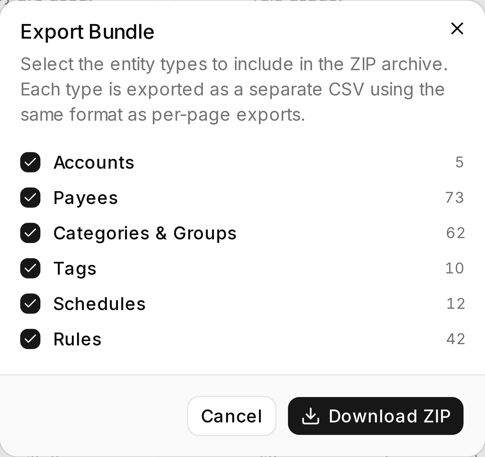

Use Bundle Export / Import to move budget structure data in one ZIP. Export a template or backup
before a large cleanup, or import a structure into another budget.

Open it from the **Export** and **Import** buttons in the [Overview](../budget-overview/) page header.

**Budget impact:** Export does not modify budget data. Import stages the bundle for review and writes
only when you **Save**.




*One ZIP, and it says exactly what is going into it before you download.*

## Why use a bundle?

Bundle Export / Import provides these functions:

- **Everything at once** - every entity type in one ZIP, each a CSV in the same format the per-page
  exports use.
- **Import in the right order** - by the time rules and schedules are read, the accounts, payees and
  categories they name are already staged.
- **One undo step** - the whole bundle stages together, and nothing is written until you Save.

## Export a bundle

1. On the Budget Overview, select **Export**.
2. The dialog lists all six entity types with **live counts** and checkboxes (pre-selected). Deselect
   any you don't want.
3. Watch for **dependency warnings** as you change the selection:
   - Selecting **Rules** without Payees, Categories, or Accounts warns that the export may not be
     portable.
   - Selecting **Schedules** without Payees or Accounts warns the same way.
4. Download to get a single ZIP, `budget-bundle-<label>-<YYYY-MM-DD>.zip`.

The dialog fetches when it opens, so what you download is what the server holds right now.

**ZIP contents:**

```
budget-bundle-<label>-<date>.zip
  ├── accounts.csv
  ├── payees.csv
  ├── category-groups-and-categories.csv
  ├── tags.csv
  ├── schedules.csv
  └── rules.csv
```

Each CSV carries the same columns as that entity's own export. The entity guides list them.

## Import a bundle

1. On the Budget Overview, select **Import** and choose a `.zip` produced by Bundle Export. Partial
   bundles (a subset of the CSVs) are valid.
2. Review the **preview** - each detected entity type with its row count, before anything is staged.
3. Confirm to stage. The order is fixed - categories, accounts, payees, tags, schedules, rules - so
   that schedules and rules find what they refer to, staged moments earlier in the same operation.
4. Read the **result summary**: staged, skipped, and any parse errors, broken down by type. The links
   take you to each entity page to look at the staged rows.
5. Click **Save** in the top bar to write everything. The entire bundle import is a **single undo
   step**.

:::caution[Bundle import stages a lot at once]
A bundle can stage hundreds of rows across six entity types in one go. Look at them before you Save.
Export the current budget before a large import so you can restore its structure if needed.
:::

## Common problems

- **A portability warning on export** - you picked Rules or Schedules without what they point at.
  Include those types, or make sure the target budget already has matching names.
- **Rows were skipped** - the per-type summary says whether it was a parse error or an unmatched
  reference.
- **Nothing changed** - the rows are staged, not saved. Press **Save**.

## Related pages

- [Overview](../budget-overview/) - where Export / Import live
- [Editing, review and save](../editing-and-saving/) - per-entity CSV import and export
