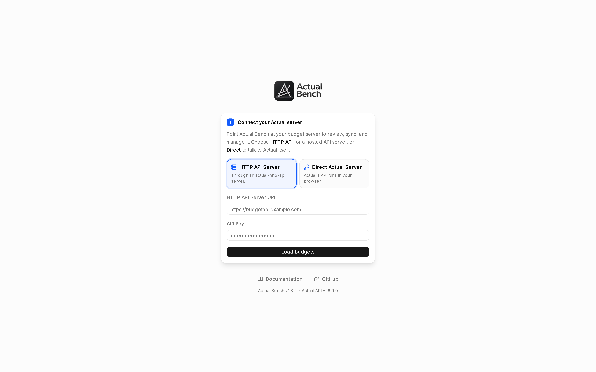

A connection does one thing: it opens a budget you already have. Most people want **Direct Actual
Server** - same URL, same password you use for Actual, then pick a budget. Choose **HTTP API Server**
if your installation already runs `actual-http-api`.

:::tip[If someone else runs Actual Bench]
Ask them which mode and which URL. None of the networking below matters to you.
:::

*Two ways in. **Direct** talks to your Actual server the way Actual does; **HTTP API** goes through
an `actual-http-api` server if your installation already has one.*

## Choose a mode

| | Direct Actual Server | HTTP API Server |
|---|---|---|
| Best fit | Most new installations | Existing `actual-http-api` deployments and unattended sync |
| You enter | Actual Server URL and server password | HTTP API URL and API key |
| Actual runs | In your browser | On the API server |
| Network path | Your browser must reach Actual Server | Actual Bench must reach `actual-http-api` |
| Unattended server sync | No | Yes, when configured |

Both modes handle encrypted budgets and every workspace. Where a mode genuinely changes what a feature
can do, that feature's guide says so.

## Connect

1. Choose **Direct Actual Server** or **HTTP API Server**.
2. Enter the server URL and the requested credential.
3. Select **Load Budgets**.
4. Choose a budget. If it is end-to-end encrypted, enter its separate **Encryption password**.
5. Select **Connect**.

Bench opens the [Budget Overview](../budget-overview/).

## Reconnect later

There are two levels of convenience here, and they are not the same thing:

- **Recent connection details** keep labels and URLs for the current tab. No secrets. Close the tab and
  you type your credentials again.
- **Remember this server** is an encrypted vault. The server credential goes into Bench's metadata
  database, locked with a passphrase you choose.

### Remember a server

1. On the budget step, select **Remember this server**.
2. Create or unlock the shared vault passphrase.
3. Connect. The server credential is encrypted and saved; an encrypted budget's password is saved
   separately for that budget.

Saved servers show up in the **Connections** list. Unlock once per restart and every remembered budget
opens without further typing. One server is stored once, however many budgets live on it.

:::caution[The passphrase cannot be recovered]
Neither the passphrase nor the key derived from it is stored anywhere. Forget it and there is no way
back in: **Reset vault** deletes the encrypted saved servers so you can start over. Your Actual
budgets are untouched.
:::

Remembered servers only survive if `/data` is persisted. If you run the installation, see
[Upgrades and backups](../../administration/upgrading-and-backups/).

## Switch between open budgets

Open budgets sit in the top-bar switcher. Each keeps its own draft and its own cache, and switching
never mixes them. Even so: look at which budget is active before you Save or Apply.

## How credentials are handled

- By default, server passwords, API keys and encryption passwords never leave browser memory.
- Recent connection details contain no secrets.
- Remembered-server credentials are opt-in, and encrypted with your passphrase.
- Unattended-sync credentials are a different opt-in again, controlled by whoever runs the server.

See [Work safely](../core-concepts/#where-data-lives) for the storage summary.

## If budgets do not load

### Direct mode

- Open the Actual Server URL in the same browser. If that fails, nothing else will work.
- Use HTTPS outside localhost.
- CORS or a same-origin reverse proxy may need configuring, which is the administrator's job.

### HTTP API mode

- Check the API URL and `ACTUAL_API_KEY`.
- With both apps in containers, `localhost` means Bench itself, not the API. Use a service name on a
  shared network, or any address that actually resolves.

Seeing only HTTP API mode means the administrator turned Direct mode off.
[Troubleshooting](../../help/troubleshooting/) goes deeper.
