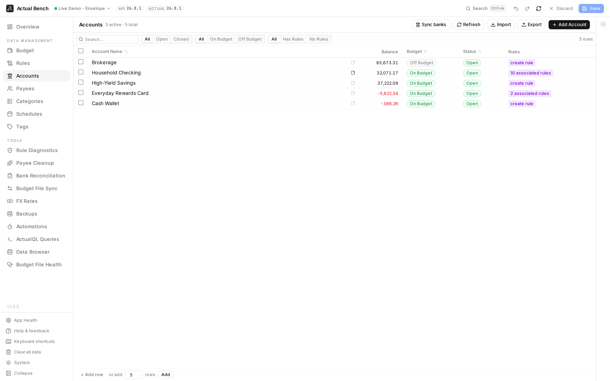

Create, rename, close, reopen and delete accounts - several at a time, with everything that depends on
them in view first. Seed a new budget. Retire a batch of old accounts. Check what points at one before
you remove it. Everyday transaction work stays in Actual.

Open it from **Data Management → Accounts** (`/accounts`).

**Write model:** stage → review → **Save**. Account notes save immediately.

*Balance, budget treatment, status and rule references on one row - so the question "what depends on
this account?" is answered before you touch it.*

It shares the [editing model](../../getting-started/editing-and-saving/) every Data Management page
uses.

## What you get beyond Actual Budget

- **Create in bulk** - paste tab-separated rows straight from a spreadsheet, or import a CSV.
- **Set a starting balance as you create it.** The Balance column stays editable while the row is
  staged.
- **Bulk close, reopen, and delete** with a single action across selected accounts.
- **See which rules reference an account** and jump straight to them.
- **Impact-aware deletion** - every close and delete shows the balance, the transaction count and the
  rule references first. A non-zero balance gets its own warning.

## Create an account

1. Select **Add Account** to open the form drawer.
2. Enter a **Name**.
3. Optionally set an **Initial Balance** (seeds the account's starting balance on creation).
4. Choose **on-budget** or **off-budget** with the toggle.
5. Save to stage the new account.

To create several at once, use the bottom **Add Rows** / paste flow - the **Balance** column is
editable there so you can set each new account's initial balance inline.

:::caution[Budget type is fixed after creation]
Actual Budget will not let an account change between on-budget and off-budget once it exists. Bench
shows it as a read-only badge afterwards. Get it right the first time.
:::

## Balances, closing, and deleting

- **Current balance** is live - aggregated through ActualQL, refreshed roughly every 60 seconds or
  when you press **Refresh**. Negative balances go red.
- Open and close accounts individually or in bulk (close, reopen).
- Deleting or closing always confirms first, with the balance, the transaction count and the rule
  count in front of you. Money still in the account gets a budget-consistency warning.

## Filter and sort

Filter by name, status, budget type, and whether any rules reference the account. Sort by name, status
or budget type. Staged rows ignore the sort and stay at the top until you Save.

## Notes

Every row has a note button beside the name. Notes render as Markdown, edit inline, and **save
immediately** - nothing to do with your staged edits.

## Import and export

Export accounts to CSV or import them (staged before saving). CSV columns:

- `name` (required), `offBudget`, `closed`.

## Common problems

- **"Can't change the account type"** - correct. It is fixed at creation.
- **A delete warns you** - read the dialog. Money left in the account affects budget consistency.
- **A new row stays highlighted** - it is staged, not saved. Press **Save**.

## Related pages

- [Editing, review and save](../../getting-started/editing-and-saving/) - the shared editing model
- [Rules](../rules/) - how rules reference accounts
