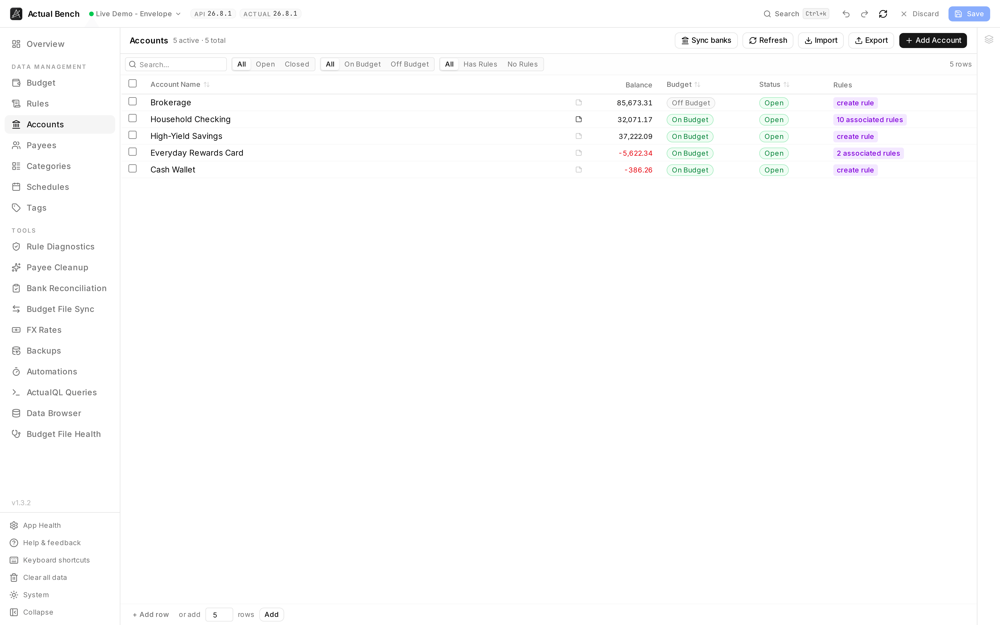

Use Accounts to create, rename, close, reopen, import, export, and delete accounts. Review balances,
transactions, and rule references before you remove an account.

Open it from **Data Management → Accounts** (`/accounts`).

**Budget impact:** Account changes remain staged for review until you **Save**. Account notes save immediately.

*Balance, budget treatment, status and rule references on one row - so the question "what depends on
this account?" is answered before you touch it.*

It shares the [editing model](../../getting-started/editing-and-saving/) every Data Management page
uses.

## What you get beyond Actual Budget

- **Create in bulk** - paste tab-separated rows straight from a spreadsheet, or import a CSV.
- **Set a starting balance as you create it.** The Balance column stays editable while the row is
  staged.
- **Bulk close, reopen, and delete** with a single action across selected accounts.
- **Organise accounts into groups** and move several accounts between them at once.
- **See which rules reference an account** and jump straight to them.
- **Impact-aware deletion** - every close and delete shows the balance, the transaction count and the
  rule references first. A non-zero balance gets its own warning.

## Create an account

1. Select **Add Account** to open the form drawer.
2. Enter a **Name**.
3. Optionally set an **Initial Balance** (seeds the account's starting balance on creation).
4. Choose **on-budget** or **off-budget** with the toggle.
5. Save to stage the new account.

To create several at once, use the bottom **Add Rows** / paste flow - the **Balance** column is
editable there so you can set each new account's initial balance inline.

:::caution[Budget type is fixed after creation]
Actual Budget will not let an account change between on-budget and off-budget once it exists. Bench
shows it as a read-only badge afterwards. Get it right the first time.
:::

## Balances, closing, and deleting

- **Current balance** is live - aggregated through ActualQL, refreshed roughly every 60 seconds or
  when you press **Refresh**. Negative balances go red.
- Open and close accounts individually or in bulk (close, reopen).
- Deleting or closing always confirms first, with the balance, the transaction count and the rule
  count in front of you. Money still in the account gets a budget-consistency warning.

## Account classes

Each account can be given a class, so Bench features know what kind of account it is.

- **Assets:** Cash, Bank, Investment, Property, Vehicle, Receivable, Other Asset.
- **Liabilities:** Credit Card, Loan, Payable, Other Liability.

Click an account's **Class** cell and choose a class, or **Unclassified** to clear it. A class is a label
only. It is separate from the type and subtype Actual keeps on its own accounts, it never changes balances,
transactions, budget mode or transfers, and it is never written to Actual. Classes are saved in Bench for the
open budget straight away, so they do not wait for **Save** and are not part of **Undo**.

**Set a class on a group.** In the **Manage Groups** dialog, choose a class for the group. Its accounts then show
that class as **Inherited** and cannot change it; change the group instead. If some of those accounts already
have their own class, Bench lists them and asks you to confirm, because the group class replaces theirs.
Moving an account out of the group does not bring a cleared class back.

Each class has an icon next to its name. New accounts and groups that are not saved yet cannot be given a class
until you **Save**. Use the **Class** filter, including **Unclassified**, to find accounts that still need one.

**Classify several at once.** Select the accounts and choose **Set class…** in the selection bar. Accounts that
inherit a group class and accounts that are not saved yet are left unchanged; Bench tells you how many.

Click the **Class** header to sort: assets first, then liabilities, then unclassified accounts.

## Account groups

Account groups are named collections that Actual shows together in its sidebar. Bench supports them
on Actual 26.9 or later; on an older server the Group column and controls do not appear.

- **Assign an account:** click its **Group** cell and choose a group, **No group**, or **New group…**.
- **Move several at once:** select the accounts, then use **Move to group…** in the selection bar.
- **Manage groups:** select **Manage Groups** in the page toolbar to create, rename, or delete groups. Names
  must be unique, ignoring case.
- **Deleting a group** keeps its accounts - they become ungrouped. The dialog says how many are
  affected first.

Like every other account edit, group changes are drafted and written only when you **Save**, and
**Undo** reverses them. New groups are created first, then accounts, and deleted groups last.

Groups cannot be reordered from Bench: Actual's API does not allow it. Reorder them in Actual itself.

:::note[HTTP API mode]
In HTTP API mode your `actual-http-api` must expose the `/accountgroups` endpoints (the release for
Actual 26.9 or later does).
:::

## Filter and sort

Filter by name, status, budget type, whether any rules reference the account, and group. Sort by name,
status, budget type, group or class. Staged rows ignore the sort and stay at the top until you Save.

## Notes

Every row has a note button beside the name. Notes render as Markdown, edit inline, and **save
immediately** - nothing to do with your staged edits.

## Import and export

Export accounts to CSV or import them (staged before saving). CSV columns:

- `name` (required), `offBudget`, `closed`.
- `group` (optional, account groups only) - the group's name. A name that matches no existing group
  stages a new one. On a server without account groups the column is ignored.

Exported files include the `group` column when the server supports groups, and a trailing `class` column once
account classes have loaded (an inherited class is exported too). Import ignores the `class` column: a class
can only be saved on an account that already exists, so set classes after you **Save**.

## Common problems

- **"Can't change the account type"** - correct. It is fixed at creation.
- **A delete warns you** - read the dialog. Money left in the account affects budget consistency.
- **A new row stays highlighted** - it is staged, not saved. Press **Save**.

## Related pages

- [Editing, review and save](../../getting-started/editing-and-saving/) - the shared editing model
- [Rules](../rules/) - how rules reference accounts
