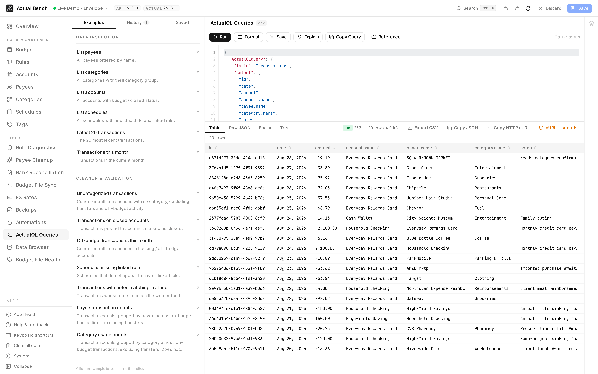

Actual's own query language, run against your budget, with the answer as a table, raw JSON, a single
value or a tree. Bring a precise question no report answers - a specific slice of transactions, a
monthly aggregate, a check on a cleanup you just did. You will be writing JSON, so start from an
example rather than an empty editor.

Open it from **Tools → ActualQL Queries** (`/query`). It works in both connection modes.

**Write model:** read-only. Queries see saved server state, not unsaved drafts.

*Examples on the left, the query in the middle, the answer underneath - with how long it took, how
much came back, and a button for each way you might want to take it away.*

## Get an answer quickly

1. Open **Examples** and choose the closest question.
2. Adjust its table, fields, filters, or dates.
3. Select **Explain** to check your intent without running it.
4. Select **Run**, then choose Table, Raw JSON, Scalar, or Tree.
5. Save a useful query or export the result.

## What ActualQL is

ActualQL is Actual Budget's query language. It is **JSON**, not SQL. Here it only ever reads.

## Open the workspace and understand the editor

- A syntax-highlighted JSON editor with line numbers. It does not autocorrect anything you type.
- Both shapes work: a bare query object, or the `{ "ActualQLquery": ... }` wrapper `actual-http-api`
  uses.
- Drag the divider between editor and results. It stays where you put it.

## Run and format a query

1. Type or paste a query.
2. Select **Run** (or press `Ctrl/Cmd+Enter`).
3. Use **Format JSON** to tidy the query.

Parse errors appear inline, before anything is sent. **Lint warnings** catch the shapes that usually
mean a mistake: a wide-open `transactions` query with no `limit`, `groupBy` or `calculate`; an empty
`$oneof`; a `groupBy` with nothing to aggregate.

## Use built-in examples and reference

- **ActualQL Reference** - a six-section quick reference (basics, filter operators, joined fields,
  aggregates, transactions options, and copyable snippets).
- **Example packs** - one-click inserts grouped into Data inspection, Cleanup & validation, Aggregation,
  and Targeted subset.

## Understand result views

Select a result view via tabs:

- **Table** - one column per key found anywhere in the rows, nested values stringified, capped at 500
  rows with a banner saying so. Dates read as dates. `amount` and `balance` show as decimals, with the
  raw integer on hover.
- **Raw JSON** - the full syntax-highlighted payload.
- **Scalar** - a large value card for `calculate` aggregate results.
- **Tree** - a collapsible JSON tree, auto-selected for plain-object results.

An execution metadata bar shows an OK / Error chip, elapsed time, row count, and payload size.

## Explain a query

**Explain** describes the query back to you in English - which table, which filters, the grouping, the
aggregation, the order, and whether you will get a table or one number. It does not run anything.

## Save, pin, and reuse queries

- **Save** a query under a name. Saved queries live in the Bench database and follow you to **every
  budget** on the instance - not one browser, not one budget. Load, rerun, duplicate, rename, delete,
  pin. Queries from an older version, which lived per-budget in your browser, are imported the first
  time you open the page.
- **History** keeps the last 10 queries you ran, per budget. Run one again and it moves to the top
  instead of appearing twice.

## Export and copy results

- **Copy result JSON** and **Copy query JSON** are available in all modes.
- In **HTTP API Server** mode you can also copy **sanitised cURL**, with placeholders where the secrets
  were, or **full cURL**, which is opt-in and labelled. Either is built from the last request you
  actually sent, not from whatever is in the editor now.

:::caution[Full cURL contains real credentials]
Full cURL contains your API key. Copy it when you need it, and do not paste it anywhere public.
:::

## Staged changes and query results

With a draft open, a banner reminds you that results come from **saved** server state. Your pending
edits are not in them.

## Practical examples

Use the example packs. They cover transactions, accounts, payees, categories, monthly spending, budget
status and rules, and they are kept current with the app.

## Mode differences

- ActualQL runs in both Direct and HTTP API Server mode.
- **cURL generation is HTTP API Server-only**, because it targets `actual-http-api`'s `/run-query`
  endpoint.

## Troubleshooting

- **Invalid JSON** - the inline error points at the character. Fix it and run.
- **Unsupported query** - check the lint warnings and the ActualQL Reference.
- **Empty result** - check your filters and your date range.
- **The table view is useless** - try Tree or Raw JSON.
- **Results look stale** - they show saved state. Save your draft first.
- **No cURL button** - you are in Direct mode. cURL only exists for HTTP API Server.

## Related pages

- [Rules](../rules/)
- [Budget File Health](../budget-file-health/) · [Data Browser](../data-browser/) - the same data from an exported snapshot
- [Connect to Actual Budget](../../getting-started/connecting/)
