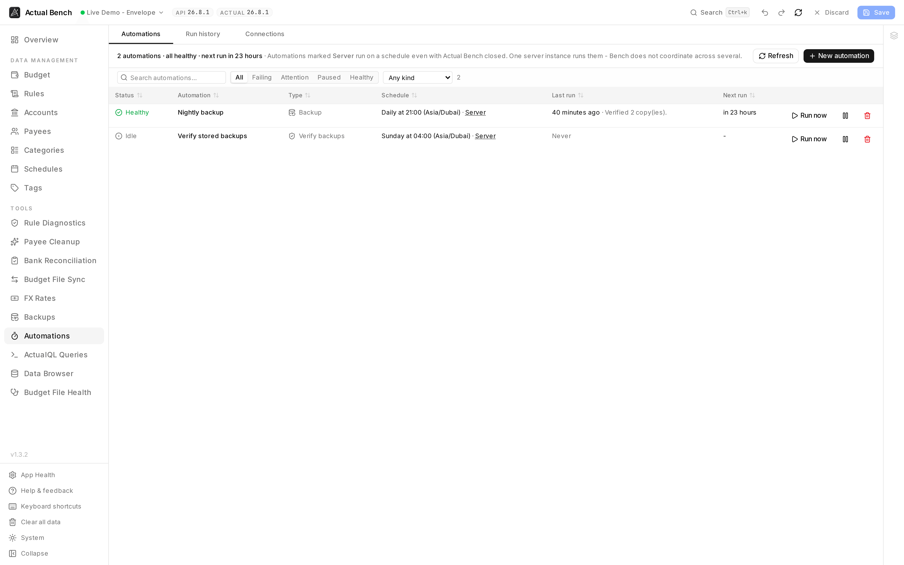

Use Automations to schedule bank syncs, backups, backup verification, and safe budget-file syncs.
The page also shows each run, its outcome, duration, retries, and redacted log.

Open it from **Tools → Automations** (`/automations`).

**Budget impact:** An automation follows the budget-impact rules of its job. It also saves run history,
duration, outcome, and a redacted log in Actual Bench.

*Each row shows the job, schedule, next run, and most recent result.*

:::note[Not Actual's Budget Automations]
Actual Budget has an experimental feature of its own called Budget Automations. This is a different
thing: Bench's own scheduled jobs, which Bench runs. It does not drive Actual's feature.
:::

## What can run on a schedule

| Kind | What it does | Set up in |
|---|---|---|
| **Bank sync** | Asks Actual to pull new transactions from the banks you connected to it | [Bank Sync](../bank-sync/) |
| **Backup** | Takes a verified copy of your budget and of Bench's own settings | [Backups](../backups/) |
| **Budget file sync** | Runs a saved sync flow, safe items only | [Budget File Sync](../budget-sync/) |
| **Verify backups** | Re-reads stored copies to check they are still readable | created with your first backup rule |

**New automation** on the Automations page lists all of them and takes you to where each is
configured. A backup and a sync flow are set up in their own screens because that is where the
decisions live; what they share is the engine that runs them.

## Check where an automation runs

Every automation says **where it runs**, on its own row:

| | |
|---|---|
| **Runs on the server** | Runs on schedule even with Actual Bench closed. Needs HTTP API mode and a budget enrolled for unattended access. |
| **Runs in your browser** | Runs only while Bench is open in a tab. Close it and nothing happens. This is a convenience, not automation. |

Direct mode runs in a browser and cannot run unattended after the browser closes.

**One instance only.** The engine runs inside the Bench server process. Running two containers
against one database would run your automations twice; Bench does not coordinate across instances.

## Unattended access

Anything that runs with the browser closed needs credentials the server can use, which means two
things: `SYNC_VAULT_KEY` set on the server, and the budget itself **enrolled**.

The **Connections** tab lists the budgets Bench may act on, when each was enrolled, and - the column
worth the tab - **what depends on it**. Withdrawing a credential stops those automations, so the
confirmation names them before it happens.

Two things to expect:

- Enrolment is **per budget, not per server**. Three budgets on one server are three entries.
- Bench can only enrol the budget you are **currently connected to**, because that is the only API
  key your browser holds. Any other budget says so and asks you to switch to it first.

You can enrol from Connections, from the bank sync or backup dialogs, or from a Budget File Sync
flow - all four write the same list.

:::caution[What gets stored]
That budget's API key, and its encryption password if it has one, encrypted with the server's
`SYNC_VAULT_KEY`. The key itself is never stored beside them. Nothing else is kept: no budget data,
and no other budget on the same server.
:::

## Schedules

Choose an interval, a daily, weekly, or monthly schedule, or a cron expression.

Whatever you pick, the picker says back **what it understood** and **when the next runs land**. That
second line is the one that catches mistakes: `0 0 * * *` reads like a fair guess at midnight until
the preview shows the next run is fourteen hours away.

Clock-based schedules carry an explicit **time zone**. Daylight saving is handled deliberately: a
time that does not exist on a spring-forward day runs as the gap closes, and a time that happens
twice on a fall-back day runs **once**.

## Run history

**Run history** shows every run across every automation, filtered by outcome first - *what failed?*
in one click - then by automation and kind, and searchable by the line a run reported. Each run
expands to its result, its duration, any retries, and a redacted log.

An automation's own drawer keeps the newest ten runs, which is enough to answer "is this healthy".

## Stopping a run

Each run happens in a worker thread of its own, with its own memory limit, so one run cannot slow
down or take down the rest of Bench.

- **Every kind of automation has a time limit:** budget file sync 20 minutes, bank sync 10, backup 60,
  verify backups 30. At the limit the run is asked to stop. If it has not stopped 10 seconds later,
  its thread is ended.
- **Cancel** appears on an automation's row while it is running, and stops it the same way.
- **A run that runs out of memory ends alone.** It reports "Ran out of memory"; the server and any
  other runs carry on. Your operator can raise the limit (see
  [Configuration](../../administration/configuration/#automation-workers)).

What a stopped run is called depends on how far it got:

| Stopped while... | Shown as |
|---|---|
| Only reading | **Failed**, or **Cancelled** if you pressed Cancel |
| It may already have changed something: applying a sync, pulling from a bank, writing a backup | **Stopped, may have made changes** |

**Stopped, may have made changes** is never retried automatically, because repeating a write could
duplicate it, and it does not count toward auto-pause. Check the budget or backup destination before
relying on what that run did. The next scheduled run goes ahead as normal.

A run that finishes its work just as the time limit passes is recorded as finished.

## When something fails

Bench treats a failure as information, not an emergency:

- **Backoff.** Attempts space out after a failure, up to a ceiling, so a broken job stops hammering
  whatever it cannot reach.
- **Auto-pause.** After a run of consecutive failures the automation pauses itself and says why.
  **Resume** clears both the pause and the streak. Editing a schedule does not clear a pause.
- **Overdue is a warning.** An automation well past its next run is flagged even when nothing failed.
- **Busy is not failure.** If the maximum number of runs is already going, a scheduled run waits for
  the next minute and does not count toward the streak.
- **Fail closed on credentials.** An automation that names a credential it cannot resolve - vault off,
  key rotated, enrolment withdrawn - does not run at all, and pauses with that reason.

What counts as a failure is the job's own judgement, and the two answers differ on purpose. A backup
that reached one of two destinations is reported as partial but does **not** count against the
streak: pausing it would stop the copies that were still working. A scrub that finds a damaged copy
**does** count - repeating it will not improve matters, and someone should look.

## Pausing and deleting

**Pause** stops an automation running and keeps everything else - its schedule, its history, its
credentials.

**Delete** removes the automation *and its run history*. What the automation produced is untouched:
backups stay in their destinations, synced transactions stay in the budget. Only the record of the
runs goes.

That is why deleting a **backup rule** does not always delete its automation. If the automation has
never run, it is removed with the rule. If it has history, it is paused with an explanation instead,
so the record of backups that actually happened survives the rule that made them. Delete it yourself
from this page when you no longer want that record.
