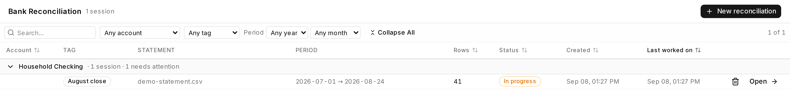
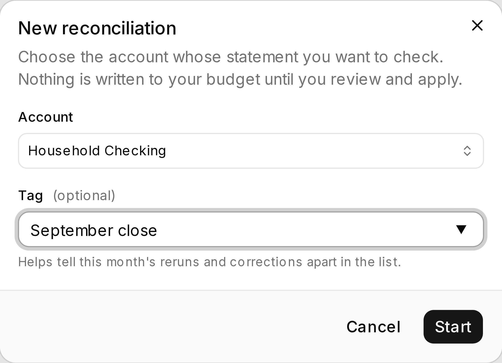
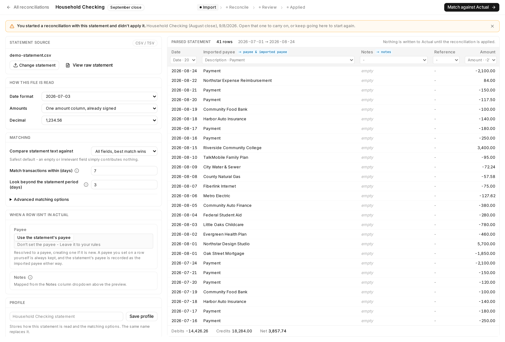
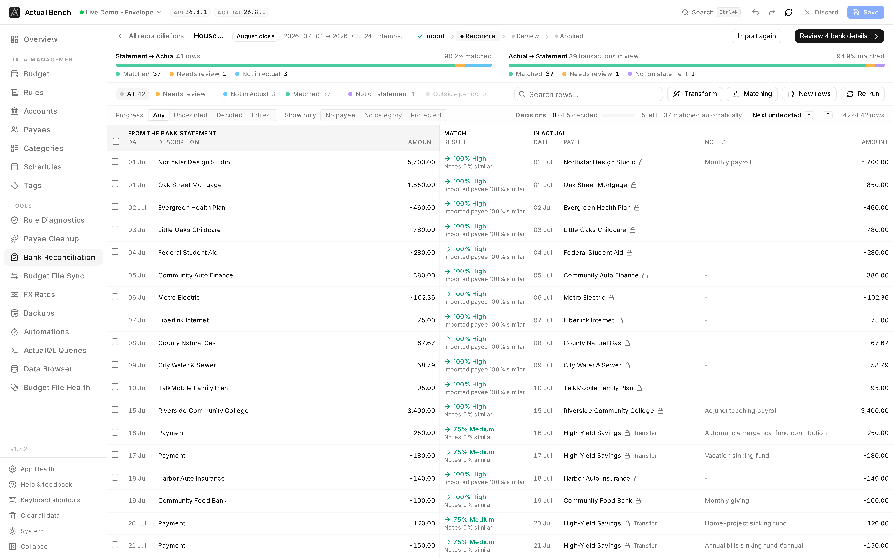
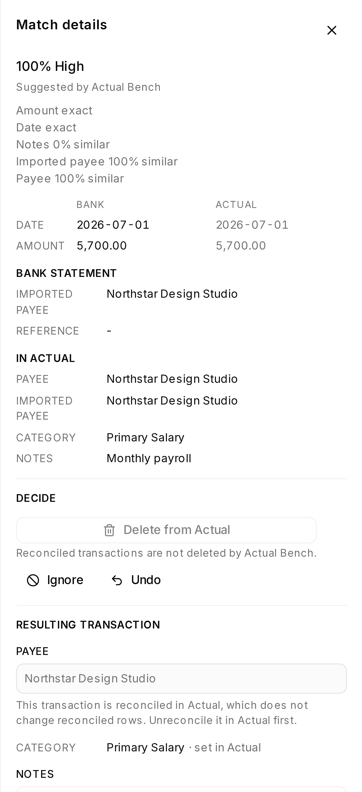
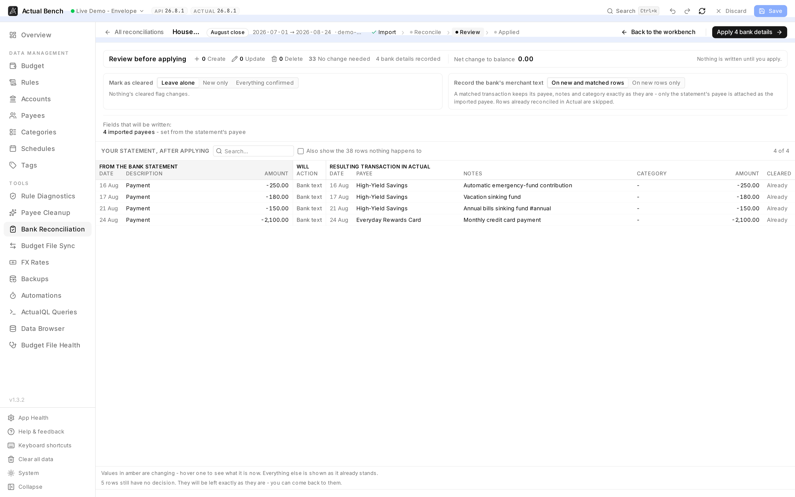

Your bank says one thing and your budget says another. **Bank Reconciliation** puts the two side by
side, row by row, and proves whether they agree — then writes only the differences you approved.

Come here when bank sync is unavailable, when a period needs auditing before you close it, or when
you suspect transactions are missing, duplicated, or wrong. It complements Actual's everyday import;
it does not replace routine transaction entry.

Open it from **Tools → Bank Reconciliation** (`/reconciliation`).

**Write model:** decide → review → **Apply**. Nothing is written before Apply. Categories are never
read or written by this workflow.

## What you need

- A **statement file** from your bank: CSV/TSV, OFX/QFX, or QIF. The format is recognised from the
  file's own content, not its name, so a `.txt` holding an OFX export still reads as OFX.
- One **account** in Actual to compare it against. A session covers one account.
- Nothing else. No bank connection, no credentials, no setup.

## The workflow in five steps

1. **Start** a session for one account and optionally give it a memorable tag.
2. **Import** the statement and confirm how its columns were read.
3. **Reconcile** each row: accept a match, choose another candidate, create a missing transaction,
   correct an amount, delete a duplicate, or leave it undecided.
4. **Review** the exact writes, the balance effect, and the two choices that govern them.
5. **Apply**. Actual Bench re-reads affected transactions first, writes what is still safe, and keeps
   failures available for retry.

Sessions survive closing the tab, so you can stop between any two steps. Once applied, a session
becomes an audit record and will not offer the same writes again.

:::note[Reconciliation does not touch categories]
It never reads, stages, or writes a transaction's category. Categorisation belongs in Actual, where
your rules and your own judgement live. A reconciliation that quietly blanked categories would undo
work this tool has no business undoing.
:::

## Your reconciliations

The sidebar lands here: every session you have started, grouped by account, with its statement,
period, row count and status.

*An account heading counts its sessions and how many still need attention. **Open** resumes a session
exactly where you left it.*

Accounts with work outstanding are expanded; an account whose sessions are all applied is collapsed.
Search, and the account, status, tag, year and month filters, narrow the same table — filtering
reveals matching groups automatically, so an applied result never hides inside a collapsed account.

## Start a session

**New reconciliation** asks for two things: the account, and an optional tag.

*The account is what the statement gets compared against, and it cannot be changed afterwards. The
dialog says plainly that nothing is written until you review and apply.*

The **tag** is worth using — `July close`, `after the refund`, `Q3 audit`. With several sessions
against one account, reruns and corrections are otherwise told apart only by timestamp. Tags are
suggested from ones you have used before, can be edited in place from the list, and can be filtered
on. They are free text and deliberately separate from your budget's own tags: disposable notes about
the reconciliation, not data about your transactions.

## Where a session is up to

Every screen carries the same header: the account and statement period, the tag, and a progress trail
— **Import › Reconcile › Review › Applied**. Steps already reached are ticked, and you can click back
to any step the session has actually been through.

The trail reflects the **session's own status**, not the screen you happen to be on, so opening the
workbench of a finished reconciliation still says Applied. A run that partly failed says *Applied
with problems* rather than pretending otherwise.

Once applied, the work a session wrote is excluded from any new plan. It will not offer to apply
itself twice, and a partial run goes on offering exactly what failed — nothing more. The Review page
stays readable as an audit, but its two write choices are disabled: they show what Apply used, not
controls that could rewrite history after the fact.

**Re-running the match is refused on an applied session.** Matching rebuilds the rows from scratch,
and the record of what was written is tied to them — re-running would lose it and offer the same
transactions again. To check the account after applying, start a new reconciliation: it reads Actual
as it stands *now*, which is what you actually want to compare against.

## 1. Import a statement

Paste the statement, or upload a **CSV/TSV**, **OFX/QFX** or **QIF** file. The format is recognised
from the file's own content rather than only its name, so a `.txt` holding an OFX export is still
read as OFX - and, as in Actual itself, `.qfx` goes through the OFX path.

### The import workbench

*Everything about how the file is read is on the left; the result of reading it is on the right. The
banner is the duplicate-statement warning described below.*

On desktop, configuration stays in a compact left pane and the **complete parsed statement** fills
the right. The statement rows have their own scroller and sticky header; totals stay visible outside
that scroller. There is no eight-row preview cap and no pagination hiding the rest of the file.

For CSV/TSV, each mapping control sits directly above the normalized column it feeds, so changing a
mapping changes the values immediately below it. Debit and Credit each get their own selector when
the statement uses separate amount columns. Structured formats omit the mapping row because OFX/QFX
and QIF define their fields themselves.

After a statement parses successfully, its source collapses to the file name and detected format to
leave room for configuration. **Change statement** replaces it; **View raw statement** opens the
original contents without expanding the whole page.

### Choose how missing rows will be created

Before matching, **When a row isn't in Actual** chooses the starting values for a transaction that
will need to be created:

- **Payee** - **The statement's payee**, resolved to a payee and created if it is new, or
  **Actual's rules**, which writes no payee and lets your rules set it on the way in.
- **Notes** - two independent switches: use the statement's memo, and also include the statement's
  payee. Tick both to keep them both, separated by a dash; untick both to leave notes empty.

On a **CSV** there is no notes control at all - the Notes column you mapped over the preview is the
decision, exactly as in Actual. Leave that column unmapped for empty notes, or map the same source
column to both Imported payee and Notes to carry the payee text into the notes as well.

The **Notes** column in the preview shows what each row will actually carry, and its header says
where the column is headed - `→ memo + payee`, `→ memo`, `→ payee`, `not written`, or `→ notes` on a CSV. Change a
switch and the table answers, so the setting is never a guess.

These choices happen before matching because the notes source is an input to transformations. After
matching, the same choices remain available from **New rows** on the Reconcile toolbar. If you have
already edited or transformed a row's notes, that row keeps what you set when the source changes.

Where the statement has a payee, it is still recorded as the imported payee in every option.

### The two text channels

A bank statement carries up to two pieces of text per transaction, and they mean different things:

| The bank calls it | Actual Bench calls it | Where it ends up |
| --- | --- | --- |
| `NAME` (OFX) · `P` (QIF) · the merchant/description column | **Imported payee** | Actual's `imported_payee`, and the candidate a Payee is resolved from |
| `MEMO` (OFX) · `M` (QIF) · a memo/details column | **Notes** | Actual's `notes` |

Keeping them apart is the point. A statement that supplies both no longer has to throw one away, and
the same normalized shape comes out whichever format went in - so matching, deciding and applying
behave identically for a CSV and an OFX file.

For **CSV/TSV**:

- The **delimiter** is detected by which candidate produces a consistent column count, not by which
  character appears most often - a description full of commas does not turn a semicolon-delimited
  file into a mess.
- A **header row** is recognised by the absence of a usable date and amount, so a statement without
  headers still parses.
- **Column mapping** is detected, including the common layout where outflows sit in their own
  **Debit** column and inflows in a **Credit** column. A statement like that is not read as a list of
  positive amounts.
- A **Notes / memo** column is detected separately from the description column, and never claimed as
  both. Ambiguous headers such as *Narrative* and *Details* go to the description, since that is the
  channel a statement's single text column normally belongs to.
- The description/payee column can also be left **unmapped**, for a statement whose one text column
  is genuinely a memo. Nothing is then recorded as the imported payee, no payee is resolved from the
  statement, and matching compares the notes column instead - the panel says so when you do it. The
  **date** column, by contrast, cannot be unset: a row without a date can be neither matched nor
  created.

QIF files also get their **date format detected** from the dates in the file, the same way a CSV date
column does - QIF states no date convention of its own, so a Quicken export writes whatever the
machine that produced it uses, including its `8/12'26` apostrophe form. OFX needs no detection: its
dates are unambiguous by definition.

Where a file's dates could genuinely be read either way round - every day of the month being 12 or
under, so `03/07` is either the 3rd of July or the 7th of March - the panel says so and asks you to
check the preview. Nothing in the data can settle that, and guessing wrong mis-dates every row.

For **OFX/QFX and QIF**, the file states the split itself, and two repairs are offered for banks that
get it wrong:

- **Use the memo as a fallback for empty payees** - the memo becomes the payee, and is then *not*
  available as a note for that row. Duplicating the same text into both fields merely because the
  bank left `NAME` blank is noise, not provenance. The import screen says how many rows this
  affected, so an empty note is never a surprise.
- **Swap the payee and memo** - some banks put the real merchant in the memo field.

Foreign-currency rows keep the **original amount and currency** the bank printed, alongside the
converted amount that actually posted - read from whichever text channel the bank printed it in.

Amounts are handled as integer minor units end to end - never through floating point - so nothing
drifts by a cent.

:::note[Bank transaction ids]
OFX files carry a `FITID` per transaction. It is kept as statement metadata and used as **matching
evidence** against transactions Actual imported from your bank. It is deliberately *not* written as
Actual's `imported_id`: that field holds Actual Bench's own deterministic marker, which is what makes
retrying a partly-applied reconciliation safe.
:::

### Importing the same statement twice

If the rows you are importing have been imported before, Actual Bench says so — naming the earlier
session and when it was created. That is the amber banner in the screenshot above. It matches on the **rows themselves**, so a statement pasted one
month and uploaded the next is still recognised, and re-sorting it in your banking app does not
disguise it.

This is a warning, not a block. Re-importing is a legitimate thing to do: after a partial apply, or
to redo a month with a corrected column mapping. Matching always reads what is in Actual *now*, and
anything already applied is recognised and skipped.

### Reconciliation profiles

Save how a statement is read - column mapping, date and amount conventions, payee/memo handling - and
the matching options for an account as a **profile**, and apply it next month in one click.
Statements from the same bank rarely change shape.

## 2. Matching

Matching is deliberately conservative, and the reason is worth stating: **an exact signed amount is
required for an automatic match**. Text never *finds* a match - it only ranks the candidates an amount
has already produced. That is what makes every result explainable.

### Choose what the text is compared against

The statement's payee is what gets compared - its memo is used only when the bank left the
merchant field empty. Where that text lives in Actual differs from person to person, so you choose
what it is compared against:

| Target | Compared how | Typical use |
| --- | --- | --- |
| **Payee** | Symmetric | A curated payee list, where a length mismatch is real evidence |
| **Imported payee** | Symmetric | The raw merchant text Actual stored at import |
| **Notes** | Containment | Notes written by an automation that captured the bank's text |

Enable any combination, give each a priority and a weight, and choose whether to score every enabled
target and take the best (*best of*) or walk them in priority order and take the first that clears a
threshold (*priority first*).

Notes are compared by **containment** rather than similarity because the bank's text may sit inside a
longer note next to your own words - and, just as often, the note is *shorter* than the statement's
text because the automation captured only part of it. Containment is checked in both directions for
exactly that reason.

### Guards that stop bad matches

- **`#tags` in notes are ignored** when comparing, on by default. Automation-written notes routinely
  begin with a workflow tag that is not part of the bank's text, and comparing it dilutes every score.
- **Short or generic text is refused as evidence.** `FEE` or `PAYMENT` would otherwise match a large
  fraction of an account. Text that appears in most of the candidate window carries no information and
  is treated as carrying none.
- **Close calls are asked, not guessed.** When the runner-up is nearly as good as the winner, you get
  the choice - unless the text plainly separates them, in which case asking would waste a decision the
  data has already made.

### Things it surfaces rather than decides

- **Amount differs.** The text plainly matches but the amounts do not. This is a conflict for you to
  settle, never an automatic match - but staying silent about a pair that is obvious to a human would
  leave you to find it by hand.
- **Foreign-currency rows.** A purchase abroad carries two amounts, and Actual may hold either. The
  original-currency amount is tried as a second exact key, with text corroboration required.
- **Likely duplicates.** The same thing recorded more than once in Actual. This is a *count* mismatch
  - one statement row, two transactions - not a matter of resemblance.

## 3. Decide each row

*Coverage is reported in both directions, every automatic match shows how confident it is and why,
and the decisions counter tracks what is left for you.*

Coverage names both questions it answers: **Statement → Actual** shows how much of the statement has
a counterpart, while **Actual → Statement** shows how much of the loaded account window the statement
explains. Decision progress and **Next undecided** stay in the table toolbar. **Matching** opens its
options in a popover, so checking or changing a tolerance does not push the comparison table off the
screen; choose **Re-run** explicitly when you want those options applied.

For every row you can:

- **Accept** the match, or **pick a different candidate** - the ones you did not pick stay available.
- **Create** the transaction in Actual.
- **Delete** a duplicate, keeping the one you want.
- **Correct an amount** in place, so the transaction's id, notes, payee, and any schedule or transfer
  link survive. Nothing you wrote is destroyed to fix a number.
- **Leave it for later.** Rows with no decision are untouched by Apply.

Selecting a row opens a details panel. Date and amount are shown **once, with both readings side by
side**, and any difference is marked and quantified — "2 days later", "−12.50" — rather than left
for you to work out from two separate lists. Foreign-currency rows also show the original amount the
bank printed.

*The panel says what a decision would do, and when it will not do it. Here the row is both reconciled
in Actual and one leg of a transfer, so deleting it is refused and the reason is given.*

Staged changes show what the value was and where the new one came from. A bulk transformation never
overwrites a value you edited by hand unless you say so. Transfers, split parents, and rows already
reconciled in Actual are protected from changes that would break them.

### Transforming notes

A transformation can be applied to many rows at once and previewed before it is staged:

- **Tags** - add, remove, replace, or move a tag to the front or back of the note.
- **Text** - append or prepend a fixed string.
- **Extend the merchant name to the statement's description.** Where the note says
  `ROYAL CATERING SERVICE` and the statement says `ROYAL CATERING SERVICE ABU DHABI UAE`, only the run
  of words that came from the bank is replaced - a leading `#2026-08` tag and a trailing
  `| dinner with Ahmad` both survive. Where no such run can be identified, the note is left alone and
  you are told why, rather than guessed at.

## 4. Review

*The last screen before anything is written. Here nothing is created, updated or deleted — 34 rows
need no change, four get the statement's payee recorded, and the balance moves by 0.00.*

The review screen shows, statement row by statement row, what each will look like in your budget
afterwards. Changed values are marked and carry their previous value. The Action column distinguishes
what kind of write is planned:

- **Bank text** in a neutral tone means only the imported payee is being filled.
- **Update + bank text** means a staged change and the provenance write travel together.
- If an imported payee already exists and will be replaced, the row turns amber and shows its
  previous value.

It also states:

- **The effect on the account balance** - created transactions, less deleted ones, plus the difference
  on any corrected amount. A reconciliation that moves money is something to agree to knowingly.
- **What gets marked cleared** - nothing, only new transactions, or everything the statement confirms.
  The last option turns matched rows that needed no write into writes, so the change count reflects it
  honestly.
- **What the statement fills in** on a transaction being created. The Payee and Notes choices made
  during Import are stated here rather than changed after transformations have already used them.
- **Whether matched transactions gain the statement's payee** - **On new and matched rows** or
  **On new rows only** - see below.

### What actually gets written

Actual keeps three separate facts about a transaction, and so does this feature:

| Field | What it holds |
| --- | --- |
| **Imported payee** | The statement's own payee text. Provenance: what your bank called this transaction. |
| **Payee** | The payee *you* keep - an Actual payee entity, curated, renameable, and the thing your reports group by. |
| **Notes** | The bank's memo, your own words, workflow tags. |

They are not alternatives to one another, so you are not asked to choose between them:

- **A created transaction records the statement's payee as its imported payee** - wherever the
  statement has one, whichever
  payee you end up with, whether a rule changes it, and whether or not you also copy the text into
  the notes. There is no setting for this, because there is no sensible reason to throw the bank's
  own text away.
- **Payee on a new transaction**: resolve the statement's payee into a payee (creating one if it is new),
  or leave it unset for your rules to decide. A payee you set on a row yourself always wins.
- **Notes on a new transaction**: the statement's memo, its payee, both (a deliberate
  duplicate, for rules that read the notes), or neither.

The Payee and Notes sources are chosen during Import, before matching and transformations, and are
summarized read-only on Review. To change them after matching, go back to Import or use **New rows**
on the Reconcile toolbar; notes already staged on a row remain untouched.

### Matched transactions keep what you curated

When a statement row matches a transaction you already have, its **payee, notes and category are left
exactly as they are**. What can be added is the statement's payee as the imported payee - the same
thing Actual's own bank import does on a match, and the reason the field exists.

That is still a write, so it is reported as one. But it is counted and named separately: Review and
Apply can say, for example, **3 changes · 126 bank details**, and **Fields that will be written**
names the imported payees as values set from the statement's payee. The Applied result keeps
the same distinction.

Rows already reconciled in Actual are skipped, and a row whose imported payee already matches is not
written to at all. **Record the statement's payee** defaults to **On new and matched rows**. Choose
**On new rows only** when this Review should leave matched transactions' existing imported payees
alone. If you return to Reconcile, the choice resets to the default; **Mark as cleared** and the
new-row Payee/Notes choices are left alone.

Once Apply starts, **Record the statement's payee** and **Mark as cleared** are disabled. On a
reopened applied or partially applied reconciliation, they show what was executed and cannot be
changed.

## 5. Apply

Apply first re-reads every affected transaction. Safe rows are written, changed or conflicting rows
are held back, partial successes are recorded honestly, and **Retry what failed** attempts only the
unfinished work.

### The drift check

A session outlives the state it was built from, and Actual does not stand still in the meantime. So
**immediately before writing, every row the plan touches is re-read** and compared against what the
session saw when it loaded. Three things can happen:

- **A note you edited in Actual.** The staged change is *replayed onto the current text* rather than
  replacing it. If the session staged `#One` → `#Two` and you appended `| Manual text` in Actual, the
  result is `Imported #Two | Manual text` - both changes survive.
- **An amount or date corrected in Actual.** An update carries these fields whether or not it is
  changing them, so a stale copy would quietly revert your correction. Instead the live value is kept,
  and you are told it happened.
- **Anything that cannot be reconciled safely** - a payee changed on both sides, a note whose words no
  longer support the staged change, a transaction deleted or reconciled in Actual. These rows are
  **held back and reported**. Nothing is written on that first press; press Apply again to write the
  rest and come back to them.

### Writing

Created transactions carry a **deterministic marker** derived from the session and the statement row,
so retrying after a partial failure never creates the same transaction twice - even if this session's
own record of the run was lost with a closed tab. Updates and deletes are written in a single batched
call where the transport supports it.

A partial failure is reported as a **partial success**, not rounded down to a failure. The session
survives it, and **Retry what failed** re-attempts only what did not succeed.

The outcome is stored with the session, so it stays readable afterwards. Reopen a finished
reconciliation and **What was applied** lists every write - including **Bank text** separately from
curated-data updates - with what it did, which transaction, and whether it was written now or
recognised as already done, alongside anything that failed. A reconciliation you did last month is
still auditable this month.

### Rules on created transactions

Actual's rules **do** run on transactions as they are created, so a created row's payee or category may
end up different from what the review screen previewed. That is Actual doing its job, not the
reconciliation losing your choice - but it is worth knowing before you compare the two afterwards.

### The check afterwards

Once the writes are done, the account is read back and compared against what you approved: created
transactions are present and present *once*, updated fields hold the approved values, deleted rows are
gone, split parents still add up, and nothing reconciled in Actual moved. A transport can report
success for a field it quietly dropped, so this is confirmed rather than assumed.

## What is stored, and where

Reconciliation sessions live in the **Actual Bench metadata database on the server**, not in your
budget file. A session holds the normalized statement rows, your decisions, the matching options used,
and the record of what was written.

That is what makes a session resumable across sittings and machines, and what makes a retry after a
partial failure safe. It also means the statement's contents leave your browser: if that matters for a
particular statement, delete the session when you are done. **Sessions are deletable from the session
list at any time** - you are asked to confirm, and told what goes with it - and deleting one removes
its statement rows and decisions. Deleting a session never touches anything in your budget, and
anything already applied stays applied.

## Limitations

- One account per session.
- Split children are read-only: a split transaction can be matched, but its lines are not edited here.
- Categories are never written (see the note at the top).
- Automatic matches always require an exact signed amount. Pairs whose amounts differ are review
  items, never matches.
