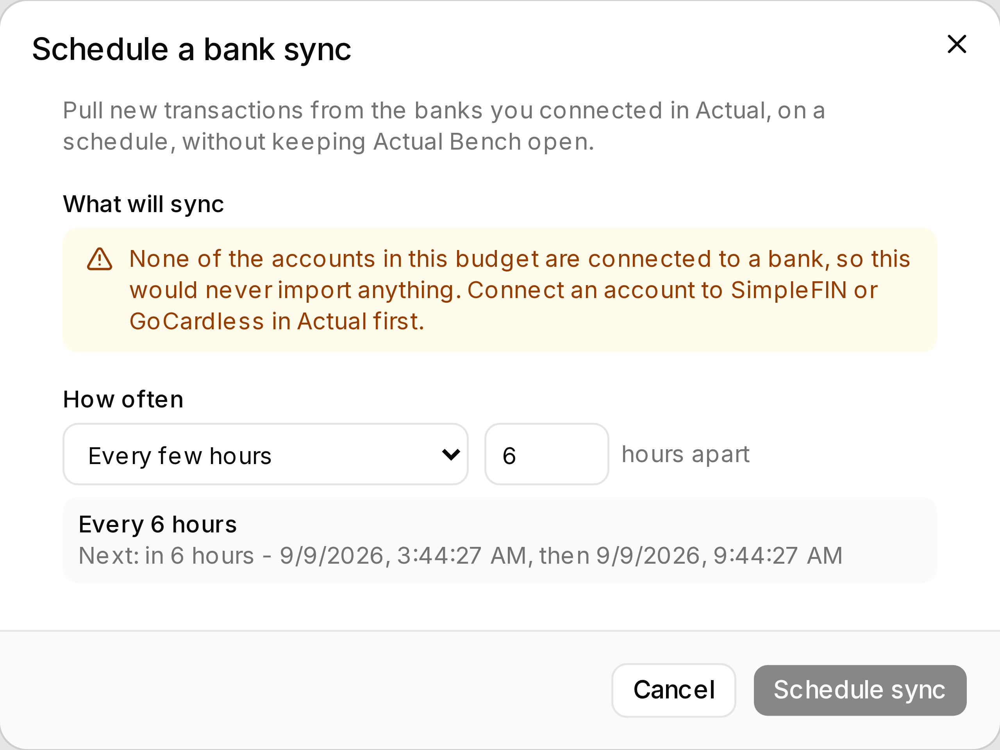

Actual connects to your bank. **Actual Bench decides when that sync runs** - on a schedule, with
nothing open - and tells you what each account came back with.

That division matters, and it is the whole feature: Bench never talks to your bank, holds no bank
credentials, and adds no provider. It asks Actual to do the thing Actual already does, at a time you
chose, and then reports honestly.

Set one up from **Tools → Automations → New automation → Bank sync** (`/automations`).

**Write model:** Actual writes the transactions, as it does for any sync. Bench writes only the record
of the run and what each account returned.

*Set the schedule and Bench works out the rest - including telling you, before you save, that this
budget has no bank-linked accounts and the sync would import nothing.*

## What you need

- Accounts **linked to a bank in Actual** (SimpleFIN or GoCardless). Bench cannot create those links.
- **HTTP API Server mode**, and the budget [enrolled for unattended access](../automations/#unattended-access) - 
  a scheduled sync runs with your browser closed, so the server needs credentials of its own.

A Direct (browser) connection can pull on demand while Bench is open, but it can never run
unattended: Actual's engine lives in your browser there, so with the tab closed there is nothing to
run.

## Setting one up

The dialog shows **which accounts will actually sync** before you commit to anything:

- Accounts linked to a bank are listed with when each last synced.
- Accounts with no bank link are listed too, marked **not connected to a bank - skipped**.

That list is the point. Without it, scheduling can only assert "every linked account is synced" and
hope - and someone whose accounts are all unlinked would create an automation that does nothing,
forever, without a hint as to why. If none are linked, Bench refuses to schedule the run rather than
letting you create it.

Then choose how often. Every few hours suits most people; the minimum interval is 15 minutes,
because below that a run spends its time reopening the budget rather than syncing.

## What a run reports

Each account is synced **separately**, so one bank being down does not stop the others:

| Result | Meaning |
|---|---|
| **Synced** | Actual accepted the pull for this account |
| **Failed** | This account's provider or link failed - the reason is on the run |
| **Skipped** | The account is closed, or not linked to a bank |

A run where some accounts failed is reported as **partial**. It does not count against the
automation's failure streak: one unreachable bank out of twelve is a normal Tuesday, and pausing the
whole automation over it would be wrong. A run where *every* account failed does count.

:::note[Transaction counts]
Bench reports a number of imported transactions only where it could measure one. In Direct mode the
pull finishes before the call returns, so a count is real. Over the HTTP API, the server answers that
the sync has *started* - so Bench records the run as accepted and does not invent a figure it cannot
observe.
:::

Full results, including per-account reasons and the redacted log, are in
[Run history](../automations/#run-history).

## What this does not do

- It does not connect to your bank, or store bank credentials. Actual owns that.
- It does not re-import a statement or reconcile anything. For a downloaded statement, use
  [Bank Reconciliation](../bank-reconciliation/).
- It does not fix a broken bank link. If a provider needs re-authorising, that is done in Actual;
  Bench will keep reporting the failure until it is.
