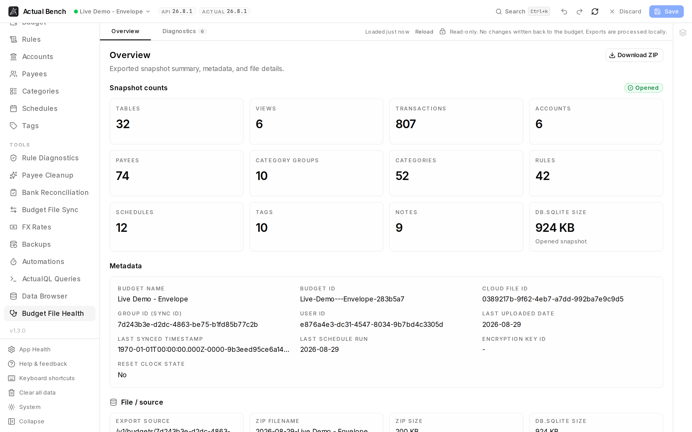

**Budget File Health** answers one question: is this budget file sound? It opens an exported snapshot
locally in your browser, runs deterministic checks over it, and reports what it found.

Open it from **Tools → Budget File Health** (`/budget-diagnostics`).

**Write model:** strictly read-only. The snapshot is inspected in your browser and never written back
to Actual.

*What the snapshot contains, down to the byte: 807 transactions, 74 payees, 42 rules, a 924 KB
database - plus the sync ids and timestamps you need when reporting a problem.*

## When to use it

| Your question | Where to look |
|---|---|
| Is this exported file structurally healthy? | **Diagnostics** tab, below |
| What does the snapshot contain, and how large is it? | **Overview** tab, below |
| What rows and columns exist in a table? | [Data Browser](../data-browser/) |
| I need a reusable query against live saved data | [ActualQL Queries](../actualql/) |

Start here. Open the [Data Browser](../data-browser/) only when a finding needs table-level detail.

:::caution[Snapshots contain your financial data]
An exported snapshot can include personal financial information. Processing happens locally in your
browser, but any ZIP or CSV you download becomes your responsibility - avoid sharing raw snapshots
when reporting issues.
:::

## Load a budget snapshot

The first time you open this page, Actual Bench downloads and opens the active budget's exported
snapshot. It is then **cached** across navigation - with a "loaded X ago" label and a **Reload**
button - and **shared** with the [Data Browser](../data-browser/), so once loaded, either tool opens
instantly.

Opening shows a staged progress rail with retry on failure, plus a reminder that the contents stay
local but may include personal budget data.

## Review snapshot metadata

The **Overview** tab summarizes export metadata, snapshot object counts, ZIP and SQLite sizes, and
source details, with a button to download the exported ZIP.

## Run diagnostics

The **Diagnostics** tab runs deterministic checks over the snapshot - schema, relationships, metadata,
and SQLite health - and summarizes findings by severity. You can:

- Run a full **SQLite integrity check** (a longer-running operation).
- **Export findings to CSV**.

No diagnostics action writes anything back to your budget.

## Safety and limitations

- Strictly read-only; it never modifies your budget.
- Very large snapshots depend on available browser memory.
- The full SQLite integrity check can take a while on large files.

## Troubleshooting

- **The snapshot won't open** - retry from the progress rail; check browser memory for large files.
- **The snapshot looks stale** - use **Reload** to fetch a fresh export.
- **A CSV opens oddly in a spreadsheet** - exports are UTF-8 with formula-injection protection; open
  them as UTF-8.

## Related pages

- [Data Browser](../data-browser/) - the same snapshot, table by table
- [ActualQL Queries](../actualql/) - query live saved data instead of a snapshot
- [Work safely](../../getting-started/core-concepts/)
