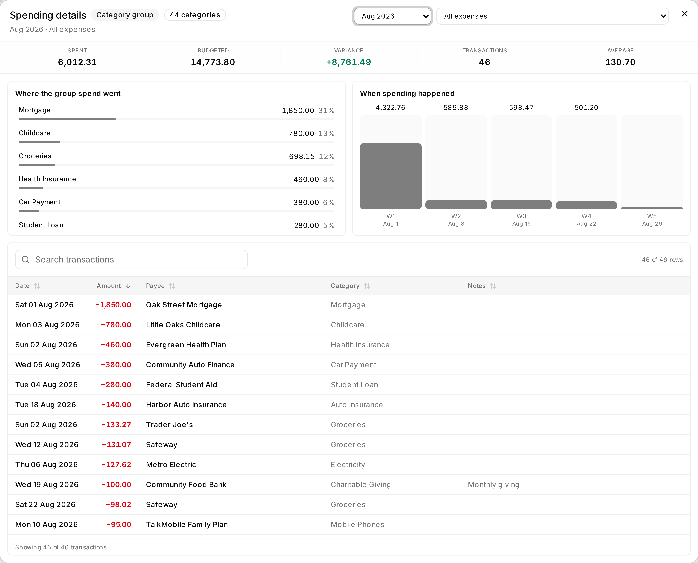
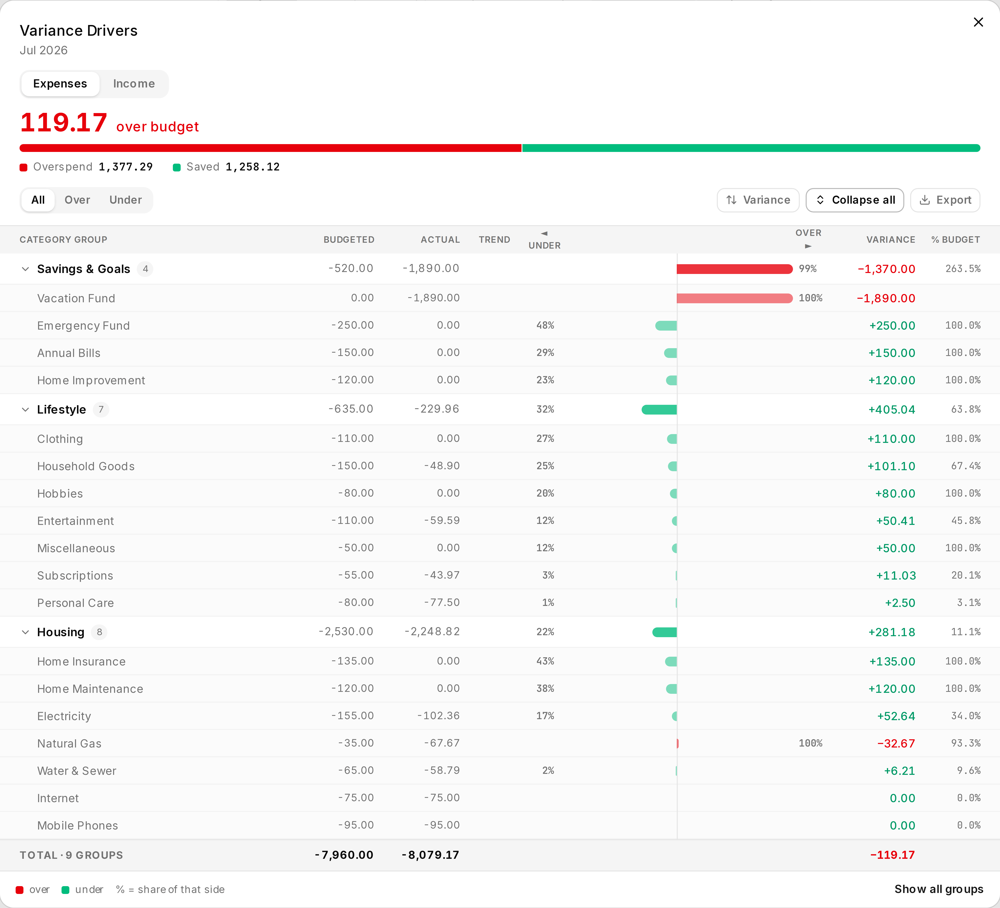

Twelve months. One screen. One measure at a time - **Budget**, **Actuals** or **Balance**.

Actual Budget puts up to six months on screen with Budget, Spent and Balance side by side. That is the
right shape for everyday work and the wrong shape for reading a year: three numbers in every cell,
twelve times over, and the pattern disappears. Splitting them apart is what makes a year scannable.
Tracking budgets gain the most, because the plan, the activity and the variance are separate
questions there.

And you can change what you see. Select, paste, fill - the grid edits like a spreadsheet.

Open it from **Data Management → Budget** (`/budget-management`).

**Write model:** budget amounts, holds, and transfers are staged until **Save**. Notes and carryover
toggles are explicit immediate writes.

*An Envelope budget: twelve months at once, focused on one measure. The panel on the right explains
where the current month's To Budget figure comes from, line by line.*

*The same workspace on a Tracking budget. The two models answer different questions, so the grid asks
different ones: envelope budgeting leads with what is left to assign, tracking with how the month is
running against plan.*

## Get the full-year view

1. Check the **Envelope** or **Tracking** badge matches your budget.
2. Pick **Budget**, **Actuals** or **Balance**. The whole grid follows.
3. Read across the year. Select a row, group or month header to fill the details panel.
4. Changing the plan? Edit a cell, paste a range, or use a fill action.
5. Read the draft, then **Save**.

That is the page. Everything below is for working faster.

## Understand the workspace

One row per category, gathered under its group. One column per month, twelve of them:

- A **budget mode badge** (`Envelope`, `Tracking`, or `Unknown`) sits at the top-left.
- The **category name column** and the **month header row** stay pinned while you scroll.
- **Group rows** total their categories per month. Collapse a group and the total stays.
- The **Budget Details** panel on the right follows whatever you have selected, and carries a
  **progress meter**. In envelope mode it fills toward what is available (`$X left`, red once you are
  past it). In tracking mode it fills spent-to-date against budget-to-date (`Under/Over budget by $X`),
  and for tracking income, received against planned. It is left out where it would mean nothing -
  envelope income, and future months that have no activity yet.

Each selection asks the panel a different question.

*Click a **month column header** for the month itself: where To Budget came from, line by line, then
what the month has actually done.*

*The same click on a Tracking budget reads differently - income and expenses against plan, a variance
for each, and whether spending is ahead of the calendar.*

*Click a **group label** for that group across the year - assigned, spent, and how its balance has
moved month to month.*

*Click a **category label** for the same read on one category, down to whether its balance rolls
over.*

## Two budgeting models

Actual has two budgeting models. This page reads the badge and changes its labels, totals and details
panel to match.

- **Envelope** budgeting hands real money to categories. What you have not handed out yet is
  **To Budget**; hand out more than you have and it reads **Overbudget**. Every category keeps a
  running **Balance** that rolls forward, so an unspent envelope carries and an overspent one comes
  out of next month. Income is only ever **received**, never budgeted - which is why income rows
  cannot be edited here.
- **Tracking** budgeting compares a plan with what happened. Its headline is **Savings** - income minus
  expenses - shown as **Projected Savings** while a month is still running and **Saved** or
  **Overspent** once it closes. It also keeps two numbers envelope budgeting blends together: the
  spreadsheet **Balance**, which includes carryover, and a **Variance** calculated on its own from this
  period's budget and this period's activity. Hidden categories drop out of tracking's plan totals. In
  envelope mode they stay financially live.

The panel leads with whichever headline belongs to your model - To Budget for envelope, Savings for
tracking - and never mixes them. Totals come from the budget's own summary, so hiding categories or
collapsing groups does not move them.

## Choose Budget, Actuals, or Balance

The toolbar toggle - or the `V` key - changes what every cell in the grid shows:

- **Budget** - the budgeted amount (expenses are shown signed-negative; envelope income has no budget).
- **Actuals** - actual activity: **spent** for expenses, **received** for income.
- **Balance** - the running balance.

Labels follow the row. An income row's activity reads *Received*, and in envelope mode it reads that
whatever the toggle says.

*The **Actuals** view: what was actually spent, month by month. A category is selected here, so the
panel carries its history alongside.*

### See spending at a glance

In the **Budget** view a thin **spending bar** sits under every editable expense cell, and under every
group total. It fills green as you spend, turns amber near the limit, and grows a red segment past it.
Spend from a category you never funded and the whole bar is red. The exact numbers stay in the hover
tooltip and the details panel - the bar is for scanning, not reading. **Spending Bars** in the toolbar
turns them off; income rows never have one.

## Navigate months and years

- It opens on the current calendar year, scrolled to the **current month** and highlighting it. A
  marker on that column shows how far into the month you are - day 12 of 31. That matters: 80% spent
  on the 5th and 80% spent on the 25th are not the same news.
- The focused cell lights up its **month header and category label** - a crosshair on the axes - so
  you can tell which cell you are in without counting columns.
- Move the 12-month window back/forward by one month with `‹` / `›`, or by a year with `«` / `»`.
- Use the calendar button to jump back to the current month at any time.
- **Click the month range in the toolbar** to jump straight to any month - pick a year, then a month,
  and the window starts there. A month the budget file has no data for is dimmed but still reachable,
  so a gap in history can be looked at.
- The `[` and `]` keys pan the window backward/forward by one month.

## Expand, collapse, and hide

- Expand or collapse all groups with the toolbar buttons, or `E` / `Shift+E`.
- Toggle a single group with `Space` on its label.
- Which groups are collapsed is remembered while the tab is open, so leaving the page and coming back
  does not undo it.
- Show or hide hidden categories with the toolbar toggle, or the `H` key.

## Edit one budget cell

1. Select a cell and press `Enter`, `F2`, or start typing (a digit, `+`, `-`, `.`, or `(`).
2. Type an amount **or an arithmetic expression** - `+`, `-`, `*`, `/`, and parentheses are supported
   (for example `1200/12`).
3. Press `Enter` to commit (and move down), `Tab` to commit sideways, or `Escape` to cancel.

Staged edits show amber. Type the original value back and the edit disappears from the draft.
`Delete` or `Backspace` zeroes the focused cell.

:::note[Income in envelope mode]
In envelope mode, income categories are not editable in the grid.
:::

## Select multiple cells

- Click a cell to select it; `Shift+click` or drag to extend a rectangular selection.
- Extend with `Shift+Arrow`, `Shift+PageUp/Down`, and `Shift+Home/End`.
- **Click a group's month cell to select that group's categories for that month**, or its label to
  select them across the whole window. A group is a summary of what is under it, so selecting one
  selects its cells - and it does not need to be expanded first. `Shift+click` extends, as cells do.
- A group row shades to show how much of it the selection covers - fully or partly - so a range
  reaching across a **collapsed** group still shows what it caught.
- The footer counts the selected cells and totals them, whichever way the selection was made.
- The first column - the category or group label - is selectable too. That is what fills the details
  panel with the whole row.

## Copy and paste

- `Ctrl/Cmd+C` copies the selection as tab-delimited text that round-trips through Excel / Google
  Sheets.
- `Ctrl/Cmd+V` fills the selection from a single value, or expands a multi-cell paste from the top-left
  cell.

## Fill values

With a range selected:

- `Ctrl/Cmd+Enter` - fill the whole selection with the anchor cell's value.
- `Ctrl/Cmd+D` - fill down.
- `Ctrl/Cmd+R` - fill right.
- `Alt+L` - fill each row with its previous-month value.
- `Alt+Y` - fill each row from the same month a year earlier.
- `Alt+A` / `Alt+Shift+A` / `Ctrl/Cmd+Alt+A` - fill each row with its 3-, 6-, or 12-month average.

## Right-click bulk actions

Right-click a **budget cell**, a **category group** (its month cell or its name), or a **month column
header**. A group is a summarisation of the categories under it, so acting on one acts on all of
them - and the group does not need to be expanded first. A month header acts on every category in
that month, which is the quickest way to plan a whole month in one go.

The menu names what it will change and how many cells, so a group or column action is never a guess.

- **Cell actions** (mode-aware, cells only): in tracking mode, enable/disable rollover from that month
  forward; in envelope mode, **Cover Overspending** or **Transfer to Another Category**. These act on
  one category-month, so they are not offered for a group or a column.
- **Copy from another month**: Copy previous month, Copy prior year same month, Copy prior year
  with %… (an uplift applied to the copied amount), Copy specific month… - the picker offers every
  month in the budget file, not only the twelve on screen.
- **Set a value**: Set to zero, Set to fixed amount…, Apply % change…
- **Average past budgets**: 3-, 6-, or 12-month average of what was **budgeted**.
- **Average past actuals**: 3-, 6-, or 12-month average of what was actually **spent or received** -
  "budget what I normally spend" rather than "what I normally budgeted".

Anything a run cannot do is reported rather than skipped quietly: months the budget file does not
cover, categories that did not exist yet, and read-only months are all counted and named.

Each budget-setting action stages as one undo step. Carryover is the exception - its toggle writes
straight away and tells you what happened.

### The preview

Group and column actions - and anything that needs a parameter - show a preview before staging
anything. An action that needs no parameter opens straight onto it.

The preview is a table of exactly what will be written: group, category, month, the current amount,
the new one, and the change. **The new amounts are editable.** If a 6-month average lands on 97 and
you wanted 100, type it - arithmetic like `50 * 2` works, `↑` and `↓` move between rows, `Enter`
commits and steps down, `Esc` abandons an edit. Adjusted rows are marked and can be reverted one by
one or all at once. What gets applied is what the table shows.

Totals sit under the table, split into **Income** and **Expenses** when a run covers both, because one
figure spanning a spending plan and an income plan answers neither. Above a dozen rows there is a
filter - it finds rows, it never changes what **Apply** writes, and the totals cover every row either
way.

## Review staged changes and Save

- The details panel shows an **"N changes"** badge. Open it for the list, grouped by month. A transfer
  appears as one linked row, not two.
- **Save** shows a summary first - how many changes, which months, the net difference - then a progress
  dialog while it sends them one at a time. Both legs of a transfer post together or not at all.
- If some fail, you get **Retry Failed**. Only what the server accepted leaves the draft.
- Undo/redo works across staged edits (`Ctrl/Cmd+Z`, `Ctrl/Cmd+Shift+Z` / `Ctrl+Y`), up to 50 steps.

## Use notes

The details panel has a **Note** for whatever is selected: a category, a group, a single category ×
month cell, or a whole month.

:::caution[Notes save immediately]
Notes go to the server the moment you confirm them. They have nothing to do with your staged edits or
the **Save** button. See [Work safely](../../getting-started/core-concepts/#immediate-save-exceptions).
:::

## Envelope budget actions

- **Hold for next month** - every *To Budget* cell shows what is being held. The toggle opens a dialog
  to stage a hold or clear one. Holds save with everything else.
- **Cover Overspending / Transfer to Another Category** - move money between categories. Both legs are
  one undo step, and they post together.

Holds and transfers are envelope-mode only.

## Tracking budget behavior

### Look at the transactions behind a figure

**Spent** and **Income received** in a month summary are links. Click either one for the transactions
that produced it, plus where the money went and when during the month it left.

*Forty-six transactions, what share each category took, and which week they landed in. Search and sort
it like any other table.*

### See what moved a month off plan

On a Tracking budget, the month summary tells you *how far* off plan a month is. **Variance Drivers**
tells you what did it. Click either variance figure to open it. Category groups come back ranked by how
much of the gap each one accounts for, expandable to the categories underneath, and filterable to just
the over-budget or just the under-budget side.

*Groups ranked by their share of the variance, expanded to the categories underneath. Export takes the
same breakdown to CSV.*

This one is Tracking-only. Envelope budgets have no plan to vary from - their equivalent question is
answered by the balance and the spending bars.

Tracking mode speaks in plans, not envelopes. Closed months report what happened, the current month is
flagged as partial, and future months show what is budgeted rather than a misleading zero. Rollover is
per category, from the right-click menu, and writes immediately - it is not part of the cell draft.

## Import and export

- **Export** lets you choose months by quick range, date range, or by hand, and whether to include
  hidden categories, income groups and staged values. There is a blank template too. Files are UTF-8
  CSV with a BOM, so Excel opens them without mangling anything.
- **Import** reads a CSV and sorts every row into exact, suggested or unmatched. You see before and
  after values, and the whole import stages as one undo step. Category names that are nearly right get
  suggestions; months outside the window can extend it.

:::tip[Back up before large imports]
One import can stage hundreds of changes. Export first. Then the worst case is re-importing a file you
already have.
:::

## Keyboard shortcuts

Press `?` - or `F1`, `Ctrl/Cmd+/`, or the toolbar **Shortcuts** button - for the full list, generated
from the app's own keymap. The bare-letter ones (`V`, `F`, `H`, `E`, `[`, `]`) stay quiet while you are
typing in a cell.

## Safety and limitations

- Rollover writes immediately, from the right-click menu, in tracking mode. It is not a staged edit.
- Transfers need a source and a destination. You cannot move money to or from the pool.
- The grid is not virtualised. A very long category list will scroll slowly.

## Troubleshooting

- **Paste did nothing** - select a cell first. Paste fills from the top-left of the selection.
- **A number is missing** - check the cell-view toggle, and whether that month is inside the visible
  twelve.
- **A category is missing** - it is probably hidden. Press `H`.
- **Changes did not save** - the failed cells are still staged, marked red. **Retry Failed**.
- **A note will not discard** - notes were saved the moment you wrote them. Discard cannot reach them.

## Related pages

- [Core Concepts](../../getting-started/core-concepts/)
- [Categories](../categories/) - budget the categories you manage there
