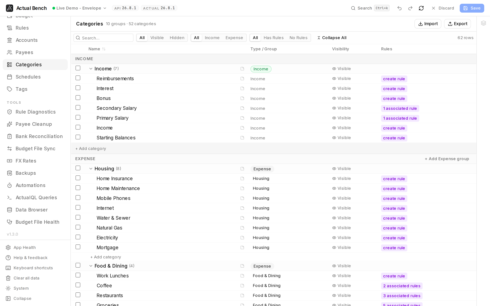

**Categories** shows a budget's whole category hierarchy - groups and the categories inside them - and
lets you edit all of it at once. Come here to design a structure, import one from a spreadsheet, change
visibility in bulk, or see what a group deletion would cascade into before you do it.

Open it from **Data Management → Categories** (`/categories`).

**Write model:** stage → review → **Save**. Category and group notes save immediately.

*Ten groups and fifty-two categories in one view, income and expense separated, with visibility and
rule references on every row.*

It shares the [editing model](../../getting-started/editing-and-saving/) every Data Management page
uses.

## What you get beyond Actual Budget

- **Import/export the entire group hierarchy as CSV** - seed a whole budget's category structure from
  a spreadsheet in one pass, or export it for backup.
- **Cascade-aware group deletion** - deleting a group shows the child-category count and aggregated
  transactions across all children, with a cascade warning, before anything is staged.
- **See which rules reference a category** and jump straight to them.
- **Notes on category groups**, not just categories.

## Groups and categories

- Create category **groups** (income or expense type) and categories within them.
- Rename groups and categories inline; collapse or expand group rows (or all groups at once).
- Group reassignment opens an on-demand editor rather than rendering every dropdown up front, keeping
  large tables responsive.

:::note[Income category constraints]
Income categories stay locked to the single income parent group. Only expense categories can be moved
between groups.
:::

## Hide, show, and delete

- Toggle visibility (hidden / visible) per category or per whole group.
- Deleting a **category** confirms with its transaction count and rule references. Deleting a **group**
  additionally shows the child category count and aggregated transactions across all children, with a
  cascade warning. Bulk delete deduplicates implicit deletions and aggregates the totals.

## Filter and sort

Filter by name, type (income / expense / all), and visibility (visible / hidden / all). Sort by name.

## Notes

Each category and group row has a note button. Read, add, edit, or clear notes inline - they **save
immediately**, independent of staged category edits.

## Import and export

Export or import the full group hierarchy as CSV (staged before saving). CSV columns:

- `type` (`group` or `category`, required), `name` (required), `group`, `is_income`, `hidden`.
- **Group rows must appear before** the categories that reference them.

## Common problems

- **"Can't move an income category"** - income categories are locked to the income group.
- **A group delete warns loudly** - it cascades to child categories; read the aggregated impact first.
- **Imported categories landed ungrouped** - check that each group row appears above its categories in
  the CSV.

## Related pages

- [Editing, review and save](../../getting-started/editing-and-saving/) - the shared editing model
- [Budget](../budget-management/) - budget the categories you create here
- [Rules](../rules/) - how rules reference categories
