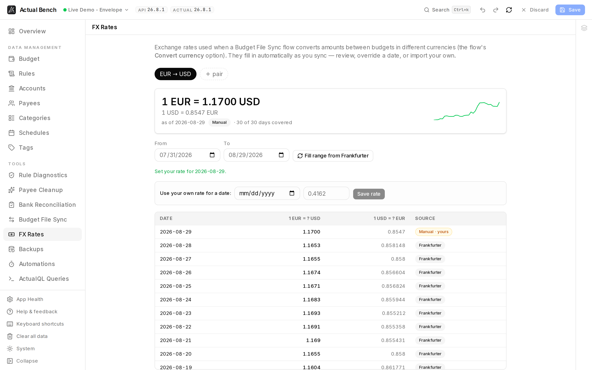

**FX Rates** holds the exchange rates a [Budget File Sync](../budget-sync/) flow uses when it moves
money between budget files kept in different currencies: date-specific rates, coverage for the dates
that have none, manual overrides, and an immutable snapshot of what was used, so a later market move
cannot silently rewrite past conversions.

It exists only to serve those flows. It is not a general currency feature, and it does not add
multi-currency accounts to a single Actual budget.

Open it from **Tools → FX Rates** (`/fx-rates`), once a converting flow is configured.

**Write model:** changing the rate registry writes Actual Bench metadata. Actual transactions change
only through a separately previewed and applied sync update.

*Both directions of the rate, how much of the range is covered, and where every day's rate came from -
`Frankfurter` for the ones fetched, `Manual · yours` for the one that was set by hand.*

## Get a converting flow ready

1. Enable **Convert currency** on a transaction flow and choose its source and target currencies.
2. Open **FX Rates** and inspect coverage for that pair and date range.
3. Fill gaps from Frankfurter, import rates, or set a deliberate override.
4. Preview the flow and verify the original amount, rate, and converted amount before Apply.

## When currency conversion is used

A transaction flow can convert amounts when you enable its **Convert currency** option and set a source
and target currency. Only transaction flows convert - payee and category flows never do.

## How rates are sourced

Rates come from a database-backed registry, filled automatically from the free
[Frankfurter](https://frankfurter.dev) provider:

- **No API key** is required.
- Rates are **date-specific**.
- For a date with no published rate (weekends and holidays), Actual Bench falls back to the **latest
  prior rate**.
- If the provider is briefly unavailable, a converting sync doesn't fail - affected rows go to review as
  **FX pending** (see [Budget File Sync](../budget-sync/#preview-a-flow)).

You can also override any date manually or import rates from a CSV.

## Open the FX Rates page

The page is organized per **currency pair**:

- A hero card shows the **latest rate**, a **trend** sparkline, and **coverage** for the selected date
  range.
- Currency pairs are seeded from your FX-enabled flows, and you can **add your own**.

## View rate history and coverage

Below the hero, a **coverage ledger** lists every day in the range, calling out gaps, and labels each
rate's source (**Frankfurter**, **Uploaded**, **Manual**, or **Derived**).

## Fill missing rates

Select **Fill range from Frankfurter** to backfill every missing day in the range in one click. Actual
Bench reports how many days were **inserted** versus **already set**.

## Override a rate

Use **Set your rate** to enter a rate for a specific date manually.

- Manual rates take precedence for that date and pair.
- When your override affects **already-synced transactions**, an **impact preview** lists them with their
  old → new converted amounts, so you can see the effect before deciding to update.

:::note[Overrides don't silently rewrite the past]
Setting a rate does not retroactively change already-synced transactions on its own. Past conversions
keep their locked rate unless you explicitly update them through the previewed sync update path (the
*Update synced transactions when the rate changes* flow option). See
[Budget File Sync](../budget-sync/#updates-and-deletion-opt-in).
:::

## Import rates from CSV

Import a CSV of rates for a pair from the FX Rates page. Uploaded rows are labeled with the
**Uploaded** source in the coverage ledger.

## Preview a converted transaction

In a converting flow's [sync preview](../budget-sync/#preview-a-flow), each row shows the **original
amount**, the **applied rate**, and the **converted amount**, each labeled with its currency. A missing
or future-dated rate is sent to the review queue as **FX pending** rather than failing the run.

## Immutable snapshots and rate locking

- Every converted transaction stores an **immutable snapshot** - the exact rate, source/target amounts,
  provider, and dates - plus a compact **audit note** on the target transaction.
- Rates **lock at first sync**, so a later rate change never silently rewrites past conversions.
- To apply a corrected rate to already-synced transactions, use the opt-in *Update synced transactions
  when the rate changes* flow option, which goes through the normal previewed, safety-checked update
  path.

## Limitations

- No FX gain/loss accounting.
- No silent recalculation of past conversions.
- No multi-currency within a single Actual budget file.
- Rate availability depends on the provider and on the coverage you've filled or imported.

See [Known Limitations](../../help/known-limitations/) for the full list.

## Troubleshooting

- **"FX pending" in a preview** - no *usable* rate was found for that date and pair. Either none has
  been recorded yet, in which case **Fill range from Frankfurter**, add an override, or import a CSV;
  or the provider was briefly unavailable, in which case previewing again once it recovers is enough.
- **A weekend or holiday date** - Actual Bench falls back to the latest prior rate; fill the range if you
  want explicit coverage.
- **A future-dated transaction** - a future rate isn't available; it stays FX pending until a rate
  exists.
- **CSV rejected** - check the columns and values against the in-app import guidance.
- **Wrong pair direction** - confirm the source and target currencies on the flow.
- **Converted amount differs slightly** - rounding is applied to the final converted amount.

## Related pages

- [Budget File Sync](../budget-sync/)
- [Connect to Actual Budget](../../getting-started/connecting/)
