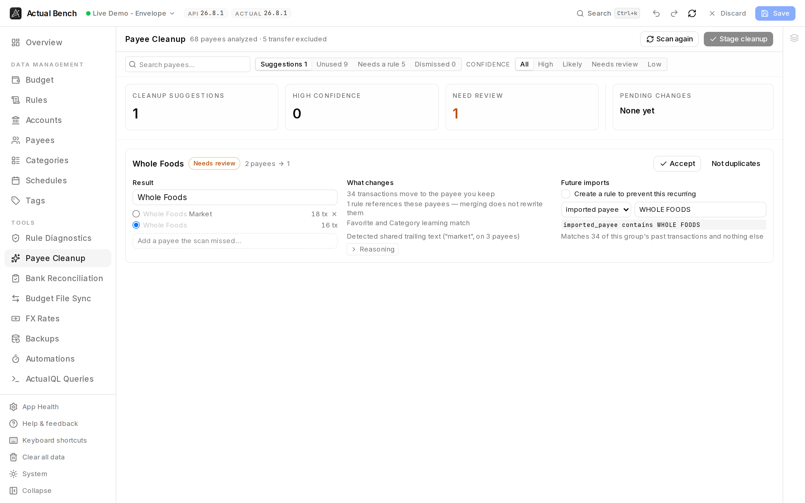
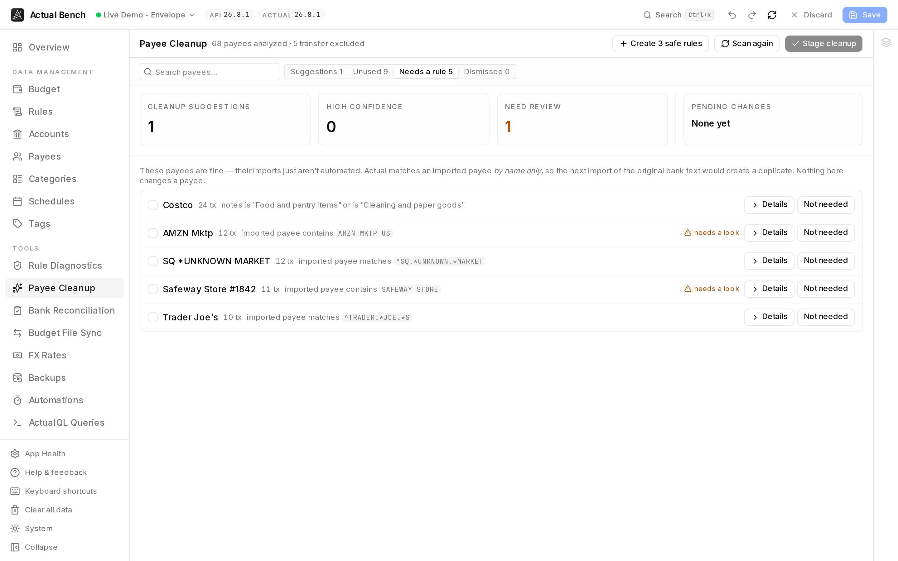

Bank imports create a payee per distinct piece of text. One shop becomes many payees, because the
text carries a date, a card number, a store number or a location that changes every transaction:

```text
MARKET BOYS PTY LTD Melbourne VI AUS Card xx4534 Value Date: 12/03/2024
MARKET BOYS PTY LTD Melbourne VI AUS Card xx9166 Value Date: 24/12/2024
MARKET BOYS PTY LTD Sydney Value Date: 10/11/2025
```

**Payee Cleanup** finds those groups, shows what merging them would change, and lets you fix the
budget in one reviewed pass - including the rule that stops the duplicates coming back.

Open it from **Tools → Payee Cleanup** (`/payees/cleanup`).

**Write model:** scan → review → accept → **Stage cleanup** → **Save**. Staging hands the merges,
renames, deletions and new rules to the normal staged-changes flow; nothing reaches your budget until
you save on the Payees page.



*A suggestion carries its own evidence: what changes, how many transactions move, why these were
grouped, and the rule that stops the duplicates coming back.*



*These payees are not duplicates - they are correct, and unprotected. Each row carries the condition
that would keep the next import resolving to it, and how many transactions it is based on.*

## How it finds duplicates

Two layers, and the difference matters when you are deciding whether to trust a suggestion.

**Shape rules** remove text that identifies itself by its structure: dates in any common layout,
times, card numbers, long reference and authorization numbers, `Label: value` metadata, exchange
rates, trailing store numbers and web addresses. These work the same for any bank in any country - 
nothing here knows about yours.

**Learned boilerplate** covers what no pattern can identify. If `ASHDOWN UAE` closes forty otherwise
unrelated payees, or `NFC - (AP-PAY)-` opens sixty of them, it is wrapping rather than a name. This
is worked out from your own payees, so a French `CARTE … RETRAIT DAB` is found by the same rule.

Anything learned this way is treated as a **guess**. It lowers the confidence and puts the suggestion
in **Needs review**, because repetition proves a fragment is shared - not that removing it is safe.
`TRANSFER FROM` also opens many payees, and it means something.

## Working through the suggestions

A toolbar across the top carries the search box, the **Suggestions / Unused / Dismissed** tabs, the
confidence filters, **Re-scan** and **Stage cleanup**. Under it, three boxes count what the scan
found and a fourth - **Pending changes** - counts what you are about to do, and reminds you that none
of it is written until you save.

**Accept _n_ safe** accepts, in one click, only the suggestions that need no judgement. It is
deliberately stricter than "everything above 90%": the match must be structural rather than inferred,
the payees must agree on Favorite and Category learning, transaction counts must have finished
loading, and no rule - proposed or existing - may reach beyond the group. Everything else stays for
you.

## Reading a suggestion

Everything a decision needs is on the card itself; there is no dialog to open. The header names the
result, its confidence, and how many payees collapse into one. Below it, three columns:

- **Result** - the payee that survives and the name it takes, both editable, with every member listed
  and its transaction count. The text each name loses is struck through, so you can see what was
  removed. Drop a member, add one the scan missed, or pick a different survivor here.
- **What changes** - transactions that move; rules, split into regular rules, active schedule-linked
  rules and completed schedule-linked ones (a schedule reaches its payee *through* its rule, so
  counting them separately would report the same relationship twice); and whether the payees disagree
  on Favorite or Category learning. **Reasoning** expands the detector's own account of the grouping.
- **Future imports** - the optional rule, described below.

Confidence bands: **High** and **Likely** are structural matches. **Needs review** means an
interpreted step was involved, or nothing but spelling similarity connects the payees.

With a card focused, <kbd>A</kbd> accepts, <kbd>R</kbd> toggles the reasoning and <kbd>N</kbd> marks
it *not duplicates* - ignored while you are typing in one of its fields.

## Correcting a suggestion

Nothing is fixed. Every change you make is remembered against that group, and **Undo my changes**
appears once there is something to undo, restoring the detector's original proposal.

If two groups you accepted would end up with the same payee name, cleanup blocks the stage rather
than quietly creating a second payee with that name - and offers to **combine them into one group**,
since naming them alike is how you said they are the same merchant.

**Not duplicates** dismisses a group for good. It is remembered per budget and reversible from the
**Dismissed** tab - including learned boilerplate you disagreed with, so a wrong inference stops
being applied everywhere rather than needing rejection on every card.

## Stopping the duplicates coming back

Cleaning up today does not stop the next import recreating the mess - but often no rule is needed.
Actual matches an imported name that exactly equals an existing payee, so the merge alone fixes
future imports, and an existing rule may already do the job. Cleanup checks both before proposing
anything.

Where a rule *is* worth it, cleanup builds one and backtests it against your own import history:

> Also create a rule: when imported payee starts with "GROCERGO", set the payee.
> Matches 92 past transactions of this payee and nothing else.

It is never pre-selected if it would also catch another payee's transactions - you are told which
ones. The **matched text** and the **field it matches on** (imported payee or notes) are both
editable, and changing either re-runs the backtest.

## Payees that need a rule

Actual matches an imported transaction to a payee **by name, and only by name**. It does not remember
which bank text produced which payee. So the moment you tidy a payee - rename it, or merge variants
into it - the next import of the original text no longer matches anything, and Actual creates the
duplicate again.

The **Needs a rule** tab lists the payees in that position, and proposes the rule that fixes it.
Nothing on this tab changes a payee; it only adds automation.

A payee appears only when all of these are true, which is why the list is short:

- its imports **don't already equal its name** - those resolve on their own, and most payees fall out
  here;
- **no existing rule** already sets it - judged by running your rules against this payee's own import
  text, not by comparing names, so a rule reading `notes contains "K AND M"` is recognised as covering
  a payee called `K&M Fashion`;
- it has import text on record and more than one transaction;
- **an honest rule exists.** If the text neither repeats nor shares a recognisable core, or if no
  core can be found that catches this payee and nobody else, there is nothing to offer and the payee
  is not listed. You will not be shown a rule that cannot be created safely.

  Where the obvious core is shared, a longer one is tried: `Uber` and `Uber Eats` both contain
  `UBER`, so `Uber` is identified by the longer text its own imports carry instead.

Two rule shapes, picked from your own history - on whether the text *varies*, not on how many
different strings there are:

- **The same text every time, with nothing dating it,** gets an exact match - the shape Actual writes
  itself. It cannot catch anything else, so it needs no backtest. Text carrying a `#2026-05` marker
  never qualifies, however identical the rest of it looks: a rule matching one month would never fire
  again.
- **Text that varies around a core** gets a pattern built from the words every import shares, so it
  also catches variants you have not seen yet. That one *is* backtested, and you are told if it would
  catch another payee's transactions.

For example, three imports reading `#API Summit Credit Bureau`, `#2026-05 Summit Credit Bureau` and
`-84 IRR (FX rate: #2026-02 SUMMIT CREDIT BUREAU ASHDOWN UAE)` share `SUMMIT CREDIT BUREAU`, so the rule
matches that anywhere in the text rather than listing three strings that will never arrive again.

Picking those words out takes more than finding what the imports have in common, because a lot of what
they have in common isn't the merchant:

- **Hashtag markers are ignored.** `#2026-05` is a date and `#API` is a channel. Two payees whose
  imports happen to fall in the same month would otherwise appear to share `05`.
- **Words shared with many other payees are discounted.** `ASHDOWN` closes hundreds of imports across a
  budget, so it says nothing about *which* payee an import belongs to, while `NOVARA` belongs to one.
  This is measured from your own payees - no list of cities is involved, and it works anywhere.
- **Numbers are discounted.** A phone number or an IBAN is perfectly stable and perfectly useless as a
  name, and a rule built on one breaks the day it changes.
- **A core stops at four words**, because a bank transfer record is mostly reference data and the
  longest thing two of them share is nearly the whole record.
- **A run that catches every import doesn't automatically win.** One import written `GYMGO` shouldn't
  reduce `GYM GO FITNESS` to `FITNESS`.

The same reasoning produces the rule offered on a merge suggestion, so one budget
gets one kind of rule wherever it was proposed from.

The pattern is shown on the row, and you can rewrite it: choose the field, choose **matches** or
**contains**, and type your own. The backtest re-runs as you go, and tells you if it now catches
nothing, will not compile, or reaches another payee. Your edits survive a re-scan.

Where the payee already has a rule of this kind, cleanup **adds the missing text to it** rather than
creating a second rule - so tidying ten payees does not mean ten new rules.

Where a rule covers only *part* of a payee's history - or tests something this page cannot check, like
an amount - the payee stays listed and the rule is shown with how much it catches, and a link to open
it on the Rules page.

**Create _n_ safe rules** takes only the ones with nothing to judge. Everything else is opted into one
at a time, and **Not needed** dismisses a payee for good, reversibly, from the Dismissed tab.

Reachable from **Tools → Payee Cleanup**, or the **Needs a rule** button on the Rules page.

## Unused payees

The **Unused** tab lists payees with no transactions and no rules pointing at them, ready to stage for
deletion. Actual Bench applies its own check here and is slightly more cautious than Actual's: it
also counts rules that *set* a payee, so a payee some rule writes to is never offered for deletion.

## What merging actually does

Merging uses Actual's own operation. Transactions follow automatically - Actual resolves them to the
payee you kept. **Rules are not rewritten**: they keep pointing at the old payee, and Actual resolves
them afterwards. Actual Bench never rewrites transactions or rules itself.

## Known limits

- **Favorite and Category learning cannot be changed** from outside Actual. The payee you keep
  decides them, which is why cleanup shows the difference and lets you choose the survivor rather
  than offering an editor.
- **Saved payee locations cannot be read** through Actual's API, and merging does not move them.
  Cleanup neither reports them nor promises anything about them.
- **Transfer payees are never touched.** Actual manages them with their accounts, and its merge
  silently does nothing when one is involved.
- Statements that concatenate every field with no separators, or that put the date before the
  merchant, reduce to their transaction *type* rather than a merchant name. That still groups them
  usefully, but it is not a merchant.
