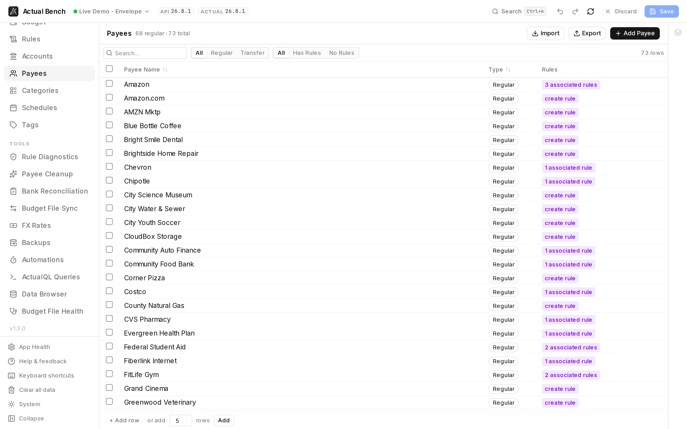
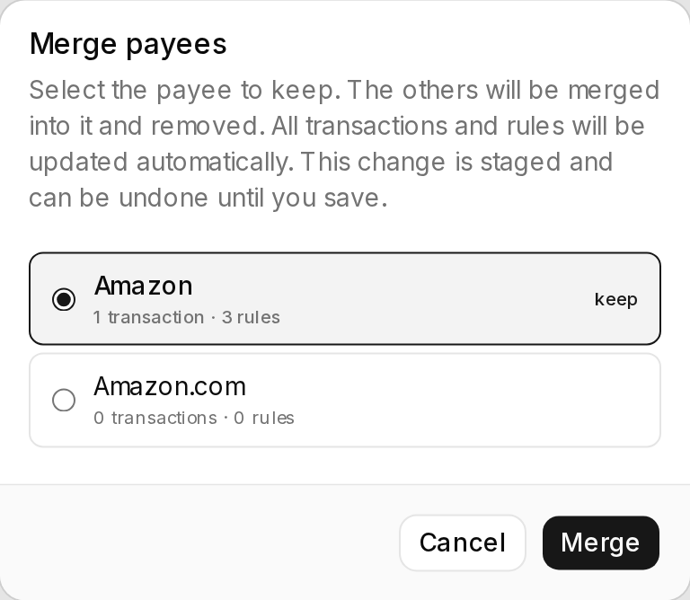

**Payees** is the full list of who a budget pays and is paid by, editable in bulk. Come here to merge
duplicates safely, rename a batch of imported names, or see how many transactions and rules depend on a
payee before removing it - as one staged pass you review, rather than a sequence of immediate edits.

Open it from **Data Management → Payees** (`/payees`).

**Write model:** stage → review → **Save**.

*Three rows for one shop - `Amazon`, `Amazon.com`, `AMZN Mktp` - is what a few years of bank imports
looks like. The rule column shows which payees something already depends on.*

It shares the [editing model](../../getting-started/editing-and-saving/) every Data Management page
uses.

*Merging asks the only question that matters - which name survives - and says what moves with it
before anything is staged.*

:::tip[Merging a lot of import duplicates?]
[Payee Cleanup](../payee-cleanup/) finds the groups for you, shows what each merge would change, and
can add a rule so the duplicates stop coming back.
:::

## What you get beyond Actual Budget

- **Bulk-merge duplicate payees** - collapse several payees into one, staged and undoable, before it
  touches your budget.
- **[Payee Cleanup](../payee-cleanup/)** finds those duplicates for you, and - once a rename or merge
  has moved a payee's name away from the text its bank sends - finds the payees whose imports will no
  longer resolve to them.
- **Create and import in bulk** - inline creation plus CSV import/export.
- **See which rules reference a payee** and jump straight to them.
- **Impact-aware deletion** - every delete shows the payee's transaction and rule-reference counts.
- **Clear transfer-payee handling** - system-managed transfer payees are shown as a distinct type and
  protected from accidental edits.

## Regular and transfer payees

Transfer payees are auto-generated for inter-account transfers. They appear as a separate, filterable
type and cannot be edited or bulk-deleted like regular payees - their selection checkbox is disabled to
make that explicit.

## Create, rename, and delete

- Create and rename payees inline.
- Every delete (single or bulk) confirms, showing the payee's transaction count and rule reference
  count. Transfer payees are excluded from bulk delete and counted separately in the dialog.

## Merge duplicate payees

1. Select **two or more regular payees**.
2. Choose **Merge**.
3. The **first payee you check** becomes the surviving target (regardless of table sort); the rest are
   absorbed.
4. The merge is staged and shown in the Draft Changes panel as "Merge Deleted" before you **Save**.
   `Ctrl+Z` undoes it.

## Filter

Filter by name, type (regular / transfer / all), and whether a payee has associated rules.

## Import and export

Export payees to CSV or import them (staged before saving). CSV columns:

- `name` (required).

## Common problems

- **"Can't select a transfer payee"** - transfer payees are system-managed and not bulk-editable.
- **A merge picked the wrong survivor** - the target is the *first* payee you checked, not the
  top-sorted row; re-select in the intended order.

## Related pages

- [Editing, review and save](../../getting-started/editing-and-saving/) - the shared editing model
- [Rules](../rules/) - how rules reference payees
