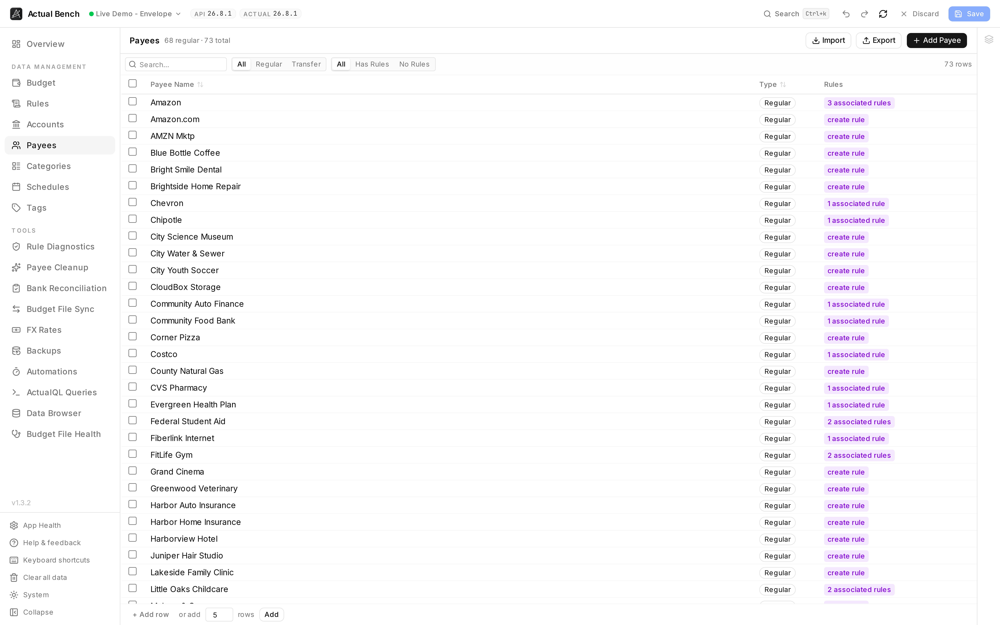
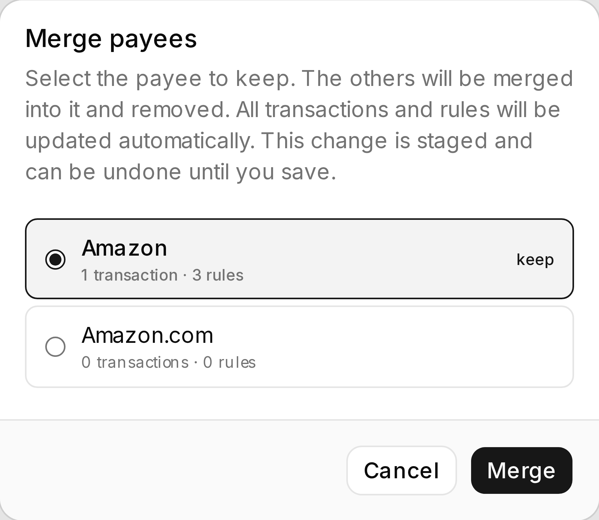

Everyone a budget pays, and everyone who pays it, editable in bulk. Merge duplicates. Rename a batch of
imported names. See how much depends on a payee before you delete it. One staged pass, reviewed at the
end, instead of forty immediate edits.

Open it from **Data Management → Payees** (`/payees`).

**Write model:** stage → review → **Save**.

*Three rows for one shop - `Amazon`, `Amazon.com`, `AMZN Mktp` - is what a few years of bank imports
looks like. The rule column shows which payees something already depends on.*

It shares the [editing model](../../getting-started/editing-and-saving/) every Data Management page
uses.

*Merging asks the only question that matters - which name survives - and says what moves with it
before anything is staged.*

:::tip[Merging a lot of import duplicates?]
[Payee Cleanup](../payee-cleanup/) finds the groups for you, shows what each merge would change, and
can add a rule so the duplicates stop coming back.
:::

## What you get beyond Actual Budget

- **Merge duplicates in bulk** - several payees into one, staged and undoable.
- **[Payee Cleanup](../payee-cleanup/)** finds those duplicates for you, and - once a rename or merge
  has moved a payee's name away from the text its bank sends - finds the payees whose imports will no
  longer resolve to them.
- **Create and import in bulk** - inline, or from CSV.
- **See which rules reference a payee** and jump straight to them.
- **Impact-aware deletion** - you see the transaction and rule counts before it goes.
- **Transfer payees are marked and protected.** Actual manages them; you cannot break them here by
  accident.

## Regular and transfer payees

Actual generates a transfer payee for every inter-account transfer. They show as their own filterable
type, and they do not edit or bulk-delete like ordinary payees. Their checkbox is disabled so you can
see that rather than discover it.

## Create, rename, and delete

- Create and rename payees inline.
- Every delete confirms, with the transaction and rule counts. Transfer payees sit out of bulk delete
  and are counted separately in the dialog.

## Merge duplicate payees

1. Select **two or more regular payees**.
2. Choose **Merge**.
3. The **first payee you tick** survives. Not the top row - the first one you ticked. The rest fold
   into it.
4. The merge is staged and shown in the Draft Changes panel as "Merge Deleted" before you **Save**.
   `Ctrl+Z` undoes it.

## Filter

Filter by name, type (regular / transfer / all), and whether a payee has associated rules.

## Import and export

Export payees to CSV or import them (staged before saving). CSV columns:

- `name` (required).

## Common problems

- **"Can't select a transfer payee"** - Actual manages those. Nothing here can edit them.
- **The merge kept the wrong name** - the survivor is the *first* one you ticked, not the top row.
  Clear the selection and tick them in the order you meant.

## Related pages

- [Editing, review and save](../../getting-started/editing-and-saving/) - the shared editing model
- [Rules](../rules/) - how rules reference payees
