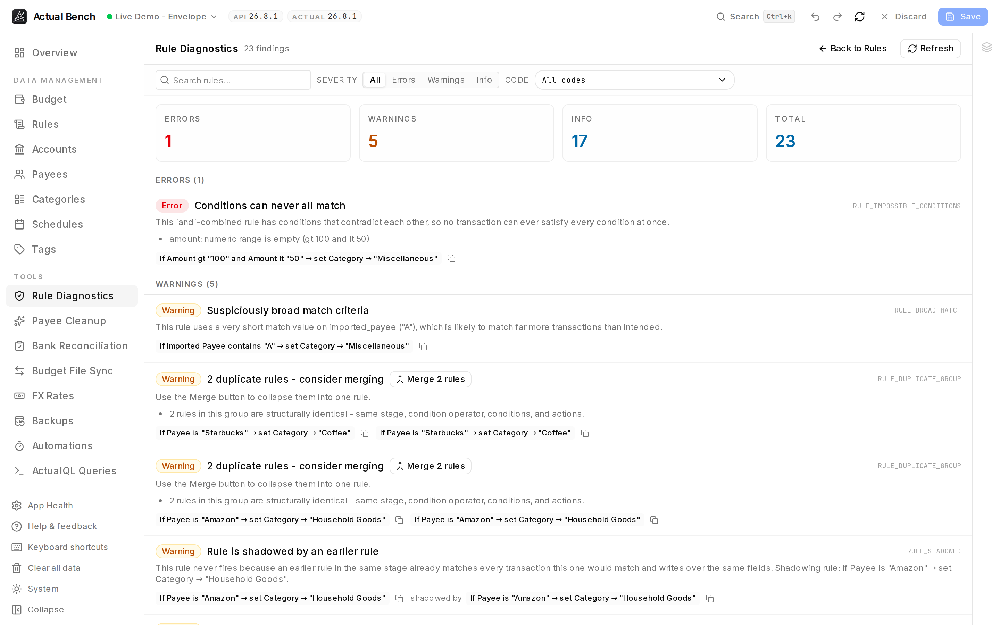

**Rule Diagnostics** audits a whole rule set at once and reports what is wrong with it: references to
deleted entities, broad rules shadowing specific ones, duplicates doing the same work twice, rules that
cannot match the next import. Actual runs rules one transaction at a time and gives you no way to look
at the set as a whole; this is that view.

Open it from **Tools → Rule Diagnostics** (`/rules/diagnostics`), or the **Diagnostics** button on the
Rules toolbar.

**Write model:** read-only and advisory. It includes unsaved staged rules, but never modifies anything
unless you follow a finding into the normal staged rule editor, or confirm a merge or a
generalisation.



*Every finding says what is wrong in a sentence, shows the rule it is about, and where a fix exists
offers it - Merge for duplicates, Generalise for a rule matching whole import strings.*

## What Actual Bench adds

Actual Budget runs rules but gives you no way to audit them in aggregate. As a rule set grows, problems
accumulate silently - a rule pointing at a deleted category, two rules that quietly shadow each other,
near-duplicate rules that should be one. Rule Diagnostics surfaces all of these in one place, explains
each in plain language, and links you straight to the fix.

## Run diagnostics and read findings

1. Open **Rule Diagnostics** (Tools sidebar, or the **Diagnostics** button on the Rules toolbar).
2. Findings are grouped by severity with summary cards for **error**, **warning**, and **info**, plus
   severity- and code-based filters.
3. Each finding has a plain-language explanation, the affected rule's summary, and a copy-UUID button.

## What it checks

- Missing payee / category / account / category-group references.
- Empty or no-op actions.
- Impossibly contradictory conditions on `and`-rules.
- Strictly shadowed rules within a stage.
- Broad match criteria (very short `contains` / `matches` values).
- Rules matching whole import strings rather than the merchant (see below).
- Duplicate rule groups and near-duplicate pairs.
- Unsupported field/operator combinations.

Schedule-generated rules are excluded from editor-relevant checks but still surface missing-entity
findings.

## Rules that match whole import strings

Actual writes some of your rules for you. When you rename a payee and accept its offer to
"apply that rename in the future", it creates a rule matching the **exact bank text** of that
transaction, and each later rename of the same merchant adds another string to the same list
([Actual's documentation of automatic rules](https://actualbudget.org/docs/budgeting/rules/#automatic-rules)):

```
imported payee is one of
  MARKET BOYS PTY LTD Melbourne VI AUS Card xx4534 Value Date: 12/03/2024
  MARKET BOYS PTY LTD Melbourne VI AUS Card xx9166 Value Date: 24/12/2024
  MARKET BOYS PTY LTD Sydney Value Date: 10/11/2025
→ set payee to Market Boys
```

That rule is already broken for your next import. The card number and the value date change every
time, so the next string is not on the list, the rule does not apply, and a duplicate payee arrives -
which you rename again, adding a fourth string. The list grows; it never starts working.

Bench reports these and offers **Generalise**, which opens a dialog on the Rules page proposing the
one condition all of those strings agree on - `imported payee contains "MARKET BOYS PTY LTD"` - so
next month's variant is caught too.

Widening a rule can only make it match *more*, so every proposal is checked against your own import
history first. The dialog tells you what each option would newly catch:

- text already going to the payee this rule sets, and text belonging to nobody - both harmless;
- text belonging to **another payee**, listed by name with examples. An option in that position is
  never preselected, and confirming it needs an explicit acknowledgement. If *every* option would do
  that, nothing is preselected at all - you have to choose one deliberately.

Nothing can be staged until that check has finished running.

If nothing can be proposed safely, the finding stays as information and no rewrite is offered.

Detection is by shape: Actual does not mark the rules it wrote, so a rule you wrote yourself in the
same shape is reported too. That is deliberate - it fails on the next import for the same reason.
Nothing is changed until you confirm, and the rewrite is staged like any other edit, so you can
review or undo it before saving.

## Act on findings

- Click a finding's rule summary to **jump to the rule** (`/rules?highlight=<id>`) and open it.
- Over-specific import rules have a **Generalise** button that opens the rewrite dialog described
  above; you're returned to the diagnostics report afterward.
- Duplicate and near-duplicate findings have a one-click **Merge** button that opens the
  [merge dialog](../rules/#merge-rules) pre-filled; you're returned to the diagnostics report afterward.
- A **stale-results** banner appears if the working set changes while the view is open; results stay
  until you **Refresh**.

## Safety

Diagnostics is advisory - it only reads. It never changes your rules; every fix is an explicit action
you take (jump to a rule, confirm a merge, or confirm a generalisation) that then follows the normal
staged **Save** flow.

## Troubleshooting

- **A missing-entity finding** - the referenced payee/category/account was deleted or renamed; open the
  rule and repoint it.
- **Results look stale** - the working set changed; click **Refresh**.
- **A large stage isn't fully analyzed** - very large rule partitions are analyzed up to a safety cap;
  a notice explains when a partition is skipped.

## Related pages

- [Rules](../rules/) - build, edit, and merge rules
- [Editing, review and save](../../getting-started/editing-and-saving/)
