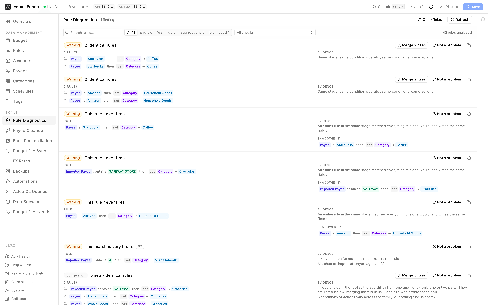
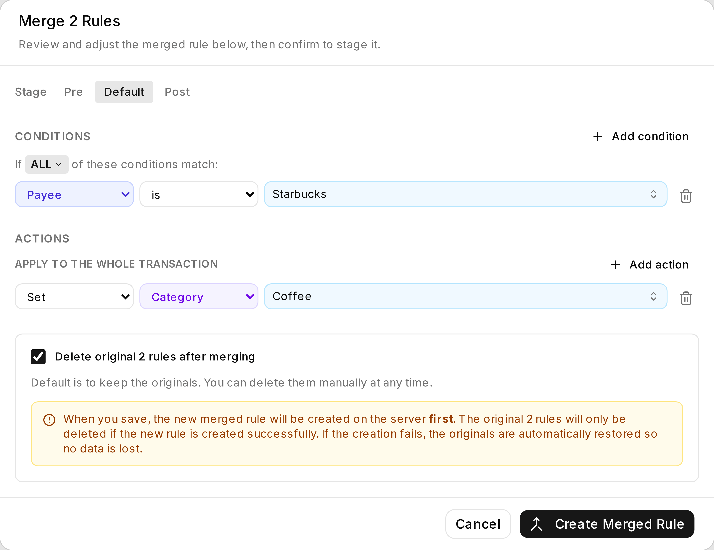

One pass over the whole rule set, reporting what is broken. References to things you deleted. Broad
rules quietly swallowing specific ones. Duplicates doing the same job twice. Rules that cannot
possibly match your next import. Actual runs rules one transaction at a time and never shows you the
set. This is that view.

Open it from **Tools → Rule Diagnostics** (`/rules/diagnostics`), or the **Diagnostics** button on the
Rules toolbar.

**Write model:** read-only. It reads your staged rules too, but changes nothing on its own. Every fix
is something you click - open the rule, confirm a merge, confirm a generalisation - and then goes
through the normal staged **Save**.



*Every finding says what is wrong in a sentence, shows the rule it is about, and where a fix exists
offers it - Merge for duplicates, Generalise for a rule matching whole import strings.*

## What Actual Bench adds

Rule sets rot quietly. You delete a category and three rules start pointing at nothing. You write a
broad rule and it swallows a specific one you wrote last year. You write the same rule twice because
you forgot the first. None of that announces itself. This page finds all of it, says what is wrong in
a sentence, and links to the fix.

## Run diagnostics and read findings

1. Open **Rule Diagnostics** (Tools sidebar, or the **Diagnostics** button on the Rules toolbar).
2. Findings arrive grouped by severity - **error**, **warning**, **info** - with filters by severity
   and by check.
3. Each one explains itself, shows the rule it concerns, and offers to copy that rule's UUID.

## What it checks

- Missing payee / category / account / category-group references.
- Empty or no-op actions.
- Impossibly contradictory conditions on `and`-rules.
- Strictly shadowed rules within a stage.
- Broad match criteria (very short `contains` / `matches` values).
- Rules matching whole import strings rather than the merchant (see below).
- Duplicate rule groups and near-duplicate pairs.
- Unsupported field/operator combinations.

Schedule-generated rules skip the checks you could not act on anyway, but still report missing
entities.

## Rules that match whole import strings

Actual writes some of your rules for you. When you rename a payee and accept its offer to
"apply that rename in the future", it creates a rule matching the **exact bank text** of that
transaction, and each later rename of the same merchant adds another string to the same list
([Actual's documentation of automatic rules](https://actualbudget.org/docs/budgeting/rules/#automatic-rules)):

```
imported payee is one of
  MARKET BOYS PTY LTD Melbourne VI AUS Card xx4534 Value Date: 12/03/2024
  MARKET BOYS PTY LTD Melbourne VI AUS Card xx9166 Value Date: 24/12/2024
  MARKET BOYS PTY LTD Sydney Value Date: 10/11/2025
→ set payee to Market Boys
```

That rule is already broken. The card number and the value date change every time, so next month's
string is not on the list, the rule does not fire, and a duplicate payee turns up. You rename it. The
list grows to four. It will never start working.

Bench spots these and offers **Generalise**. It reads the strings, finds the part they all agree on,
and proposes `imported payee contains "MARKET BOYS PTY LTD"` instead. Next month's variant is caught
by the same rule.

Widening a rule can only ever make it match more. So every proposal is backtested against your own
import history before you see it, and the dialog says exactly what each option would newly catch:

- text already going to this rule's payee, and text belonging to nobody - both harmless;
- text belonging to **another payee**, named, with examples. Those are never preselected, and
  confirming one takes an explicit acknowledgement. If every option would do it, nothing is
  preselected and you have to choose on purpose.

Nothing can be staged until the backtest finishes.

When nothing can be proposed safely, the finding stays as information. No rewrite is offered.

Detection works on shape, because Actual does not mark the rules it writes. So a rule you wrote
yourself in that shape gets reported too. That is intentional - it will fail on the next import for
exactly the same reason. Nothing changes until you confirm, and the rewrite stages like any other
edit.

## Act on findings

- Click the rule summary on a finding to **open that rule** (`/rules?highlight=<id>`).
- Over-specific import rules get a **Generalise** button, which opens the rewrite dialog above and
  brings you back here afterwards.
- Duplicates get **Merge**, which opens the [merge dialog](../rules/#merge-rules) already filled in,
  and also brings you back.
- Change your rules while this is open and a **stale results** banner appears. The old findings stay
  put until you press **Refresh**.



*The merge arrives filled in from the finding. Deleting the originals is opt-in, and the new rule is
created before anything is removed - so a failure leaves you with what you started with.*

## Safety

This page only reads. It never touches a rule. Every fix is something you do deliberately - open a
rule, confirm a merge, confirm a generalisation - and every one of those goes through the normal
staged **Save**.

## Troubleshooting

- **A missing-entity finding** - that payee, category or account was deleted or renamed. Open the rule
  and point it somewhere real.
- **Results look stale** - they are. Press **Refresh**.
- **A large stage was not fully analysed** - there is a safety cap on how big a partition gets
  compared. A notice tells you when one was skipped.

## Related pages

- [Rules](../rules/) - build, edit, and merge rules
- [Editing, review and save](../../getting-started/editing-and-saving/)
