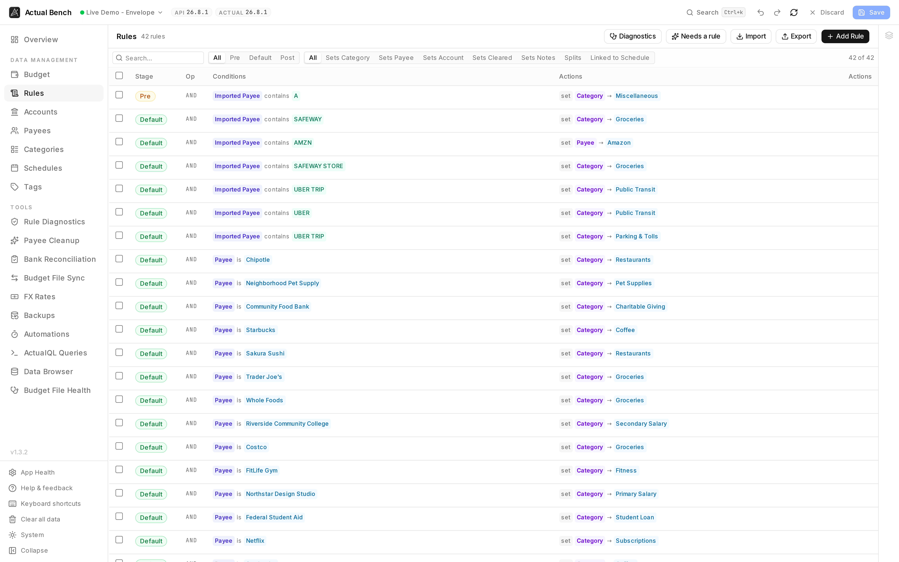

The whole rule set on one page, with every reference showing the payee, category or account it names
instead of an id. Come here once automation has outgrown a handful of categorisation rules. Actual
still runs them. Bench makes them readable.

Open it from **Data Management → Rules** (`/rules`).

**Write model:** stage → review → **Save**. [Rule Diagnostics](../rule-diagnostics/) is read-only until
you explicitly open or merge a rule.

*The whole rule set, with every reference resolved to the payee, category or account it names.*

## Start with the job you have

- **Create or edit automation:** use the rule builder below.
- **Find broken, overlapping, or duplicate rules:** run [Rule Diagnostics](../rule-diagnostics/).
- **Move or bulk-edit a rule set:** export it to CSV, edit it, then import and review the staged result.

## Why use Actual Bench for rules?

Actual runs your rules well. It is a bad place to read them. Past two dozen rules the questions change
shape: which rule did this? do these two overlap? what breaks if I delete that category? None of those
are questions about a single rule.

- Payees, categories and accounts appear as **names** - in the table and in the search box. Nothing to
  decode.
- **Handlebars templates** and **Excel-style formulas**, for actions that work something out instead of
  setting a constant.
- **Split rules** - one transaction divided across several categories, by fixed amount, percentage,
  formula or an equal share of what is left.
- **Merge duplicates** into one rule, from here or straight from a diagnostics finding.
- **CSV in and out** for the whole set - edit fifty rules in a spreadsheet, or keep a copy before you
  try.
- [Rule Diagnostics](../rule-diagnostics/) audits the set as a whole: broken references, rules that
  shadow each other, rules that cannot match the next import.

## How a rule works

A rule has **conditions** - when it applies - and **actions** - what it does. Actual runs rules as a
transaction arrives. It never goes back over transactions you already have.

Every rule sits in one of three **stages**, run in order: `pre`, `default`, `post`. That is how you
control which rule goes first. Clean up the imported payee text in `pre`, categorise it in `default`,
let `post` handle what is left over.

## Create a basic rule

1. On the **Rules** page, create a rule to open the editor.
2. A new rule starts with a guided default condition (`Payee is`) and a default action row.
3. Set the condition field, operator, and value.
4. Add an action.
5. Save to stage the rule.

Nothing is flagged red while you are still typing. Validation waits until you edit a row or try to
save, then marks what is missing and warns about destructive combinations and about a rule with no
conditions, which never matches. Close the
drawer with unsaved edits and it asks first.

## Add conditions

Bench offers exactly the fields and operators Actual's engine accepts, derived from the engine
itself - so a rule you build here is a rule Actual will run.

- **Fields:** imported payee, account, category, category group, date, payee, notes, amount,
  **amount (inflow)**, **amount (outflow)**, and cleared.
- **Combine** them with **AND** / **OR** logic (`conditions_op`).
- **Text operators:** `is`, `is not`, `contains`, `does not contain`, `is one of`, `is not one of`,
  `matches` (regex, with a syntax hint), and on notes, **`has all tags`** / **`has any tag`**.
- **Date operators:** `is`, `is approx.`, `is after`, `is after or equals`, `is before`,
  `is before or equals`.
- **Amount operators:** `is`, `is approx.`, `is between`, and the four comparisons. Pick
  **amount (inflow)** or **amount (outflow)** to match only money coming in or only money going out -
  outflows compare as positive numbers, so "amount (outflow) is greater than 100" reads the way you
  would say it.
- **References** to a payee, category or account are blue chips. Literal text is green. One glance
  tells you which you are looking at.

Not every operator applies to every field, and Bench only offers the ones that do. Notes has no
`is one of`; imported payee has no tag operators; only account has `is on budget` / `is off budget`.

## Add actions

Common actions include **set payee**, **set category**, **set account**, **set amount**, **set notes**,
and **link schedule**.

### Templates

The `{}` button on an action switches it to **Handlebars**, for example
`{{regex imported_payee 'foo' 'bar'}}`. Templates show as amber monospace chips in the table.

### Formulas

The `ƒ` button switches an action to an **Excel-style formula**, run by HyperFormula -
`=IF(ISBLANK(notes), imported_payee, notes)`. It has to start with `=`. One row can be a template or
a formula, never both.

Both modes are available on every **set** action except **payee**, **category** and **account** -
those hold ids rather than text, so computing one would not help. Prepend/append notes, delete
transaction, link schedule and the split **Allocate** row have their own inputs and no mode toggle.

## Split a transaction across categories

A split rule turns one incoming transaction into a parent plus several children, each with its own
category. Use it for the shop where half the receipt is groceries and half is household, or to put a
fixed service charge on its own line.

1. In the rule editor, choose **Add split**. The actions section grows a **Split 1** group.
2. Each split starts with an **Allocate** row saying how much of the transaction it takes:
   - **a fixed amount** - a literal figure.
   - **a fixed percent of the remainder** - a percentage of what is left after the fixed amounts.
   - **based on a formula** - an `=` expression, as above.
   - **an equal portion of the remainder** - whatever is left, shared equally between the splits
     that ask for it.
3. Add the actions for that split - typically **set category**, and optionally payee or notes.
4. **Add split** again for as many children as you need.

Actual works them out in three passes: **fixed amounts and formulas** first, then **percentages** of
whatever remains after those, then the **equal shares** of what is still left, with any rounding
difference going to the last one. So a percentage is a percentage of the remainder *after* both the
fixed amounts and the formulas have taken theirs.

Amount, cleared, account and date belong to the transaction as a whole, so they are only offered in
the **Apply to the whole transaction** group at the top, never inside a split. Splits are numbered
from 1, and removing one renumbers the rest.

Split rules cannot be merged - flattening two of them into one would produce a rule nobody wrote, so
Bench asks you to edit them individually instead.

## Edit, duplicate, filter, and search

- Duplicate a rule with one click.
- Filter the list by stage, payee, category, or **Splits** to find every rule that divides a
  transaction.
- **Search knows the names.** Type "Groceries" and it finds the rules whose `oneOf` condition holds
  that category's id. You never see a raw id.
- Arriving from the Payees or Categories page filters the list to that entity for you.

## Merge rules

1. Select the rules to combine.
2. Choose **Merge** to open the merge dialog (it shares the main editor's sections and validation).
3. Review the merged result; the **Delete originals** checkbox is pre-ticked for full duplicates and
   unticked for near-duplicates.
4. Confirm to stage the merge.

Merge from a [Rule Diagnostics](../rule-diagnostics/) finding and you land back in the report, ready
for the next one.

## Schedule-generated rules

A schedule writes its own rule, with a `link-schedule` action. Those are **read-only** here, and left
out of bulk selection and merge. Change them from [Schedules](../schedules/).

## Import and export

The CSV is long-format: one condition or action per row, grouped by `rule_id`. The columns that matter
are `rule_id`, `stage`, `conditions_op`, `row_type` (`condition` or `action`), `field`, `op`,
`value`, `split_index` and `options` - separate multiple `oneOf` values with `|`. Formulas export
with a leading `'` so your spreadsheet does not try to evaluate them. The prefix comes off again on
import.

`split_index` is blank for anything applying to the whole transaction, and `1`, `2`, … for the
splits. `options` carries the rest as `key=value;key=value` - the allocation `method` on an
**Allocate** row, and `inflow=true` / `outflow=true` on an amount condition. A file exported before
those two columns existed still imports; the importer matches columns by name.

An action with an operator the importer does not recognise skips its whole rule and tells you which
operator it was, rather than quietly importing it as something else.

## Examples

Substitute your own payees and categories:

- **Categorize by payee** - condition `Payee is "Fresh Market"`, action `set category "Groceries"`.
- **Normalize imported text** - a `pre`-stage template action on `payee_name`:
  `{{regex imported_payee 'SQ \*' ''}}`.
- **Fall back to imported payee** - a formula on `notes`: `=IF(ISBLANK(notes), imported_payee, notes)`.
- **Route by amount** - condition `amount is greater than 1000.00`, action
  `set category "Large Purchases"`.
- **Only large payments out** - condition `amount (outflow) is greater than 500.00`, so incoming
  money of the same size is left alone.
- **Tagged notes** - condition `notes has any tag "#reimburse"`, action `set category "Owed to me"`.
- **Split a warehouse shop** - condition `Payee is "Costco"`, then **Split 1** allocating
  a fixed percent of 60% to `Groceries` and **Split 2** taking an equal portion of the remainder to
  `Household`.

## Safety and limitations

- Rules run when a transaction is created, and several can hit the same transaction. If the result
  surprises you, the answer is almost always stage order.
- **A rule with no conditions never runs.** Actual treats an empty condition list as "no match", not
  as "match everything", so a rule with only actions is inert. The editor says so.

## Troubleshooting

- **A rule never fires** - check that it has at least one condition (a rule without one never
  matches), then check its stage, and whether an earlier stage already changed the field it tests.
- **A split will not save** - each split needs exactly one **Allocate** row, and a percentage has to
  be between 0 and 100.
- **AND/OR confusion** - check `conditions_op`. AND needs every condition; OR needs one.
- **A regex will not match** - read the syntax hint on the `matches` operator.
- **A template or formula will not save** - formulas start with `=`, and one row cannot be both.
- **A schedule-linked rule will not edit** - that is deliberate. Go to Schedules.

## Related pages

- [Rule Diagnostics](../rule-diagnostics/) - lint your rule set for problems
- [Schedules](../schedules/)
- [ActualQL Queries](../actualql/)
