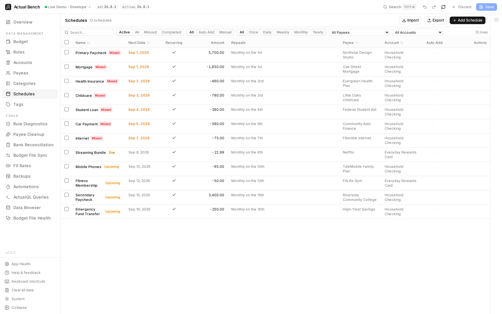

Every recurring plan in the budget: what repeats, when it next falls due, what it is attached to.
Create or revise several at once, move them in and out through CSV, or check a schedule's linked rule
and transaction count before deleting it.

Open it from **Data Management → Schedules** (`/schedules`).

**Write model:** stage → review → **Save**.

*Next date, amount, recurrence, payee and account together - and the two marked **Missed** are the
ones worth looking at first.*

It shares the [editing model](../../getting-started/editing-and-saving/) every Data Management page
uses.

## What you get beyond Actual Budget

- **CSV import and export** of schedules for bulk setup and backup.
- **Impact-aware deletion** - every delete shows the schedule's linked-rule status, auto-post flag, and
  transaction count first.
- **A recurrence summary that reads like English**, worked out from the start date.
- **Edit as Rule** - open the schedule's server-managed rule directly in the Rules editor.
- **Staged review** - set up a dozen schedules, read them once, then Save.

## Create a schedule

1. On the **Schedules** page, open the schedule drawer to add a schedule.
2. Set the **name** (optional), **date** (or recurrence), and amount.
3. Optionally assign a **payee** and **account**.
4. Save to stage the schedule.

Save a schedule you did not change and the drawer just closes - no empty draft. Close it with unsaved
edits and it asks first.

## Choose an amount mode

Schedule amounts always use one of three modes:

- **Exact** (`is`)
- **Approximate** (`is approx.`)
- **Range** (`is between`) - with a low and high amount

A missing amount on the server is read as an approximate zero.

## Configure recurrence

- Frequencies: **daily**, **weekly**, **monthly**, **yearly**, each with a configurable interval.
- Monthly schedules support a **specific day of the month** (including "last day") or a
  **weekday-of-week position** (for example "2nd Friday").
- The table's **Repeats** summary infers weekday/day anchors from the start date (for example
  `Every 2 weeks on Wednesday`), and a **Recurring** column marks repeating schedules.

## Weekend adjustment and end conditions

- **Weekend adjustment** - a date landing on a Saturday or Sunday moves to the **Friday before** or the
  **Monday after**, your choice.
- **End conditions** - run forever, end after **N occurrences**, or end **on a date**.

## Auto-add and linked rules

- **Auto-add** - Actual posts the transaction itself when the schedule falls due.
- Every schedule has a **linked rule** behind it, managed by the server. **Edit as Rule** in the drawer
  opens it.

:::note[Schedule-generated rules are managed here]
Schedule-linked rules are read-only on the [Rules](../rules/) page. The `link-schedule` action shows
the schedule's name and cannot be written by hand. Change the behaviour here instead.
:::

## Edit, delete, and filter

- Edit in the drawer. A saved edit stays on screen while the background refresh catches up with the
  server.
- Deleting confirms first, showing the linked rule, the auto-post flag and the transaction count.
- Filter by name, payee, account, frequency, and auto-add state.

## Import and export

Import and export schedules as CSV (staged before saving).

:::note[No "completed" status column]
The `completed` flag survives a CSV round-trip but is not shown as a status, because it does not
reliably mean paid or finished. Imported schedules start active.
:::

## Common problems

- **The rule is read-only** - it belongs to the schedule. **Edit as Rule** opens the parts you can
  change.
- **The recurrence summary looks wrong** - it is derived from the start date. Check the day or weekday
  anchor and the interval.

## Related pages

- [Rules](../rules/) - schedule-linked rules
- [Tags](../tags/)
- [Core Concepts](../../getting-started/core-concepts/)
