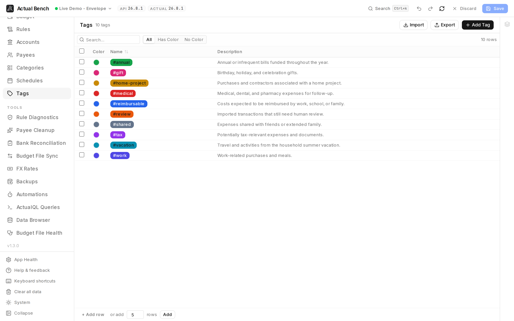

**Tags** is the tag vocabulary itself - the labels, their colors and descriptions - managed as a set
rather than one transaction at a time. Come here to seed a vocabulary, tidy one that grew by accident,
or find out which rules reference a tag before removing it.

Open it from **Data Management → Tags** (`/tags`). Tags require Actual Budget v26.3.0 or later.

**Write model:** stage → review → **Save**.

*A tag vocabulary is only useful if everyone remembers what each one means, so the description sits
beside the colour rather than in someone's head.*

It shares the [editing model](../../getting-started/editing-and-saving/) every Data Management page
uses.

## What you get beyond Actual Budget

- **CSV import and export** for bulk tag setup and backup.
- **Colors and descriptions** managed inline, with a **filter by color presence**.
- **Bulk delete** across selected tags, staged before it touches your budget.
- **See which rules reference a tag** via the Usage Inspector.

## Create and edit a tag

1. On the **Tags** page, create a tag and give it a **name**.
2. Optionally assign a **color** - click the swatch to open a native color picker; hover the row for a
   clear button.
3. Optionally add a **description**.
4. Edit any name or description inline (`Enter` confirms, `Escape` cancels).

## Filter, delete, and import/export

- Filter by name or description, and by color presence (All / Has Color / No Color), with live counts.
- Bulk-select and delete; duplicate names show a warning.
- Import and export tags as CSV. CSV columns:
  - `name` (required), `color` (optional hex, e.g. `#FF5733`), `description` (optional).

:::note[Tag usage data]
The Usage Inspector shows a tag's rule references, but transaction data is not available for tags, so
the drawer notes that explicitly.
:::

## Common problems

- **Tags are unavailable** - tags require Actual Budget v26.3.0 or later on the server.
- **A color or description didn't stick** - confirm you saved; inline edits commit on `Enter`.

## Related pages

- [Editing, review and save](../../getting-started/editing-and-saving/) - the shared editing model
- [Schedules](../schedules/)
