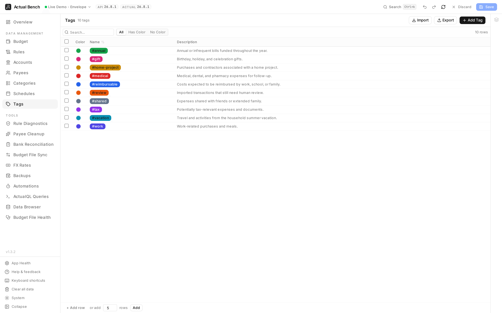

Use Tags to create and manage tag names, colors, descriptions, and CSV data. Review rule references
before deleting a tag.

Open it from **Data Management → Tags** (`/tags`). Tags require Actual Budget v26.3.0 or later.

**Budget impact:** Tag changes remain staged for review until you **Save**.

*A tag vocabulary is only useful if everyone remembers what each one means, so the description sits
beside the colour rather than in someone's head.*

It shares the [editing model](../../getting-started/editing-and-saving/) every Data Management page
uses.

## What you get beyond Actual Budget

- **CSV import and export** for bulk tag setup and backup.
- **Colours and descriptions** edited inline, and a filter for tags that have no colour yet.
- **Bulk delete**, staged like everything else.
- **See which rules reference a tag** via the Usage Inspector.

## Create and edit a tag

1. On the **Tags** page, create a tag and give it a **name**.
2. Give it a **colour** if you want - click the swatch. Hovering the row reveals a clear button.
3. Optionally add a **description**.
4. Edit any name or description inline (`Enter` confirms, `Escape` cancels).

## Filter, delete, and import/export

- Filter by name, by description, or by whether a tag has a colour. Counts update as you type.
- Select several and delete them together. Duplicate names get flagged.
- Import and export tags as CSV. CSV columns:
  - `name` (required), `color` (optional hex, e.g. `#FF5733`), `description` (optional).

:::note[Tag usage data]
The Usage Inspector shows which rules reference a tag. It cannot show transactions - Actual does not
expose that for tags - and the drawer says so rather than showing a misleading zero.
:::

## Common problems

- **No tags anywhere** - your server is older than Actual Budget v26.3.0.
- **A colour or description did not stick** - inline edits commit on `Enter`, and the page still needs
  a **Save**.

## Related pages

- [Editing, review and save](../../getting-started/editing-and-saving/) - the shared editing model
- [Schedules](../schedules/)
